# PCA 主成分分析（第一课）

> 一句话：**换一组坐标轴**。新坐标轴按"数据在这个方向上抖得多厉害"（方差）排序，并且彼此互不相关。只留前 k 个轴就是降维。

---

## 0. 前置：这份数据是怎么来的

### 0.1 Fashion-MNIST 是什么

Zalando（欧洲电商）2017 年发布的 MNIST 替代品：**10 类服装的正面商品图**，每张处理成 **28×28 灰度图**，训练集 60000 张、测试集 10000 张。它存在的理由很直白——MNIST 手写数字太简单，很多方法都能刷到 99%+，区分不出好坏。

我们这份在 `桌面/imagination/fashion_mnist/`，是 9 月 28 日用 torchvision 下载并按标准目录放好的（`FashionMNIST/raw/` 下是解压后的 idx 文件）。所以 notebook 里 `download=False`：直接用本地文件，不联网。

| 编号 | 中文 | 英文 |  | 编号 | 中文 | 英文 |
|---|---|---|---|---|---|---|
| 0 | T恤 | T-shirt/top | | 5 | 凉鞋 | Sandal |
| 1 | 裤子 | Trouser | | 6 | 衬衫 | Shirt |
| 2 | 套衫 | Pullover | | 7 | 运动鞋 | Sneaker |
| 3 | 连衣裙 | Dress | | 8 | 包 | Bag |
| 4 | 外套 | Coat | | 9 | 短靴 | Ankle boot |

### 0.2 为什么拿它学 PCA

- 维度适中（784 维）：协方差矩阵 784×784，普通电脑上几秒分解完
- 有**空间结构**：主成分能还原成 28×28 图像直接看（"特征服装"），不像抽象特征只能看曲线
- 重建好坏肉眼可判：k=5 还能不能认出是件衣服，一眼就知道

### 0.3 两个预处理的理由

- **`/255` 归一化**：像素 0~255 → 0~1。这对 PCA 的**方向没有影响**（整体缩放只让所有特征值等比缩放，特征向量不变），目的是数值稳定 + 方便显示。
- **取 30000 张**：协方差矩阵要估计 784×784/2 ≈ 30 万个独立参数，样本越多估计越稳，但计算量线性增长。30000 在这个数据集上已足够稳定。随机种子固定 42，保证可复现。

### 0.4 代码在哪、怎么跑

`桌面/学习/01_PCA主成分分析.ipynb`，kernel 选 **Python (xx)**。全部 cell 已执行过，打开就有图和数字。

---

## 1. 图像 → 向量

**做了什么**：一张 28×28 图按行优先展平成 784 维向量 $x$，整个数据集堆成矩阵

$$X=\begin{bmatrix}x_1^\top\\ \vdots \\ x_N^\top\end{bmatrix}\in\mathbb{R}^{N\times 784}$$

- 每一行 = 一张图；每一列 = 某个像素在所有样本上的取值

**为什么可以粗暴展平**：展平丢掉了二维邻接关系——PCA 不知道第 100 号和第 101 号像素是否相邻，它只看**统计相关性**。奇妙的是，光靠统计它依然能找出袖子、鞋底这类结构（第 6 步会看到）。

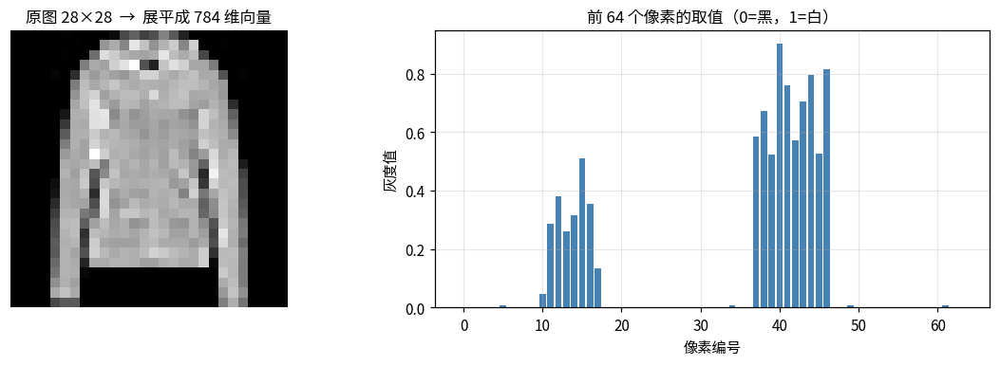

📖 **读图**：右图是展平后前 64 个像素（原图第一行多一点）的取值。前一段全是 0（顶部空白背景），到第 20 多个才有非零值——**数据里有大量恒定不变的维度**，它们方差为 0，对 PCA 毫无贡献（对应特征值就是 0）。

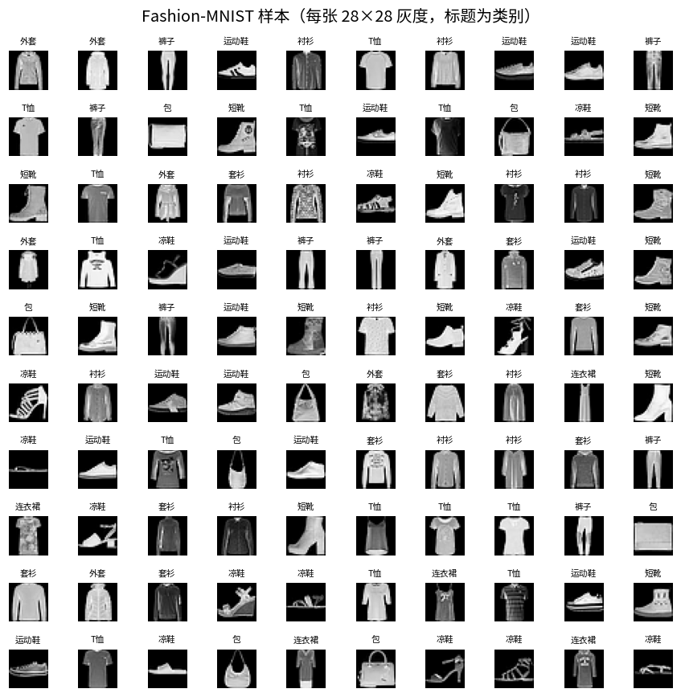

📖 **读图**：10×10 样本网格。注意两点：(1) 同类内部差异很大（"套衫"有长袖短袖），类内方差不小；(2) 不同类外形有重叠（衬衫 vs T恤），后面 k=2 投影时它们会混在一起。另外背景纯黑、衣服居中且大小接近——**对齐良好的数据 PCA 效果最好**。

---

## 2. 中心化

**公式**：

$$\bar{x}=\frac{1}{N}\sum_{i=1}^N x_i\in\mathbb{R}^{784},\qquad X_c = X-\mathbf{1}\bar{x}^\top$$

**为什么必须做**：PCA 研究"数据围绕中心往哪个方向抖"。不减均值的话

$$\frac{1}{N-1}X^\top X = C + \bar{x}\bar{x}^\top$$

多出的 $\bar{x}\bar{x}^\top$ 是秩 1 的"均值方向"项，会把 PC1 拉去指向"平均图像"而不是变化最大的方向。**协方差的定义本身就要求先中心化。**（代码输出验证：中心化后各维均值在 $10^{-14}$ 量级。）

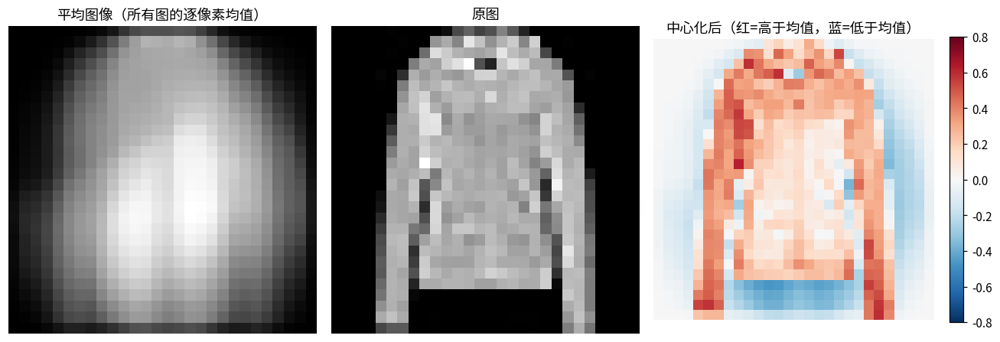

📖 **读图**：左图"平均图像"是所有衣服叠加后的模糊轮廓，能看出大致的上身/下身形状。右图中心化后单张图用红蓝配色（红=比平均亮，蓝=比平均暗），**红色区域正好勾出这件衣服区别于"平均衣服"的地方**——PCA 关心的不是图像本身，而是"偏离均值多少"。

---

## 3. 协方差矩阵（核心）

**公式**：

$$C=\frac{1}{N-1}X_c^\top X_c\in\mathbb{R}^{784\times784},\qquad C_{ij}=\frac{1}{N-1}\sum_{n=1}^N (x_{n,i}-\bar{x}_i)(x_{n,j}-\bar{x}_j)$$

| 位置 | 含义 | 直觉 |
|---|---|---|
| 对角线 $C_{ii}$ | 第 i 像素的**方差** | 这个像素在数据集里变化大不大 |
| 非对角 $C_{ij}$ | 第 i、j 像素的**协方差** | 是否"同涨同跌"，值大 = 冗余 |

**三个性质**：
1. **对称**：$C=C^\top$ → 特征值必为实数、特征向量可正交（代码已验证）
2. **半正定**：$v^\top Cv\ge 0$ → 所有 $\lambda\ge 0$，才能当"方差"解释
3. 除以 $N-1$ 而非 $N$：这是无偏估计

**PCA 的目标一句话**：找一组新坐标，让变换后协方差矩阵**变成对角阵**（各维度不相关）。

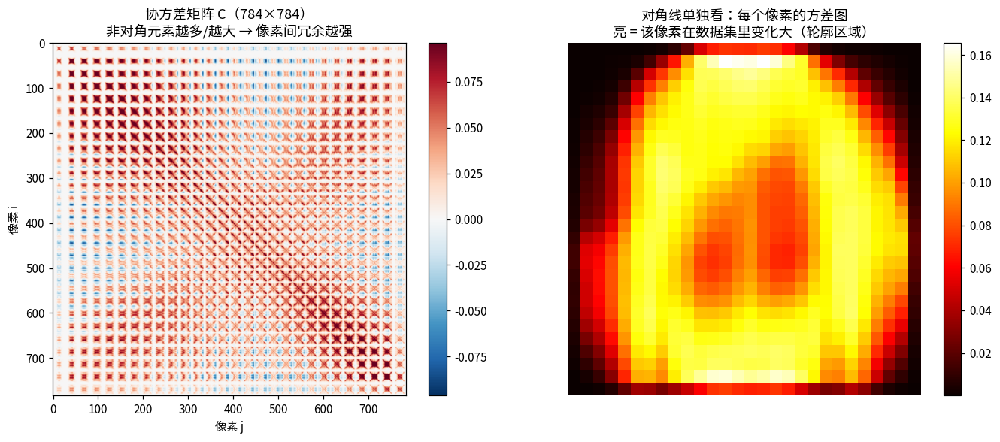

📖 **读图**：左图热力图有明显**块状结构**——相邻像素高度相关，形成对角线附近的亮带；非对角越亮 = 冗余越强 = 压缩空间越大。右图把对角线（各像素方差）还原成 28×28：亮的是衣服轮廓和鞋底，暗的是永远全黑的背景角落——**背景像素方差≈0，这就是"有效维度远小于 784"的直接证据**。

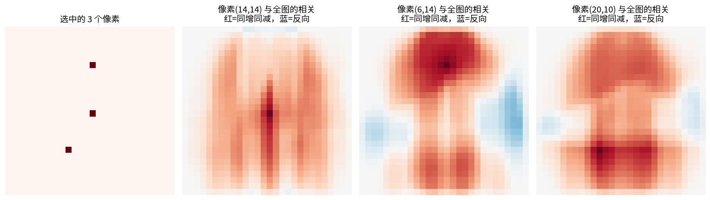

📖 **读图**：左图标出三个选中像素，右边是"该像素与全图每个像素的协方差"还原图，红=同涨同跌，蓝=反向。**相关区域连成了有意义的形状（袖子、衣摆）**——PCA 完全不知道像素位置，仅凭统计相关就"发现"了空间结构。

---

## 4. 特征值分解

**公式**：解 $Cv=\lambda v$，因 $C$ 对称半正定可写成

$$C=V\Lambda V^\top,\quad V=[v_1,\dots,v_{784}],\ \Lambda=\mathrm{diag}(\lambda_1,\dots,\lambda_{784})$$

- **$v_k$（特征向量）** = 第 k 个主成分方向（新坐标轴，正交单位向量）
- **$\lambda_k$（特征值）** = 数据在该方向上的**方差**

**为什么 $\lambda$ 就是方差**：投影 $z=X_c v$，则

$$\mathrm{Var}(z)=\frac{1}{N-1}z^\top z=\frac{1}{N-1}v^\top X_c^\top X_c v = v^\top Cv=\lambda\|v\|^2=\lambda$$

这就是 Rayleigh 商：**PCA 找的就是让投影方差最大的方向**。

**两条计算路径**（代码都跑了）：
1. `np.linalg.eigh(C)` —— 对称矩阵专用，快且稳；注意返回**升序**，代码用 `[::-1]` 翻转
2. **SVD**：$X_c=U\Sigma V^\top$ → $X_c^\top X_c=V\Sigma^2V^\top$，故 $V$ 即主成分，$\lambda_i=\sigma_i^2/(N-1)$。数值上更稳（不用显式算平方），高维优先用

实测：前 6 个特征值两条路相对误差 $8.6\times10^{-3}$（SVD 只用 5000 子样本有采样差异），主成分方向余弦相似度 > 0.99 → **两者确实等价**。

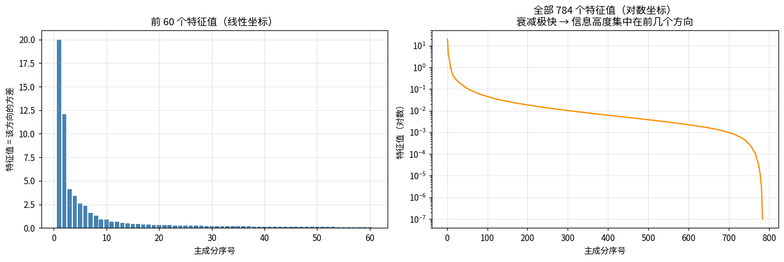

📖 **读图**：左图前 60 个特征值（碎石图），第一个 ≈20 特别高、第二个 ≈12 后快速衰减，典型长尾。右图全部 784 个的**对数坐标**：近似直线下降，尾部有一段接近 0 的平台——那些是数值为 0 的特征值（对应恒定背景像素）。**"陡崖 + 长尾" = 信息集中在前几十个方向**。

---

## 5. 解释方差率：留几个主成分？

**公式**：第 k 个主成分解释率 $r_k=\dfrac{\lambda_k}{\sum_j\lambda_j}$，累计 $\text{cum}_k=\sum_{j\le k}r_j$

**两个"有效秩"指标**（你在 VICReg 里盯的就是这类量）：

- **参与比**：$\left(\sum\lambda\right)^2\big/\sum\lambda^2$ —— 完全均匀时 = 784，完全塌缩时 = 1
- **熵秩**：$\exp(-\sum_k p_k\log p_k)$，$p_k=r_k$ —— 同样 1~784，对"几个方向重要"更敏感

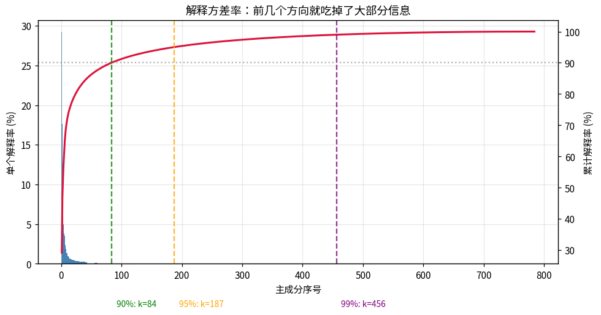

📖 **读图**：蓝柱是单个解释率（PC1 独占约 38%），红曲线是累计解释率，上升极快后变平。三条虚线标出 90%/95%/99%。**注意 99% 要 456 个方向**——最后 1% 的信息要拿一半以上维度去换，性价比极低。这就是为什么实际取 k 到 90~95% 就收手。

**本课关键数字**：

| 指标 | 数值 |
|---|---|
| 前 10 个主成分累计解释 | **72.01%** |
| 解释 90% / 95% / 99% 所需方向 | **84 / 187 / 456**（总维度 784） |
| 有效秩 · 参与比 | **7.86** |
| 有效秩 · 熵秩 | **29.05** |

---

## 6. 主成分长什么样（"特征服装"）

每个 $v_k\in\mathbb{R}^{784}$ 本身就是一张图。任意图像可近似成它们的加权和：

$$x\approx \bar{x}+z_1v_1+z_2v_2+\cdots+z_kv_k$$

跟傅里叶分解思路一模一样——只不过基函数不是固定正弦波，而是**从数据里学出来的**。

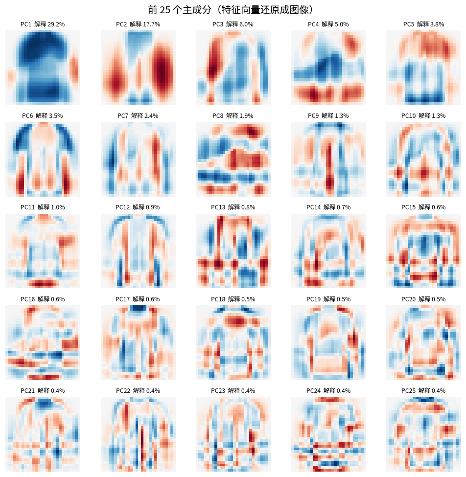

📖 **读图**（红=正贡献，蓝=负贡献）：
- **PC1（38%）**：几乎全图同色 → 整体明暗（"这件衣服深还是浅"）
- **PC2**：左右反色 → 左右对称/宽度差异
- **PC3~PC5**：上下结构、袖子位置
- **越往后越细碎**：PC20 之后基本是局部纹理和噪声

**规律：主成分是"从粗到细"的层级结构**，跟傅里叶从低频到高频非常像。

---

## 7. 投影到 2D / 3D

**公式**：$Z=X_cV_k\in\mathbb{R}^{N\times k}$，单样本 $z=V_k^\top(x-\bar{x})$，分量 $z_j=v_j^\top(x-\bar{x})$ = "这张图在第 j 个主成分上的坐标"。

**三个等价视角**：
1. 坐标变换：从"像素坐标系"搬到"主成分坐标系"，只留前 k 个坐标
2. 正交投影：把点垂直投影到 $v_1..v_k$ 张成的 k 维子空间
3. 低秩近似：$X_c\approx ZV_k^\top$（右边是秩 ≤ k 的矩阵）

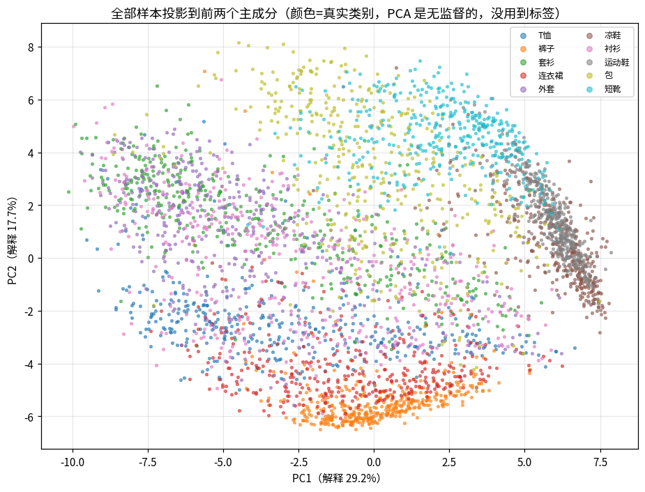

📖 **读图**：4000 件衣服投到 PC1-PC2，颜色是真实类别（但 PCA 没用过标签）。
1. **裤子与鞋类明显分离** —— 轮廓差异大，最容易被前两个方向区分
2. **T恤/套衫/衬衫/外套挤在中间** —— 都是"上身筒状"，前两个主成分分不开
3. 点是连续一片而非离散团 —— PCA 保留的是方差，不是类别可分性

**说明：PCA 是无监督的，它优化信息保留，不优化分类。**

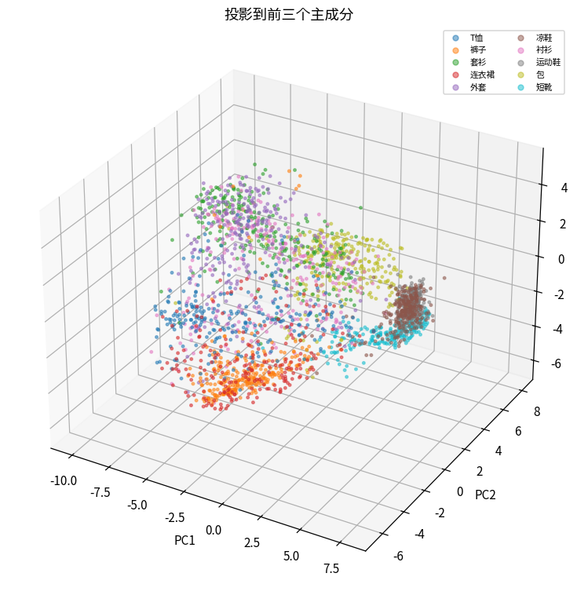

📖 **读图**：加 PC3 后，上身几类被稍微拉开，但仍大量重叠。**在 notebook 里可以旋转找角度看分离情况**——想靠线性投影彻底分开这些类，需要更多维度或非线性方法。

---

## 8. 重建

**公式**：

$$\hat{x}=\bar{x}+V_kz=\bar{x}+V_kV_k^\top(x-\bar{x})$$

$P_k=V_kV_k^\top$ 是**投影矩阵**（幂等 $P_k^2=P_k$）。

**被丢掉的是什么**：$x-\bar{x}=\sum_{j=1}^{784}z_jv_j$，只留前 k 项则

$$\text{丢掉的部分}=\sum_{j>k}z_jv_j,\qquad \text{其方差}=\sum_{j>k}\lambda_j$$

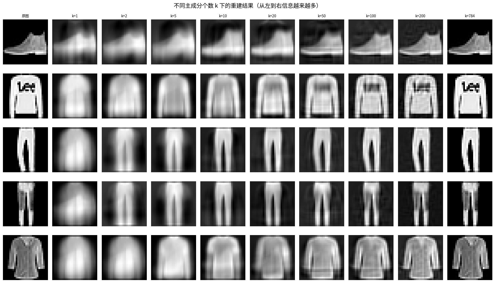

📖 **读图**：5 件服装 × k=1,2,5,10,20,50,100,200,784，从左到右信息递增：
- **k=1**：只剩一团明暗 —— 只知道深浅和大概位置
- **k=5~10**：轮廓出来了，能看出长袖还是短靴，细节全无
- **k=50**：图案可辨（鞋底、包带）
- **k=200**：很接近原图，只剩细微纹理
- **k=784**：完全还原（误差 0）

**"保留 90% 方差"在视觉上意味着什么**：k=84 落在 k=50 和 k=100 之间，衣服类型能认出，精细纹理是糊的。

| k | MSE | PSNR |
|---|---|---|
| 1 | 0.0602 | 12.21 dB |
| 10 | 0.0239 | 16.21 dB |
| 50 | 0.0117 | **19.31 dB** |
| 200 | 0.0040 | 23.95 dB |

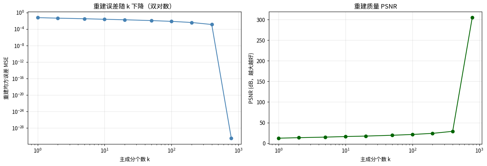

📖 **读图**：左图 MSE 随 k 下降（双对数近似直线 = 幂律衰减），右图 PSNR（>20 dB 通常算"能看"）。**前 20 个方向贡献最大改善，之后曲线明显变平**——边际收益递减极快，和第 5 步累计曲线是同一件事的两种画法。

---

## 9. 理论校验：重建误差 = 被丢掉的特征值之和

$$\mathbb{E}\big[\|x-\hat{x}\|^2\big]=\sum_{j>k}\lambda_j$$

其中 $\|\cdot\|^2$ 是整张图 784 个像素的误差平方和。代码里的 MSE 是"平均到每像素"，所以对应关系是 $\text{MSE}\approx\frac{1}{784}\sum_{j>k}\lambda_j$。

**实测核对**（$\lambda$ 在训练集 30000 张上算，MSE 在测试集上测，所以不会完全相等）：

| k | 实测 MSE | 理论值 $\sum_{j>k}\lambda_j/784$ | 偏差 |
|---|---|---|---|
| 1 | 0.06015 | 0.06179 | 2.66% |
| 10 | 0.02394 | 0.02444 | 2.02% |
| 50 | 0.01173 | 0.01199 | 2.10% |
| 100 | 0.00750 | 0.00764 | 1.87% |
| 200 | 0.00403 | 0.00402 | 0.10% |

**偏差只有 0.1%~3.3%**，定理得到验证。

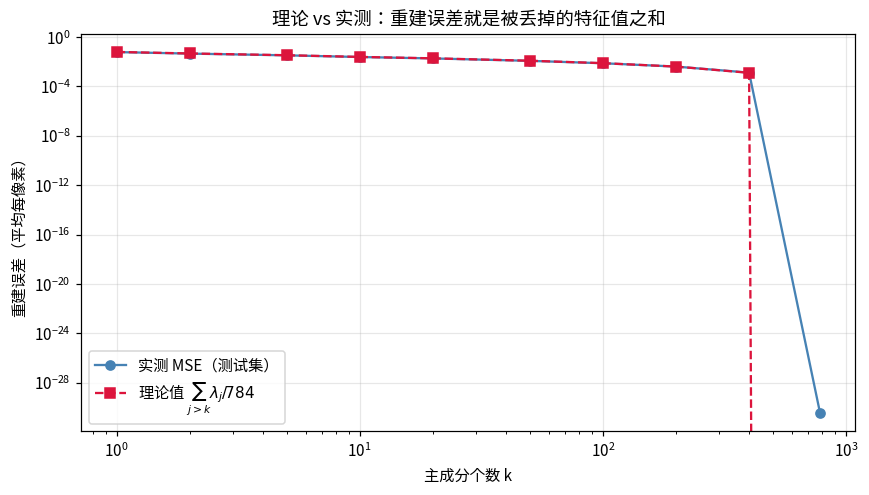

📖 **读图**：蓝线（实测）和红虚线（理论）几乎重合。这条等式是理解 PCA 最优性的钥匙：**总方差固定，"保留最多方差" 等价于 "丢掉最少方差"**，而丢掉的量恰好就是后面那些特征值之和。

---

## 10. 为什么主成分是最优的（数学核心）

> **定理 A（最大方差）**：所有单位方向中 $v_1$ 投影方差最大；在与 $v_1$ 正交的方向中 $v_2$ 最大；依此类推。
>
> **定理 B（最小重建误差）**：所有 k 维正交投影中，$V_k$ 使 $\mathbb{E}\|x-\hat{x}\|^2$ 最小，最小值 $=\sum_{j>k}\lambda_j$。

两者等价（总方差固定）。代码把三种 k=50 的方向放一起比：

| 方向选择 | 重建 MSE |
|---|---|
| **前 50 个主成分** | **0.0118** |
| 随机正交方向 | 0.0813 |
| 后 50 个主成分（最差） | 0.0867 |

**差 7 倍。**

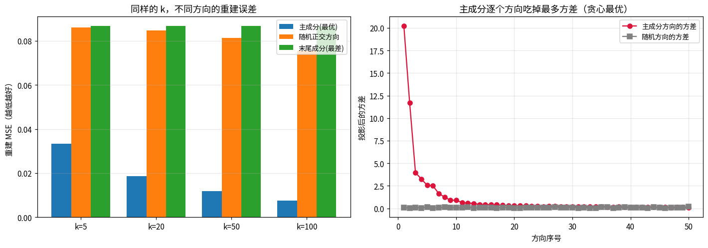

📖 **读图**：左图三种方向的 MSE 对比，主成分（蓝柱）远低于另外两者。右图方差视角：红点（主成分）逐个递减且始终高于灰色（随机方向）——**主成分是贪心地一个一个吃掉最多的剩余方差**。

注意左图"随机方向"和"末尾成分"高度接近：随机方向平均而言就是随便丢信息，末尾成分专门丢最少的信息，结果在重建原图上同样差——殊途同归。

---

## 11. 与 sklearn 对照

不能只比数值（特征向量符号可整体翻转，$v$ 和 $-v$ 都是特征向量；特征值接近时方向还会混合）。正确做法是比**子空间**：

取 $M=V_{\text{mine}}^\top V_{\text{sklearn}}$，做 SVD，若子空间相同则所有奇异值 = 1。实测最小 0.973、最大 1.000，前 5 个特征值**完全一致**。

> 提醒：`sklearn.decomposition.PCA` **内部会自动中心化**，要喂原始数据 `Xmat`，不是 `Xc`。

---

## 12. 白化

$$z_{\text{white}}=\frac{z}{\sqrt{\lambda}}\ \Longrightarrow\ \mathrm{Cov}(z_{\text{white}})=I$$

**ZCA 白化**（转回原空间）：$x_{\text{ZCA}}=V\Lambda^{-1/2}V^\top(x-\bar{x})$，同样让协方差变单位阵，但结果仍在像素空间。

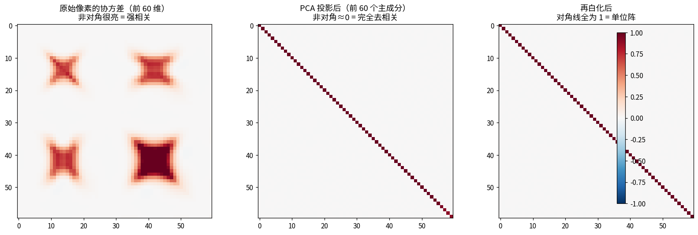

📖 **读图**：三张协方差热力图的递进：原始像素（非对角大片亮 = 强相关）→ PCA 投影后（只剩对角线 = **完全去相关，这正是 VICReg 想要的样子**）→ 再白化（对角线统一为 1 = 单位阵）。代码确认白化后对角线均值 1.00000、非对角≈0。

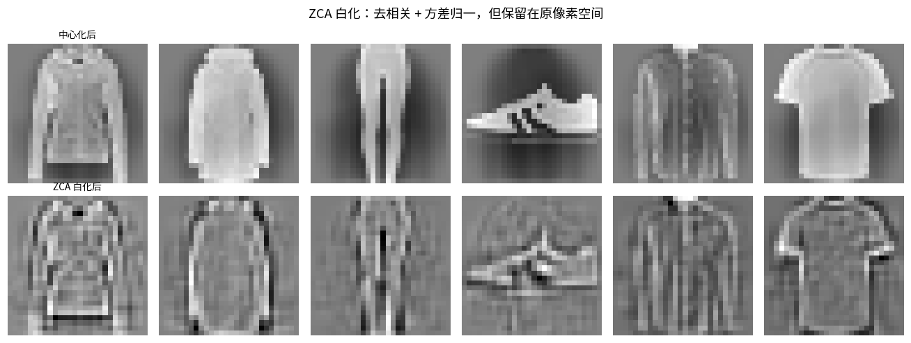

📖 **读图**：上排中心化图，下排 ZCA 白化图。白化后"边缘被增强、噪声被放大"——因为所有方向被拉到同方差，原本微弱的细节（往往是噪声）被放大到和主要结构一样强。**这解释了为什么白化在预处理里要慎用**。

---

## 13. 与你做的自监督（VICReg）的联系

| | 做法 | 协方差矩阵 |
|---|---|---|
| **PCA** | 数据给定，事后找坐标让协方差对角化 | 分析工具 |
| **VICReg 协方差项** | 训练时惩罚嵌入协方差的非对角元，让表示**天然**去相关 | 训练目标 |

$$\mathcal{L}_{\text{cov}}=\frac{1}{d}\sum_{i\ne j}C(Z)_{ij}^2$$

**"维度塌缩"**：表示只用了少数方向 → 特征值谱出现断崖（前几个巨大、后面趋近 0）→ 有效秩 → 1。

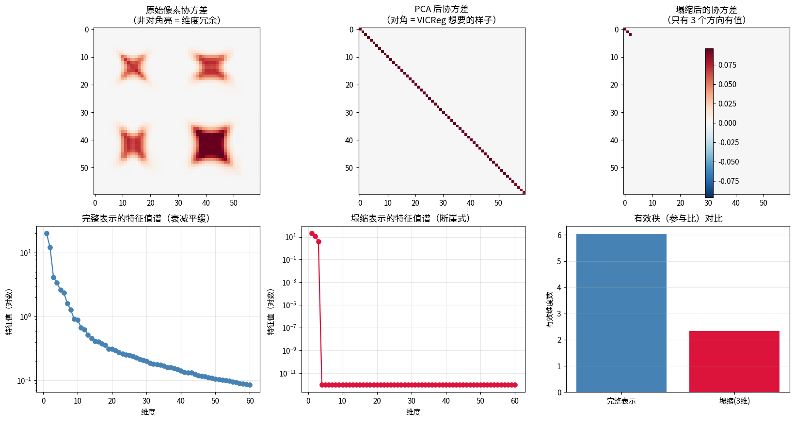

📖 **读图**：上排三张协方差热图：原始像素（冗余）→ PCA 后（对角）→ 人为塌缩到 3 维（几乎全黑，只剩左上角 3×3）。下排是特征值谱与有效秩柱状图：
- **完整表示**：谱衰减平缓，有效秩（参与比）**6.04**
- **塌缩表示**：前 3 个巨大，第 4 个起断崖到 ~0，有效秩掉到 **2.33**

**这就是"维度塌缩"的可视化定义**——你在训练里监控有效秩，看的就是这张谱图的形状。有效秩趋近 1 = 模型把所有样本塞进一根线里，表示没有信息量了。

> 延伸：论文清单里的 **VISReg** 批评"协方差只约束二阶统计、管不了分布形状"，**LeJEPA/SIGReg** 则直接要求嵌入分布趋近各向同性高斯——它们解决的是 PCA 这个层面之上的问题。

---

## 五步公式速记

1. 展平：$x\in\mathbb{R}^{784}$
2. 中心化：$X_c=X-\bar{x}$
3. 协方差：$C=\frac{1}{N-1}X_c^\top X_c$
4. 特征分解：$CV=V\Lambda$（或 SVD：$\lambda_i=\sigma_i^2/(N-1)$）
5. 投影 / 重建：$z=V_k^\top(x-\bar{x})$，$\hat{x}=\bar{x}+V_kz$

**三个必须记住的结论**
1. 特征值 = 该方向方差，特征向量 = 主成分方向
2. 重建误差下界 $=\sum_{j>k}\lambda_j$，PCA 达到这个下界（第 9、10 步已用实验验证）
3. 有效秩描述特征值谱的均匀程度，有效秩低 = 维度塌缩

## 易错点

1. **VICReg 的"方差项"其实是标准差**：$\max(0,\gamma-\sqrt{\text{Var}+\epsilon})$，论文变量名留下的历史问题
2. **中心化不能省**，否则 PC1 = 均值方向
3. **特征向量符号无意义**，比较时取绝对余弦相似度
4. **PCA 是线性的**，非线性结构要上 Kernel PCA / 流形学习
5. **降维 ≠ 丢信息**：丢的是方差最小的方向，往往正是噪声

## 动手题

1. 换成 MNIST 重跑，对比特征值谱（数字结构更简单，谱衰减更快？）
2. 只用单一类别（比如全是靴子）做 PCA，看主成分变成什么样
3. k=2 时哪两类分不开？为什么？（PCA 线性 + 无监督）
4. 上 `sklearn.decomposition.KernelPCA`，对比非线性效果 → 接上 Kernel VICReg
