# SVD 奇异值分解（第二课）

> 一句话：**任何矩阵都能拆成一堆"秩 1 矩阵"的加权和**，权重（奇异值）从大到小排。只留前 k 项，就是原矩阵在最小误差意义下的最佳简化。

- **数据集**：STL-10（96×96 彩色，`桌面/师生距离比值路线/data/stl10`，9/28 下载）+ Fashion-MNIST（回顾第一课）

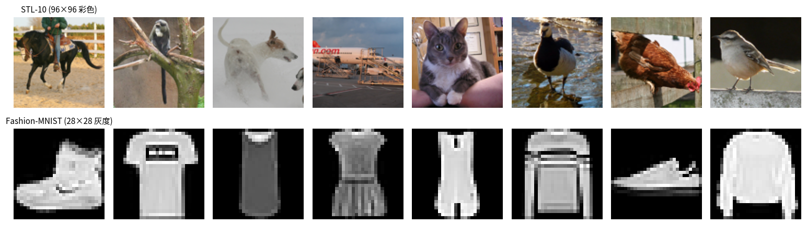

📖 **读图**：本课用的 STL-10 测试集样例（96×96 彩色，8000 张）。后面所有「秩 k 近似 / 压缩比 / PSNR」都是在这些图上做的。
- **可运行代码**：`桌面/学习/02_SVD奇异值分解.ipynb`（kernel 选 `Python (xx)`）
- **与第一课的关系**：PCA 是 SVD 在"统计量"上的应用（中心化 + 协方差）。SVD 本身是纯矩阵工具，不需要"数据/样本"的概念——**先学 SVD 再回头看 PCA，会通透很多**

---

## 1. 秩 1 矩阵长什么样

**定义**：$A=u\,v^\top\in\mathbb{R}^{m\times n}$，即 $A_{ij}=u_i v_j$。

**为什么它是"积木"**：每一行都是 $v^\top$ 的倍数、每一列都是 $u$ 的倍数——一张 $m\times n$ 的图只需要 $m+n$ 个数就能存下。任何复杂矩阵都是这些积木的加权和。

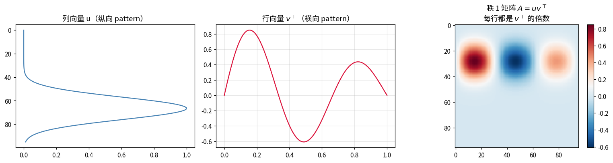

📖 **读图**：左图列向量 $u$（纵向 pattern，一个峰），中图行向量 $v^\top$（横向 pattern，衰减振荡），右图是它们的外积——**行是 $v^\top$ 的复制、列是 $u$ 的复制**，图案完全"可分离"。秩 1 矩阵的信息量极小，但它是 SVD 的原子。

## 2. SVD 的定义与几何意义

$$A=U\Sigma V^\top=\sum_{i=1}^{r}\sigma_i u_i v_i^\top$$

| 符号 | 形状 | 含义 |
|---|---|---|
| $U$ | $m\times m$ | 左奇异向量，正交列（$U^\top U=I$） |
| $\Sigma$ | $m\times n$ | 对角阵，$\sigma_1\ge\sigma_2\ge\dots\ge0$ 为**奇异值** |
| $V$ | $n\times n$ | 右奇异向量，正交列 |

**几何意义**：任何线性变换 = **旋转（$V^\top$）→ 沿轴拉伸（$\Sigma$）→ 再旋转（$U$）**。所以 $A$ 把单位圆变成椭圆，**椭圆半轴长度 = 奇异值，半轴方向 = 左奇异向量**。

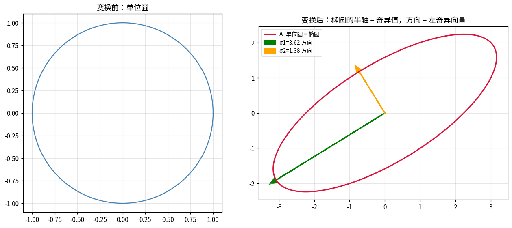

📖 **读图**：左图单位圆，右图被 $A=\begin{psmallmatrix}3&1\\1&2\end{psmallmatrix}$ 拉成椭圆。两支绿色/橙色箭头就是 $u_1,u_2$，长度是 $\sigma_1=3.62,\ \sigma_2=1.38$。**注意箭头互相垂直**——正交性保证 SVD 总存在（任何实矩阵都有 SVD，这是它比特征分解普适的地方：特征分解只对方阵、且不保证实特征值）。

## 3. 奇异值谱与能量分布

**Frobenius 范数**：$\|A\|_F^2=\sum_i\sigma_i^2$（全部元素的平方和）。所以第 $k$ 个奇异值的"能量占比"是 $\sigma_k^2/\sum\sigma_j^2$。

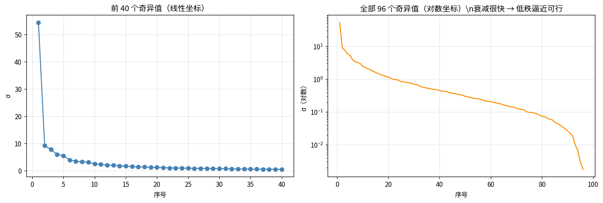

📖 **读图**：左图前 40 个奇异值，第 1 个（54.42）远高于第 2 个（9.13），之后长尾衰减；右图对数坐标下近似直线下降。**这张图的背景（天空）非常单调，所以谱特别陡**——能量 90% 只要 **1 个**奇异值，99% 只要 **12 个**（总秩 96）。

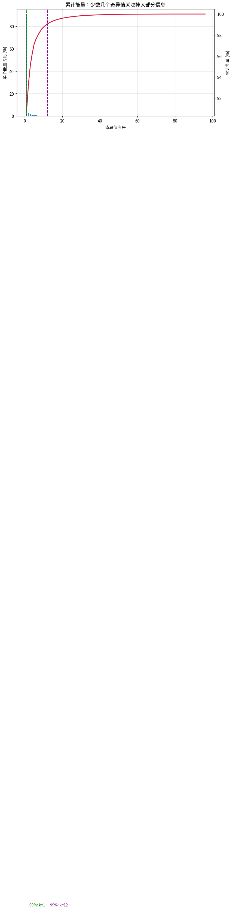

📖 **读图**：蓝柱是单个奇异值能量占比，红曲线是累计。**累计曲线越早上凸 = 数据越低秩 = 压缩空间越大。** 有效秩：参与比 5.88、熵秩 1.71（总维度 96）——这张图实际上只活在很少几个方向上。

## 4. 低秩逼近（Eckart–Young 定理）

只留前 k 项：$A_k=U_k\Sigma_k V_k^\top$。

> **定理（Eckart–Young–Mirsky）**：在所有秩 ≤ k 的矩阵中，$A_k$ 与 $A$ 距离最小，且
> $$\|A-A_k\|_2=\sigma_{k+1},\qquad \|A-A_k\|_F=\sqrt{\textstyle\sum_{i>k}\sigma_i^2}$$

**这就是第一课 PCA 最优性的"矩阵版"**——那边是 $\sum_{j>k}\lambda_j$，这边是 $\sum_{i>k}\sigma_i^2$，本质相同（$\lambda=\sigma^2/(N-1)$）。

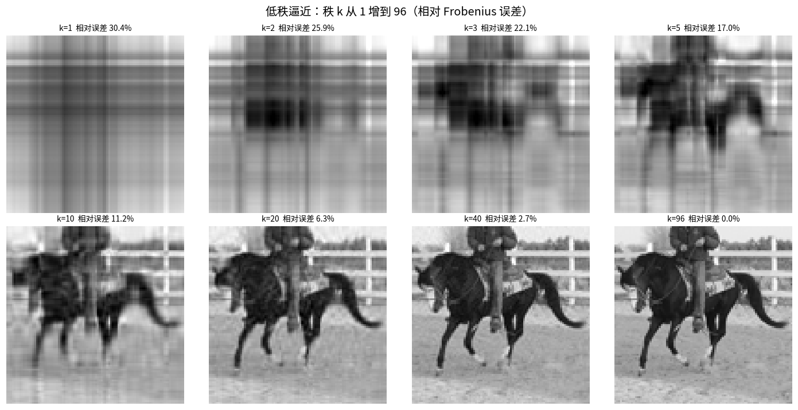

📖 **读图**：秩 k 从 1 到 96 的重建。k=1 时只剩一张"平均亮度版"，k=5 出现主要色块，k=20 结构基本齐全（相对误差 6.3%），k=40 几乎无差别（2.7%）。

**定理的数值验证**（谱范数误差应恰好等于 $\sigma_{k+1}$）：

| k | 实测 $\|A-A_k\|_2$ | $\sigma_{k+1}$ | 差 |
|---|---|---|---|
| 1 | 9.134622 | 9.134622 | 1.1e-14 |
| 20 | 1.074557 | 1.074557 | 1.3e-15 |
| 50 | 0.290607 | 0.290607 | 1.7e-16 |

**分毫不差**——机器精度级别。

## 5-6. 图像压缩

**要存多少数**：原图 $m\times n$ 存 $mn$ 个数；秩 k 只需 $k(m+n+1)$ 个。压缩比 $=\dfrac{mn}{k(m+n+1)}$。

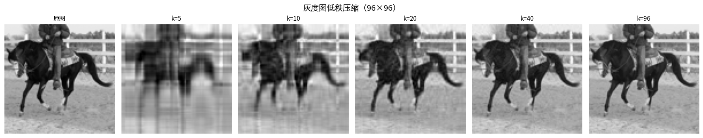

📖 **读图**：灰度图 k=1→96。k=5 已经能看出主体（因为第 1 个奇异值独占 90% 能量，背景太单调了），k=20 结构齐全。

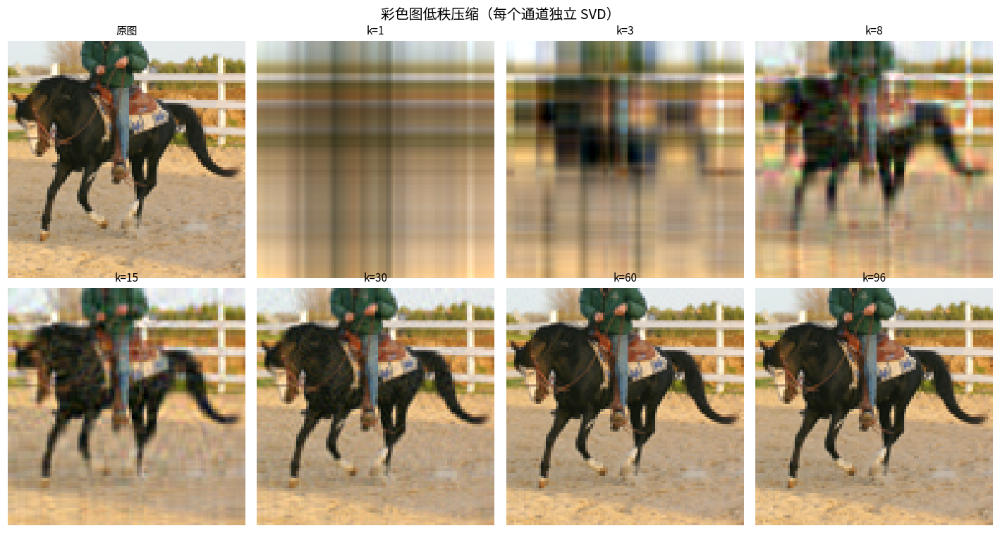

📖 **读图**：彩色图对 R/G/B 三个通道各做一次 SVD。k=8 时整体色调和构图都在，但细节纹理糊；k=30 之后与原图几乎无差别。**注意彩色图有效秩更高**——三个通道各有一套谱，且物体表面纹理丰富。

## 7. 误差 vs 压缩率

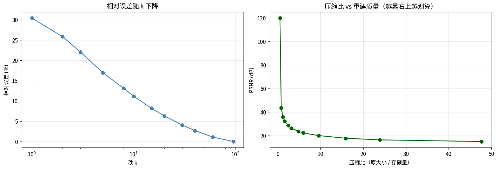

📖 **读图**：左图相对误差随 k 下降（对数横轴）；右图是"压缩比 vs PSNR"的**性价比曲线**——越靠右上越划算。几个代表点：

| k | 相对误差 | 压缩比 | PSNR |
|---|---|---|---|
| 5 | 16.96% | 9.55× | 19.92 dB |
| 10 | 11.18% | 4.78× | 23.54 dB |
| 20 | 6.33% | 2.39× | **28.48 dB** |
| 40 | 2.71% | 1.19× | 35.85 dB |

**k=20 是性价比拐点**：2.4 倍压缩只损失 6% 信息。k>40 后压缩比 <2，意义不大。

## 8. 去噪：为什么低秩能滤噪声

**原理**：真实图像近似低秩，而**随机噪声是满秩的**——它均匀铺在所有奇异方向上。截断 SVD 只留前 k 个方向，噪声所在的方向被整体丢掉。

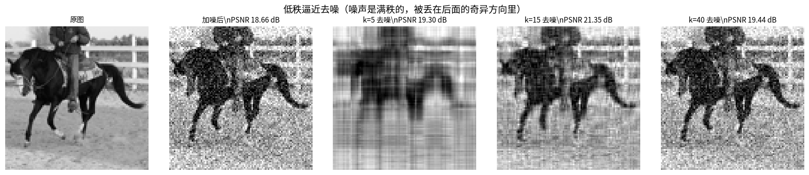

📖 **读图**：加 σ=0.12 高斯噪声后 PSNR 掉到约 14 dB；k=15 去噪后回升明显，k=40 更干净。注意 k 太大时噪声也会被保留回来（k=96 等于没去噪）——**去噪的 k 是"结构 vs 噪声"的权衡**。

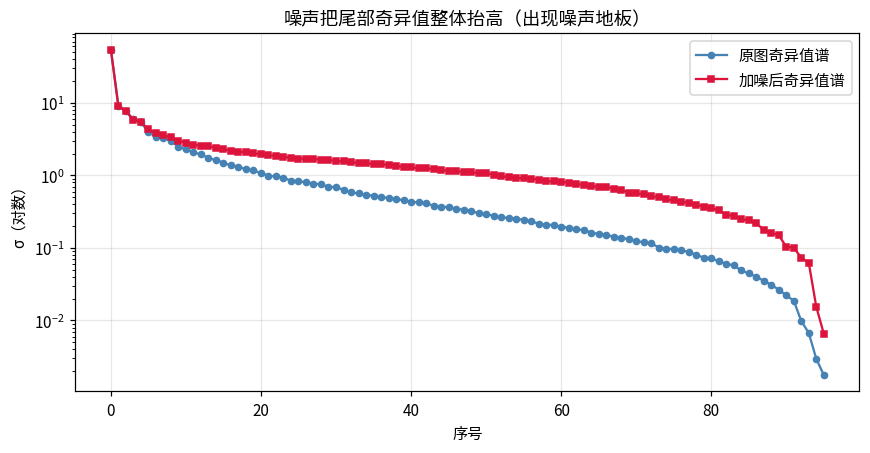

📖 **读图**：噪声对谱的影响一目了然——加噪后（红）**尾部奇异值被整体抬高**，出现一段"噪声地板"，因为它对所有方向均匀加方差。去噪的本质 = 把地板以上的部分裁掉。**这个"谱上找地板拐点"的做法，就是自监督里判断表示质量的思想源头之一**。

## 9. 左/右奇异向量

对图像：$u_i$ 是纵向 pattern、$v_i$ 是横向 pattern，第 i 个分量 $\sigma_i u_i v_i^\top$ 是它们的外积。

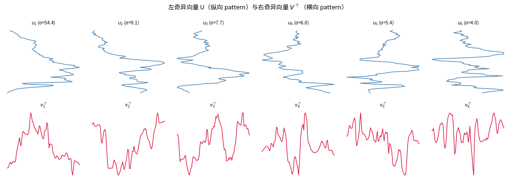

📖 **读图**：上排 $u_1..u_6$（纵向），下排 $v_1..v_6$（横向）。第 1 对是大尺度结构，越往后振荡越快、越像噪声——**从粗到细的层级**，和 PCA 的"特征服装"一样。

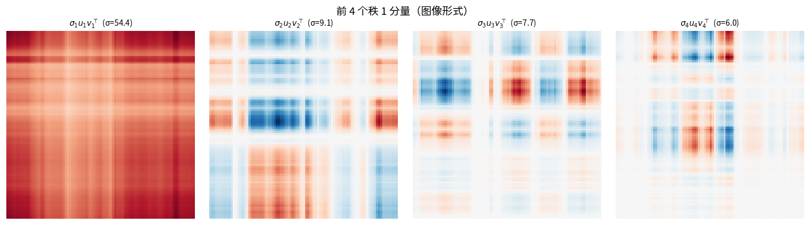

📖 **读图**：前 4 个秩 1 分量的图像。注意它们是**有正有负**的（红蓝），重建时按系数 $z_i=u_i^\top A v_i$ 加减叠加。

## 10. 与 PCA 的关系（第一课回顾）

对已中心化数据 $X_c$ 做 SVD：$X_c=U\Sigma V^\top$，则

- $V$ 的列 = **主成分方向**
- $\lambda_i=\sigma_i^2/(N-1)$

**PCA 就是"中心化后做 SVD"**。实测（Fashion-MNIST 5000 张）：

- 两种途径特征值：SVD [19.7329, 12.4999, …] vs eigh [19.7329, 12.4999, …]，**最大相对误差 2.88e-15**（机器精度）
- 前 10 个主成分方向余弦相似度全部 > 0.99

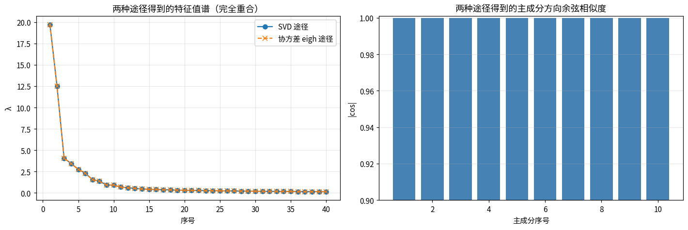

📖 **读图**：左图两条曲线完全重合；右图 10 根柱子都顶到 1.0。**第一课的 PCA 和这一课的 SVD 从此打通：同一件事的两种算法路径**。SVD 数值上更稳（不用显式算 $X_c^\top X_c$），所以 sklearn 内部用的就是 SVD。

## 11. 伪逆、最小二乘与条件数

**伪逆**：$A^+=V\Sigma^+U^\top$（非零奇异值取倒数）。最小二乘 $\min_x\|Ax-b\|$ 的最优解 $x=A^+b$。

**条件数**：$\kappa(A)=\sigma_{\max}/\sigma_{\min}$，衡量"输入扰动被放大的倍数"。

实测对比：

| 矩阵 | 奇异值 | 条件数 | b 扰动 1e-6 → 解的变化 |
|---|---|---|---|
| 良态 $\mathrm{diag}(2,1)$ | [2, 1] | 2 | 1e-6（1 倍放大） |
| 病态 $\mathrm{diag}(2,10^{-6})$ | [2, 1e-6] | **2×10⁶** | **1.0（放大一百万倍）** |

伪逆解与 `lstsq` 完全一致：[2.4635, 1.1284]。

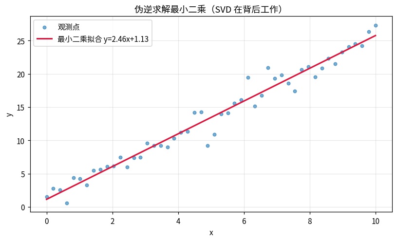

📖 **读图**：50 个带噪观测点，SVD 伪逆拟合出 $y=2.46x+1.13$（真实 2.5 和 1.0，噪声导致的偏差正常）。**你每天用的 `np.linalg.lstsq`、线性回归、乃至神经网络的初始化分析，背后都是 SVD**。

## 12. 低秩补全（推荐系统的原理）

用户-物品矩阵巨大、稀疏、**近似低秩**（人的偏好由少数隐因子决定）。迭代补全：`截断 SVD → 低秩估计填回缺失位 → 重复`。

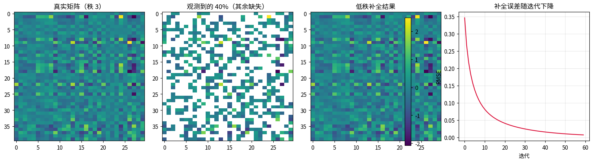

📖 **读图**：真实矩阵秩 3（左），抹掉 60% 只留 40%（左二），迭代 SVD 补全结果（右二）与真实几乎一样，RMSE 0.0069（取值范围 ±2.49，误差 <0.3%）。右图误差随迭代指数下降。**Netflix Prize 的核心思想就是这个的工业级版本**，也是"矩阵补全理论"（Candès & Recht）的玩具演示。

## 13. 与自监督的联系：低秩 = 塌缩

第一课说过：塌缩 = 特征值谱不均。SVD 语言：**嵌入矩阵 $Z$ 的奇异值集中在极少数几个上**。

实测三种 128 维嵌入（各向同性 / 部分塌缩 20 维 / 完全塌缩）：

| 嵌入 | 参与比 | 熵秩 |
|---|---|---|
| 健康（各向同性） | 125.96 | 123.99 |
| 部分塌缩（20/128） | 31.55 | 21.79 |
| 完全塌缩 | **1.24** | **1.00** |

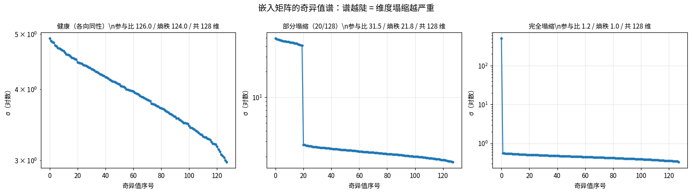

📖 **读图**：三张谱图从平到陡。健康的谱是水平线（所有方向等方差）；部分塌缩前 20 个高、后面塌下去；完全塌缩只剩 1 根柱子。**你在自监督训练里画"有效秩曲线"，画的就是这个**。LeJEPA/SIGReg 要求嵌入分布接近各向同性高斯，目标就是让这张谱保持水平。

---

## 小结

**SVD 一句话**：$A=\sum_i\sigma_iu_iv_i^\top$，任何矩阵都是秩 1 积木的加权和。

**四个必须记住的结论**
1. **Eckart–Young**：截断 SVD 是最佳秩 k 近似，$\|A-A_k\|_2=\sigma_{k+1}$（机器精度验证）
2. **能量集中**：少数奇异值吃掉大部分 $\sum\sigma^2$ → 压缩/去噪可行
3. **PCA = 中心化 + SVD**：$\lambda_i=\sigma_i^2/(N-1)$（机器精度验证）
4. **谱的形状 = 信息的分布**：谱越陡有效秩越低，"塌缩"就是谱塌了

## 动手题

1. 换几张不同的 STL-10 图，比奇异值谱——哪类图更"低秩"？（天空/墙面多的图更集中）
2. 去噪实验把噪声加大到 0.3，看最优 k 怎么变
3. 矩阵补全把"猜的秩"故意设错（10 或 2），看恢复退化
4. 思考：为什么 CNN 的特征图常常低秩？（关联模型压缩里的"低秩分解"）
