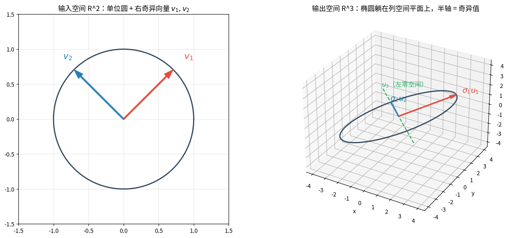
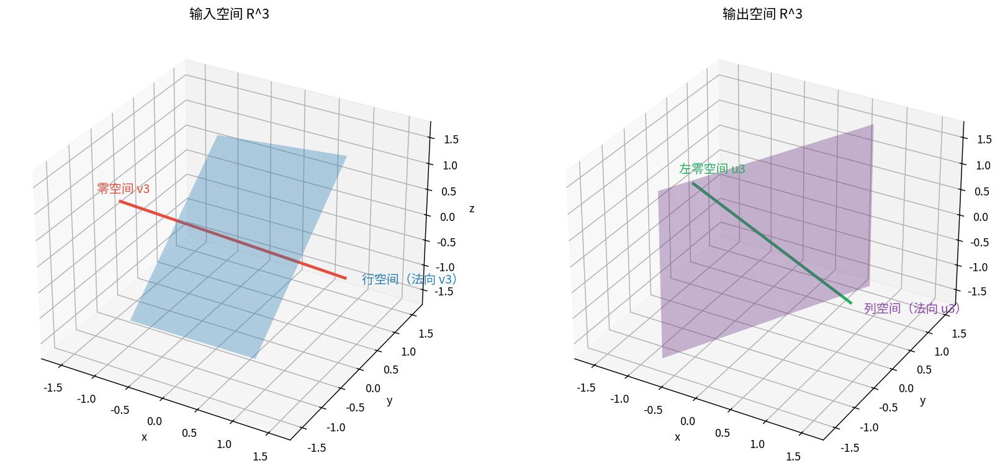
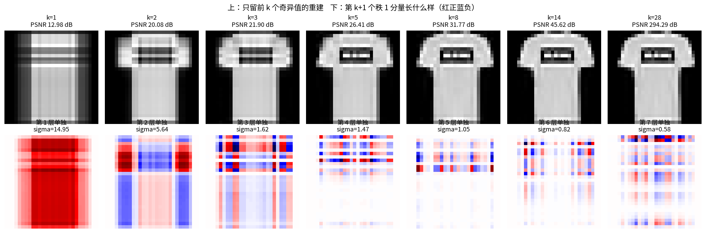
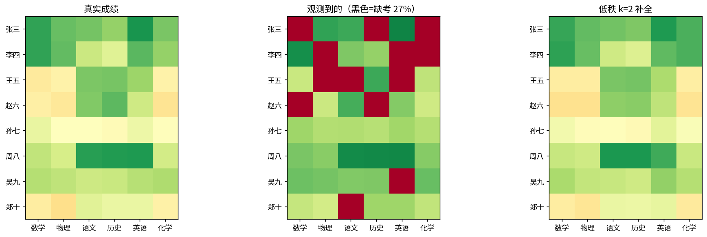
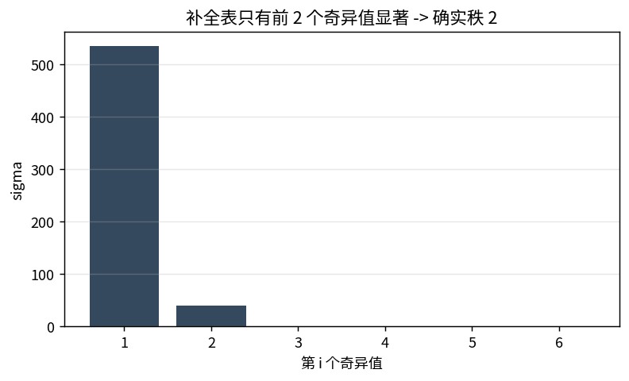
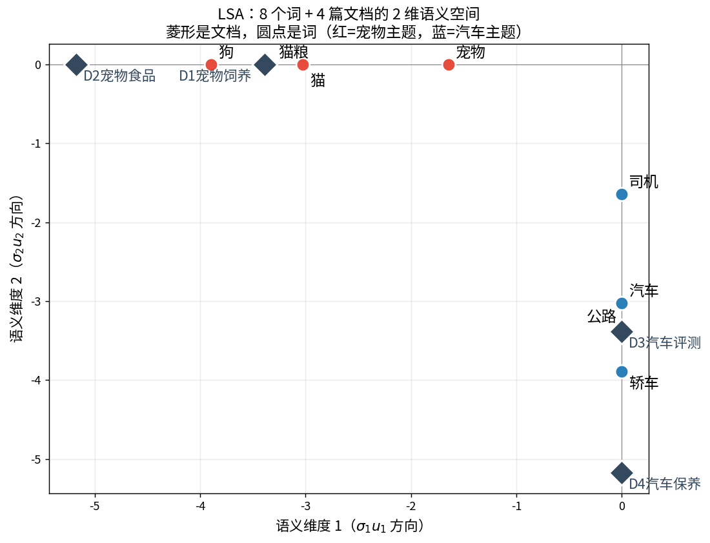
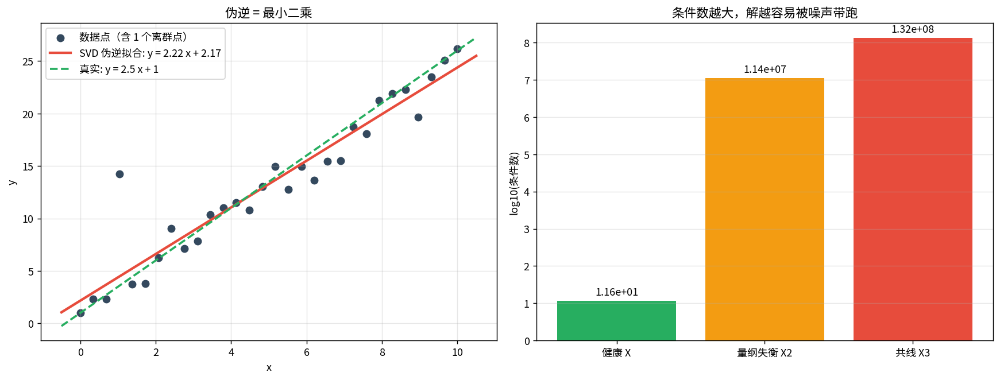
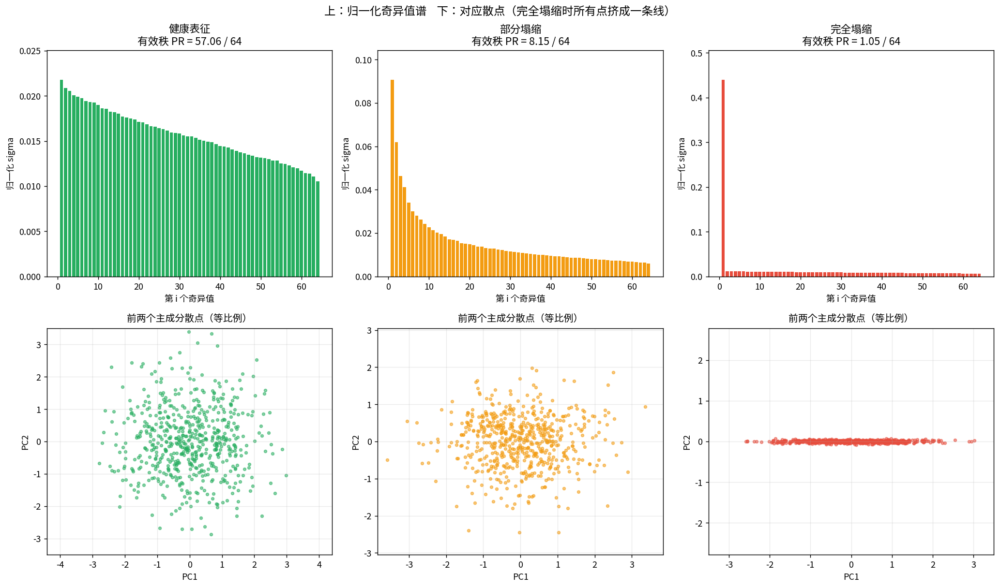

# SVD 手算拆解与实例映射（第二课补充）

> 第二课没看懂，正常——第二课直接上了大矩阵和图像，**没有一处是能拿纸笔算完的**。
> 这一课全部用小矩阵手算，每一步都把矩阵打印出来，配 5 个实际场景。

---

## 0 · 先记住三句话

**① 分解式**：任意矩阵 $A$（m×n）都能写成
$$A = U\Sigma V^\top$$
$U$：m×m 正交阵（**输出空间**的坐标系）；$\Sigma$：m×n 对角阵，对角线是奇异值 $\sigma_1\ge\sigma_2\ge\dots\ge0$；$V$：n×n 正交阵（**输入空间**的坐标系）。

**② 几何**：$A$ 的作用 = 先旋转（$V^\top$）→ 按 $\sigma_i$ 拉伸 → 再旋转（$U$）。所以**单位圆过 $A$ 变成椭圆**，椭圆半轴长 = 奇异值，半轴方向 = 左奇异向量。

**③ 代数**：$A=\sum_i \sigma_i u_i v_i^\top$，一堆**秩 1 矩阵的加权和**，权重从大到小。截前 k 项 = 最佳低秩近似。

---

## 1 · 手算 3×2 矩阵（全程可笔算）

$$A=\begin{bmatrix}3&1\\1&3\\1&1\end{bmatrix}$$

### 为什么入口是 $A^\top A$

$A^\top A$ 一定**对称半正定** → 一定有正交特征向量组（这就是 $V$ 存在的保证）。而且：
$$A^\top A = V\Sigma^\top \underbrace{U^\top U}_{I}\Sigma V^\top = V(\Sigma^\top\Sigma)V^\top$$
所以 **$A^\top A$ 的特征向量 = $V$，特征值 = $\sigma^2$**。

### 五步流程

| 步   | 做什么                         | 本例结果                                                                                                                                                  |
| --- | --------------------------- | ----------------------------------------------------------------------------------------------------------------------------------------------------- |
| 1   | 算 $G=A^\top A$              | $\begin{bmatrix}11&7\\7&11\end{bmatrix}$（9+1+1=11，3+3+1=7，1+9+1=11）                                                                                   |
| 2   | 求 $G$ 的特征值/向量               | $\lambda_1=11+7=18$，$\lambda_2=11-7=4$；$v_1=\frac{1}{\sqrt2}\begin{bmatrix}1\\1\end{bmatrix}$，$v_2=\frac{1}{\sqrt2}\begin{bmatrix}1\\-1\end{bmatrix}$ |
| 3   | $\sigma_i=\sqrt{\lambda_i}$ | $\sigma_1=3\sqrt2\approx4.2426$，$\sigma_2=2$                                                                                                          |
| 4   | $u_i=A v_i/\sigma_i$        | $u_1=\begin{bmatrix}2/3\\2/3\\1/3\end{bmatrix}$，$u_2=\begin{bmatrix}1/\sqrt2\\-1/\sqrt2\\0\end{bmatrix}$                                              |
| 5   | 补齐 $U$ 剩余列                  | $u_3=u_1\times u_2=\frac{1}{\sqrt{18}}\begin{bmatrix}1\\1\\-4\end{bmatrix}$（左零空间方向）                                                                   |

**步骤 4 手算示范**（以 $u_1$ 为例）：
$$Av_1=\frac{1}{\sqrt2}\begin{bmatrix}3+1\\1+3\\1+1\end{bmatrix}=\frac{1}{\sqrt2}\begin{bmatrix}4\\4\\2\end{bmatrix},\qquad
u_1=\frac{Av_1}{3\sqrt2}=\frac{1}{\sqrt2\cdot 3\sqrt2}\begin{bmatrix}4\\4\\2\end{bmatrix}=\begin{bmatrix}4/6\\4/6\\2/6\end{bmatrix}$$

**步骤 5 为什么要叉乘**：$u_1,u_2$ 张成列空间（$\mathbb R^3$ 里一个平面），与之垂直的方向就是 $A^\top$ 的零空间。三维里两个向量的叉乘天然给出垂直方向。 notebook 里验证了 $A^\top u_3=0$（精确为 0）。

**验证**：$U\Sigma V^\top$ 与 $A$ 的最大绝对误差 = **4.4×10⁻¹⁶**（机器精度）。两层秩 1 相加的误差 = 8.9×10⁻¹⁶。

### 📖 这张图怎么读

- **左（输入空间 $\mathbb R^2$）**：黑圆是单位圆上所有点；红箭头 $v_1$、蓝箭头 $v_2$ 是两个右奇异向量，**互相垂直**。
- **右（输出空间 $\mathbb R^3$）**：黑椭圆是所有 $Ax$ 的落点。它**躺在一个平面上**（这就是列空间）。
- 红/蓝箭头 $\sigma_1u_1$、$\sigma_2u_2$ 是椭圆的两条半轴：**长度恰好等于奇异值 4.24 和 2**。
- 绿色虚线 $u_3$ 垂直于椭圆所在平面——输出永远不会朝这个方向跑。
- 一句话：**SVD 就是把「圆→椭圆」这件事里的旋转、拉伸、旋转三步各自拆出来。**

### 和 numpy 对一下

numpy 的 $V$ 与手算差一个整体正负号（$\begin{bmatrix}-0.7071&-0.7071\\0.7071&-0.7071\end{bmatrix}$ vs 手算 $\begin{bmatrix}0.7071&0.7071\\-0.7071&0.7071\end{bmatrix}$）。
**这不是错**：特征向量取反仍是特征向量，且 $\sigma_i(-u_i)(-v_i)^\top=\sigma_iu_iv_i^\top$ 不变。只要 $\Sigma$ 一致、$U\Sigma V^\top$ 一致即正确。

---

## 2 · 四个基本子空间（SVD 一次给全）

换降秩矩阵 $B=\begin{bmatrix}1&2&3\\2&4&6\\1&1&2\end{bmatrix}$（第 2 行 = 2×第 1 行 → 秩 2）。

$Bv_i=\sigma_iu_i$ 这一条式子同时给出四个子空间：

| 子空间 | 维度 | 由谁张成 | 直观含义 |
|---|---|---|---|
| 行空间 Row | r=2 | $v_1,v_2$ | 输入里「会被映射」的方向 |
| 零空间 Null | n−r=1 | $v_3$ | 输入里「直接归零」的方向：$Bv_3=0$ 精确成立 |
| 列空间 Col | r=2 | $u_1,u_2$ | 输出能到达的全部范围 |
| 左零空间 | m−r=1 | $u_3$ | 输出永远到不了的方向 |

### 📖 这张图怎么读

- **左 = 输入空间**：蓝平面是行空间（法向恰为 $v_3$），红直线是零空间（沿 $v_3$）。二者垂直。
- **右 = 输出空间**：紫平面是列空间（法向 $u_3$），绿直线是左零空间（沿 $u_3$）。二者垂直。
- **维数恒等式**：$r+(n-r)=2+1=3=n$，输入空间被**恰好**分成「有用 + 白给」两块。

---

## 3 · 实例 1：图像 = 秩 1 图像的加权叠加

把一张 28×28 的 Fashion-MNIST（T 恤）当矩阵。SVD 后：
$$A=\underbrace{\sigma_1u_1v_1^\top}_{\text{最粗轮廓}}+\underbrace{\sigma_2u_2v_2^\top}_{\text{结构}}+\cdots$$

实测前 8 个奇异值：`14.95, 5.64, 1.62, 1.47, 1.05, 0.82, 0.58, 0.52`。**第 1 层单独占 84.98% 能量**。

### 📖 这张图怎么读

- **上排**：只留前 k 个奇异值的重建。k=1 是一团横条纹（第 1 层秩 1 矩阵只能表达「按行重复的图案」）；k=2 出现袖子；k=3 以后补领口、布料细节。
- **下排**：第 1~7 个秩 1 分量各自长什么样（红=正值、蓝=负值）。第 1 层是大块红条纹，越往后的层越碎——它们在**逐层修正误差**，而不是逐层加细节。
- **存储账本**（原图 784 个数）：

| k | 存储 | 压缩 | PSNR |
|---|---|---|---|
| 1 | 57 | 13.75× | 12.98 dB |
| 3 | 171 | 4.58× | 21.90 dB |
| 5 | 285 | 2.75× | 26.41 dB |
| 10 | 570 | 1.38× | 36.35 dB |

- **为什么不存 784 个像素，只存 $k$ 组 $(u_i,\sigma_i,v_i)$？** 因为 SVD 保证这是同等存储量下**误差最小**的方案（Eckart–Young）。

---

## 4 · 实例 2：学生成绩矩阵（推荐系统的原型）

造一份 8 学生 × 6 课程的秩 2 成绩表（隐因子：综合能力 $p_s$ × 课程给分松紧，文理倾向 $t_s$ × 课程文理属性），挖掉 27.1% 当缺考，看能不能补回来。

**低秩假设的含义**：成绩不是随机的，由少数隐因子决定——$\text{score}_{sc}\approx$ 少数几个 $p_{s}^{(i)}q_{c}^{(i)}$ 之和 → 整张表是低秩矩阵。

| 方法 | 缺考格子 RMSE |
|---|---|
| 行均值基线（用该学生平均分填） | 8.18 分 |
| 低秩 k=1 | 7.80 分 |
| **低秩 k=2** | **3.09 分** |
| 低秩 k=3 | 7.68 分 |

### 📖 这两张图怎么读

- **fig04 左**：真实成绩。张三/李四（理科倾向 +）数学物理高、语文历史低；周八整体高。
- **fig04 中**：挖掉 27.1%（红色 = 缺考）。
- **fig04 右**：k=2 补全，模式和左边几乎一样。
- **fig04b**：补全表的奇异值 `535.6, 39.9, 0, 0, 0, 0` —— 迭代强制低秩后，**谱自己告诉你它就是秩 2**。
- **两个细节**：
  1. **k=3 比 k=2 差**（7.68 vs 3.09）：第 3 个因子在拟合噪声。k 不是越大越好，**看谱的断崖位置**。
  2. **因子符号任意**：因子 2 与构造时文理倾向的相关系数是 −0.94（接近 ±1 即可），因为 $u_i,v_i$ 同时取反时 $\sigma_iu_iv_i^\top$ 不变。

**映射到现实**：Netflix / 「猜你喜欢」= 行是用户、列是物品、99% 格子为空的这张表。同时「看谱断崖定 k」和你自监督里看**有效秩**用的是同一个信号。

---

## 5 · 实例 3：词-文档矩阵（LSA 语义检索）

8 个词 × 4 篇短文的共现矩阵。**「宠物」只在 D1（饲养）出现、「猫粮」只在 D2（食品）出现——两词共现为 0，字面上完全无关**，但显然是同类。

| 词对 | 原始余弦 | k=2 低秩后 |
|---|---|---|
| 宠物-猫粮 | **0.000** | **1.000** |
| 司机-公路 | **0.000** | **1.000** |
| 猫-猫粮 | 0.243 | 1.000 |
| 猫-汽车 | 0.000 | −0.000 |

### 📖 这张图怎么读

- 红点（宠物主题 4 词）落在**同一条水平射线**上，蓝点（汽车主题 4 词）落在**同一条竖直射线**上，两条线互相垂直。
- 深色菱形是 4 篇文档，各自靠近自己主题的词。
- **SVD 做了什么**：它发现 D1 和 D2 总是在同一批词上一起出现 → 判定它们是同一个主题 → 把「宠物」「猫粮」都拉到这个主题方向上。
- **没有乱脑补**：跨主题的格子（猫×汽车评测）在低秩矩阵里仍然是 0。
- 这就是 **LSA**，现代 embedding / 词向量的祖宗。你的自监督表征做的也是同一件事：**把「该靠近的」拉到同一方向，不同类之间拉开。**

---

## 6 · 实例 4：伪逆与最小二乘

拟合 $y=ax+b$ 写成矩阵 $X\beta=y$（30 行 × 2 列，超定、一般无解）。SVD 给出解：
$$X=U\Sigma V^\top \;\Rightarrow\; X^{+}=V\Sigma^{+}U^\top,\quad \hat\beta=X^{+}y$$
$\Sigma^{+}$ 把每个非零 $\sigma$ 取倒数；**接近 0 的 $\sigma$ 要直接置 0**（截断），否则放大 $1/\sigma$ 倍噪声。

实测三种算法（SVD 手算 / `lstsq` / `pinv`）给出完全一致的结果：$a=2.2218,\ b=2.1699$（真实 2.5 / 1.0，被离群点拉偏）。

### 📖 这张图怎么读

- **左**：红实线是 SVD 伪逆拟合，绿虚线是真实关系。x=1 处那个离群点（+12）把斜率从 2.5 拉到 2.22。
- **右**：三种矩阵的条件数 $\kappa=\sigma_1/\sigma_r$：
  - 健康 X：**11.6**
  - 量纲失衡（第一列 ×10⁶）：**1.1×10⁷**
  - 两列几乎共线：**1.3×10⁸**
- 条件数大 = 矩阵「接近不可逆」= 解会被噪声放大 $\kappa$ 倍。**截断小奇异值 = ridge 岭回归的原型**。
- 这也解释了第二课的病态实验：κ=2 的矩阵扰动只放大 2 倍，κ=2×10⁶ 放大 100 万倍。

---

## 7 · SVD 与 PCA 到底什么关系（5×3 手算验证）

对**已中心化**的数据矩阵 $X$：
$$X=U\Sigma V^\top \;\Longrightarrow\; \underbrace{\tfrac{1}{n-1}X^\top X}_{\text{协方差}}=V\frac{\Sigma^2}{n-1}V^\top$$

| 路线 A：直接对 $X$ 做 SVD | 路线 B：协方差特征分解 |
|---|---|
| $V$ 的列 | 主成分方向（特征向量） |
| $\sigma_i^2/(n-1)$ | 第 i 主成分方差（特征值） |
| $U\Sigma$ | 主成分得分 |

实测两条路线的特征值**逐位相等**，$V$ 与特征向量在允许反号意义下一致；得分矩阵 $X_cV$ 与 $U\Sigma$ 之差 = 8.3×10⁻¹⁷。

**两个坑（实测）**
1. **不中心化会歪**：直接对原始 $X$ 做 SVD，第 1 个「主成分」只在描述均值位置，不是变化方向。这就是 PCA 必须先减均值的根本原因。
2. 本例 5×3 小矩阵 PC1 解释 72.15%、PC2 27.74%、PC3 0.10% —— 第 3 列特征数量级太小（0.6 vs 4），几乎没贡献方差。

> **一句话**：PCA 就是「先中心化，再做 SVD」。PCA 是 SVD 的一个用法，SVD 是更一般的工具。

---

## 8 · 实例 5：表征塌缩（直接接你的自监督实验）

backbone 输出 $Z\in\mathbb R^{N\times d}$（600 样本 × 64 维）。对它做 SVD，**谱的形状就是诊断器**。

$$\text{有效秩 PR}=\frac{\left(\sum_i\sigma_i^2\right)^2}{\sum_i\sigma_i^4}\quad
\begin{cases}\text{只有一个非零 }\sigma\to \text{PR}=1\\ \text{d 个相等的 }\sigma\to \text{PR}=d\end{cases}$$

| 造的表征 | 有效秩 | 最大奇异值占比 |
|---|---|---|
| 健康（各方向方差接近） | **57.06** / 64 | 2.2% |
| 部分塌缩（方差快速衰减） | **8.15** / 64 | 9.1% |
| 完全塌缩（样本只沿一个方向浮动） | **1.05** / 64 | 40%+ |

### 📖 这张图怎么读

- **上排**：健康谱缓慢下降（PR 57）；部分塌缩指数式衰减（PR 8）；完全塌缩只剩 1 根柱子（PR 1.05）。
- **下排（等比例坐标）**：健康 = 圆云；部分 = 仍是一团；**完全塌缩 = 一条水平线**——所有样本挤在一维上，维度全废。
- **接你的实验**：训完先算 PR。掉到个位数 = 表征塌了。VICReg 的**方差项** = 强行把每个方向 std 顶到阈值以上（不让谱衰减太快）；**协方差项** = 让谱更平（去相关）。两者合起来 = **抬高有效秩**。

---

## 9 · SVD 速查表

| 你问的问题 | SVD 的回答 |
|---|---|
| 信息集中在哪？ | 看 $\sigma_i$ 分布，前几个占多少能量 |
| 能不能压缩？ | 留前 k 项，存 $k(m+n+1)$ 个数，谱范数误差 $=\sigma_{k+1}$ |
| 输入哪个方向最重要？ | $v_1$ |
| 输出落在哪？ | $\text{span}(u_1..u_r)$ = 列空间 |
| 接近不可逆吗？ | 最小 $\sigma$ 接近 0；条件数 $\sigma_1/\sigma_r$ |
| 超定方程怎么解？ | $X^{+}=V\Sigma^{+}U^\top$，小 $\sigma$ 截断 |
| 缺失值怎么补？ | 强制低秩 + 迭代 SVD 截断 |
| 词/文档语义在哪？ | $U,V$ 投影到同一个 k 维空间（LSA） |
| 表征塌没塌？ | $\text{PR}=(\sum\sigma^2)^2/\sum\sigma^4$ |

**和 PCA 的关系一句话**：中心化后 $V$=主成分方向、$\sigma^2/(n-1)$=方差、$U\Sigma$=得分。PCA 是 SVD 的一个用法。

---

## 关联

- 前置：[[02-SVD奇异值分解/SVD奇异值分解|第二课 SVD]]（大矩阵、图像压缩、条件数实验）
- 第一课：[[01-PCA主成分分析/PCA主成分分析|PCA]]（本课第 7 段给出手算级证明）
- 下一课衔接：有效秩会反复出现——它是你「师生距离比值路线」的核心诊断指标之一
