# KMeans 聚类（第三课）

> 一句话：**找 k 个中心，让每个样本到自己中心的距离平方和最小**。算法只有两步来回倒腾：**分配 → 更新中心**，每步都让目标函数不增，所以必然收敛。

- **数据集**：Fashion-MNIST 测试集 10000 张（承接第一、二课的 PCA/SVD）+ 三个合成玩具数据集
- **可运行代码**：`桌面/学习/03_KMeans聚类.ipynb`（kernel 选 `Python (xx)`）
- **与你的关系**：这一课的第 9 步就是你在 v3/vicreg 里天天跑的 "KMeans ACC" 评测流程

---

## 1. 数据与"为什么要先降维"

用 Fashion-MNIST **测试集**（不用训练集，避免"用训练数据评估"的嫌疑），10000 张。

**先用 SVD 做 PCA 降到 50 维**（承接第二课：$Z=U_k\Sigma_k$），保留 **86.29%** 的方差；另留 2 维版本专门画图。

**为什么聚类前常先降维**：
1. 高维里距离会失效（维度灾难：所有点对距离趋于相等），而 KMeans 唯一依赖的就是距离
2. 噪声维度会主导距离计算
3. 计算量从 $O(Ndk)$ 降下来

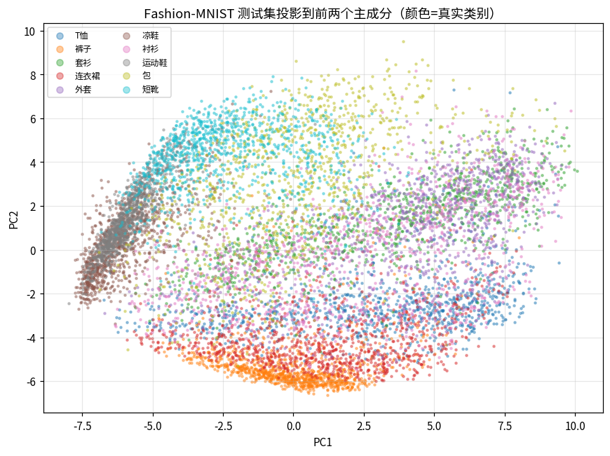

📖 **读图**：测试集在前两个主成分上的散点，颜色是真实类别。注意**"裤子"和"鞋类"各自成团、而"上身服装"（T恤/套衫/衬衫/外套）糊成一片**——这个结构决定了后面聚类的成败。

## 2. 目标函数

$$J=\sum_{i=1}^{N}\|x_i-\mu_{c_i}\|^2,\qquad c_i=\arg\min_j\|x_i-\mu_j\|^2$$

（sklearn 里叫 inertia，直译"惯性"）

**这是"鸡生蛋"问题**：知道中心才能分配，知道分配才能算中心。Lloyd 用**交替优化**破解——固定一边优化另一边。

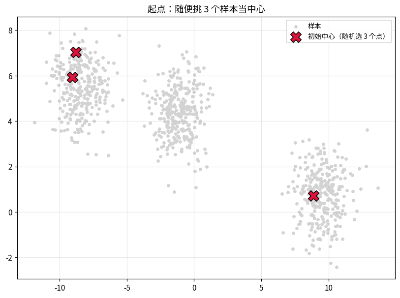

📖 **读图**：起点是随机挑 3 个样本当中心（红叉）。它们都挤在中间，**这就是随机初始化的典型问题：中心可能全落在一团里，另一团没人管**。

## 3. Lloyd 算法（从零手写）

```
重复直到收敛：
  1) 分配：每个点归到最近的中心        （固定 μ，优化 c → J 下降）
  2) 更新：中心 = 该簇所有点的均值      （固定 c，优化 μ → J 下降）
```

**为什么更新为均值**：对 $\sum_{i\in C_j}\|x_i-\mu_j\|^2$ 关于 $\mu_j$ 求导令其为零 → $\mu_j=\frac{1}{|C_j|}\sum_{i\in C_j}x_i$。**均值是平方误差下的最优代表**；如果换成绝对误差（L1），最优代表就是中位数了。

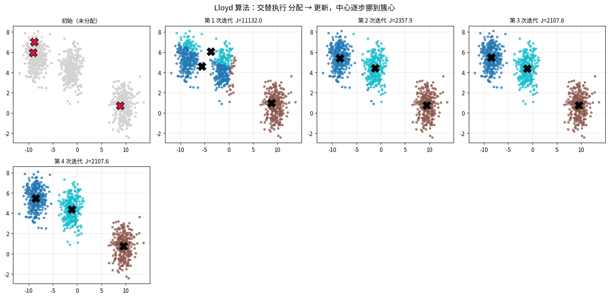

📖 **读图**：7 格显示迭代过程。第 1 次迭代就把大部分点分对了（J 从 11132 掉到 2358），第 2 次微调（2108），第 3 次已经不动了。**KMeans 收敛极快，绝大部分工作在头两三拍完成**。

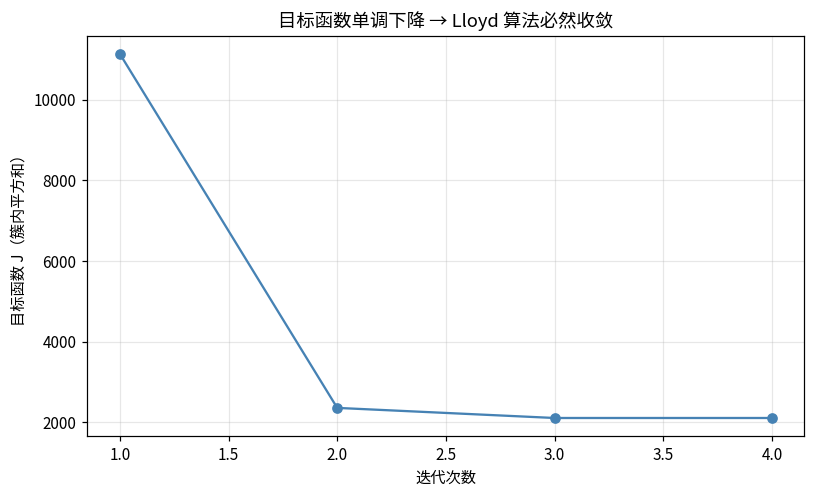

📖 **读图**：目标函数 J 单调下降（实测值 11131.98 → 2357.91 → 2107.56 → 2107.56）。**单调不增是 Lloyd 收敛的保证**——每步都在下降，而 J 有下界 0，所以必然停。注意它停的是**局部最优**，不是全局最优。

## 4. 初始化：随机 vs k-means++

k-means++ 的规则：第一个中心随机选，之后每次以"离已有中心越远概率越大"的方式选下一个——让初始中心尽量分散。

**20 次运行对比（Fashion-MNIST PCA-50，k=10）**：

| | J 均值 | 最好 | **最差** |
|---|---|---|---|
| 随机初始化 | 229049 | 223833 | **245745** |
| k-means++ | **226353** | 223832 | **231058** |

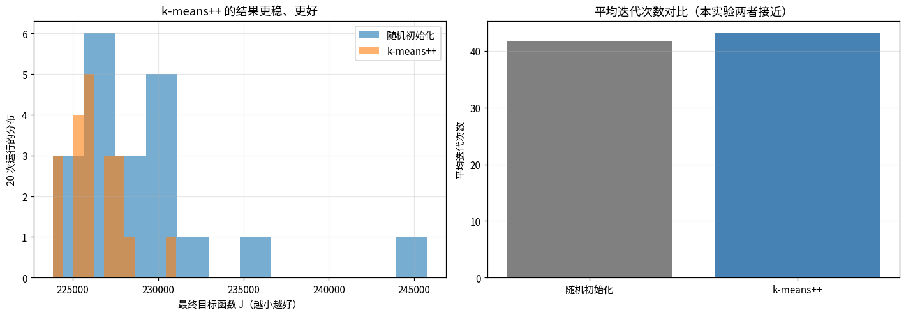

📖 **读图**：左图是 20 次结果的分布——k-means++（橙）明显更集中、更靠左。右图是平均迭代次数，**两者接近（41.7 vs 43.1）**。

⚠️ **一个反直觉的结论**：这次实验里 k-means++ 的优势体现在**结果质量和稳定性**（最差值从 245745 降到 231058，波动范围缩小 3 倍），**而不是迭代次数**。很多教程说"k-means++ 收敛更快"，在当前数据上并不成立——别把它当卖点记。

**实用建议**：无论如何都要 `n_init>1`（sklearn 默认 10）——多次重启取最优，比换初始化方式更实在。

## 5. 怎么选 k

- **肘部法**：画 J 随 k 的曲线找拐点（J 必然随 k 单调下降，看的是边际收益骤减处）
- **轮廓系数** $s(i)=\dfrac{b(i)-a(i)}{\max(a,b)}$，其中 $a$ = 到同簇平均距离，$b$ = 到最近邻簇平均距离，取值 $[-1,1]$ 越大越好，**不需要真实标签**

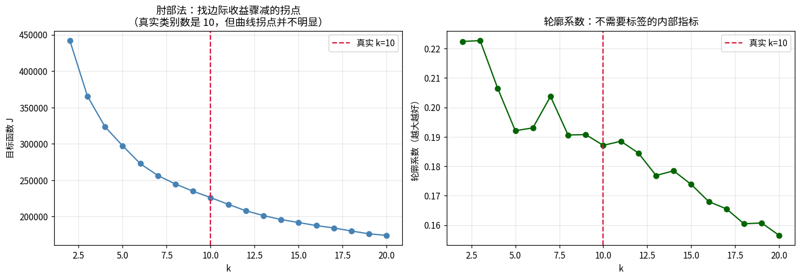

📖 **读图**：左图肘部法——曲线平滑下降，**几乎看不出明显拐点**（真实 k=10 的红色虚线处没有特征）；右图轮廓系数**最大值出现在 k=3**，而真实类别数是 10。

⚠️ **第二个反直觉结论**：内部指标在类别重叠的数据上会失效。轮廓系数偏好"少数几个大而分离的团"，而 Fashion-MNIST 的上身服装本来就糊在一起。**所以自监督论文从不靠轮廓系数选 k，而是直接设 k = 类别数**。

## 6. 聚类怎么评分（自监督评测标准三件套）

| 指标 | 含义 | 取值 | 特点 |
|---|---|---|---|
| **ACC** | 匈牙利匹配后算正确率 | 0~1 | 要求 k = 类别数；簇与类一一对应 |
| **ARI** | 调整兰德指数（两两样本分组一致性，对随机校正） | -1~1（随机≈0） | 对簇数敏感，惩罚乱分 |
| **NMI** | 归一化互信息 | 0~1 | 对"一类拆成多簇"较宽容 |

**为什么要三个都看**：它们会给出**不同的排名**。ACC 和 ARI 随 k 增大会被稀释，NMI 相对宽容——论文里三个一起报就是为了避免单一指标的误导。

**实测（k=10，PCA-50 特征）**：

$$\text{ACC}=0.4868,\quad \text{ARI}=0.3513,\quad \text{NMI}=0.5147$$

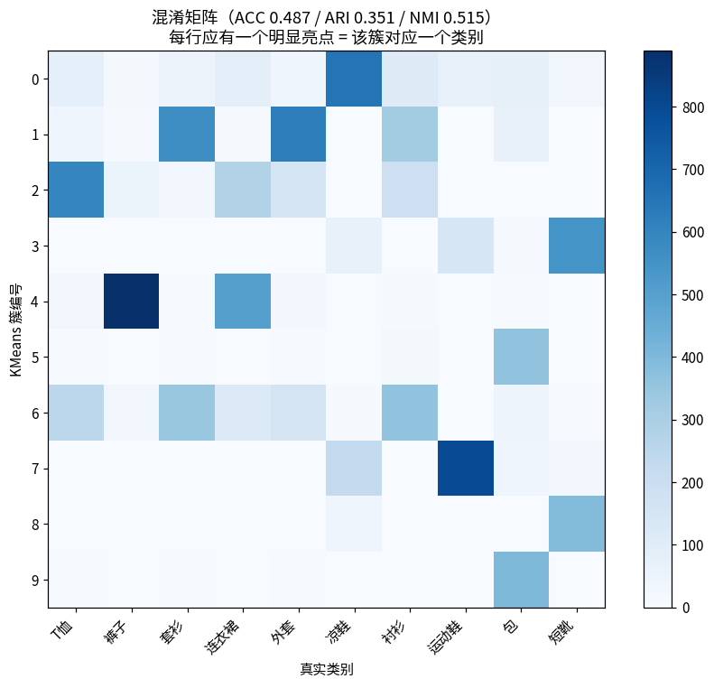

📖 **读图**：混淆矩阵（行=KMeans 簇，列=真实类别）。理想情况每行只有一个亮点。看几个典型：

| 簇 | 主导类别 | 纯度 |
|---|---|---|
| 5 / 9 | 包 | 92.3% / **95.5%** |
| 3 / 8 | 短靴 | 71.7% / 90.3% |
| 7 | 运动鞋 | 73.0% |
| 6 | 衬衫 | **27.2%**（最差） |

**两个发现**：
1. **"包"和"短靴"各自被拆成了两个簇**（因为 k=10 但真实只有 10 类，KMeans 用两个簇去描述一个类内部的两种形态）——这会拉低 ACC，但 NMI 没那么敏感
2. **衬衫纯度只有 27.2%**，它跟 T恤/套衫/外套混在一起——和第 1 步散点图看到的结构完全一致

## 7. 手写 vs sklearn

| | 值 |
|---|---|
| sklearn 最终 J | 223832.12 |
| 手写 Lloyd 最终 J | **223832.12** |
| 两者标签 ARI | **1.0000**（完全一致） |

手写实现与 sklearn 数值上分毫不差，验证了算法理解正确。

## 8. KMeans 与 GMM 的关系

| | KMeans | GMM |
|---|---|---|
| 分配 | **硬**：每点只属一个簇 | **软**：给出概率 |
| 簇形状 | 各向同性球（只有中心） | 椭圆（有协方差） |
| 优化 | Lloyd（交替最小化） | EM（最大化似然） |

**KMeans = GMM 在协方差→0 且等权重时的极限。**

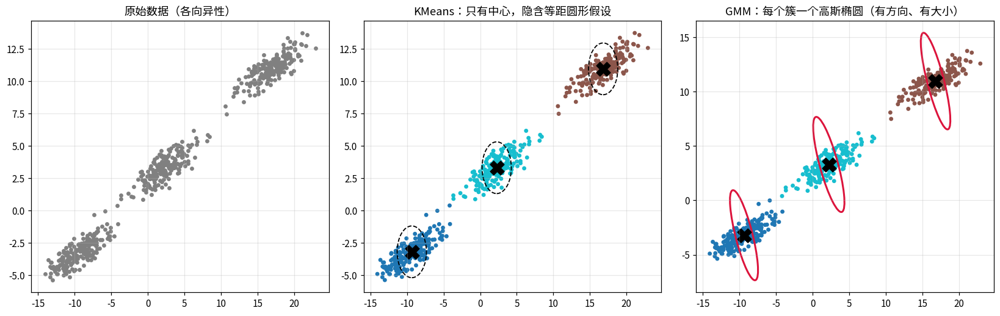

📖 **读图**：数据被刻意拉成各向异性（细长）。中间 KMeans 用虚线圆表示它的"等距"假设——**它只能画圆形的势力范围**；右边 GMM 的红椭圆能带上方向和长短轴。**遇到细长簇，GMM 明显更合适**。

## 9. KMeans 什么时候会失败

KMeans 隐含三个假设：**簇是凸的、大小相近、密度相近**。

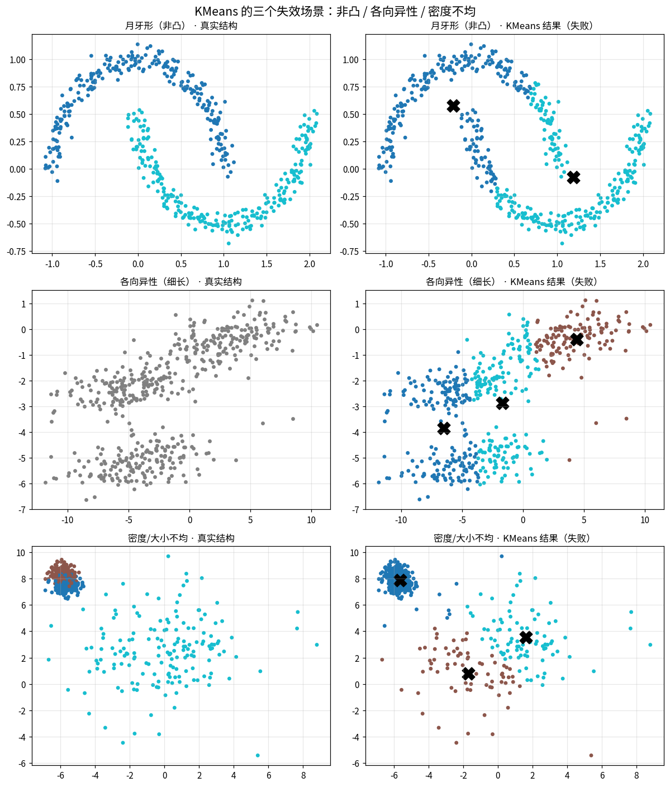

📖 **读图**：三行分别打破一个假设——
1. **月牙形（非凸）**：KMeans 硬切成两块，完全不是想要的结果（这种情况该用谱聚类或 DBSCAN）
2. **各向异性（细长）**：细长的簇被从中间切开（该用 GMM）
3. **密度/大小不均**：大簇被撕成几块，小簇被合并（该用 GMM 或密度聚类）

**一句话记忆**：KMeans = "用球去套数据"，数据是球形的才行。

## 10. 与自监督的联系：你天天在跑的 KMeans 评测

自监督论文里的 "KMeans ACC" = **把 frozen 特征跑 KMeans(k=类别数)，算 ACC/ARI/NMI**。它衡量"学到的特征空间里同类是否已经聚成一团"。

**实测三组特征对照**：

| 特征 | ACC | ARI | NMI |
|---|---|---|---|
| 原始像素 784 维 | **0.4907** | **0.3535** | **0.5163** |
| PCA 50 维 | 0.4868 | 0.3513 | 0.5147 |
| PCA 50 维 + 标准化 | 0.4286 | 0.2987 | 0.4817 |

⚠️ **第三个反直觉结论（最重要的一个）**：**PCA 特征做标准化反而让 ACC 掉了 6 个点！**

原因：PCA 的各维方差**就是信息量**（$\lambda_i$ = 该方向的方差）。标准化把所有维度拉到同方差，等于**把噪声维度放大到和主成分同等重要**——这正是第二课"白化会放大噪声"的翻版。

**实践准则**：
- **PCA / SVD 出来的特征**：不要标准化（方差已经编码了重要性）
- **神经网络输出的 embedding**：通常要标准化或 L2 归一化（各维没有天然的方差排序）
- **无论哪种**：务必在论文/报告里写清楚预处理，否则数字不可复现

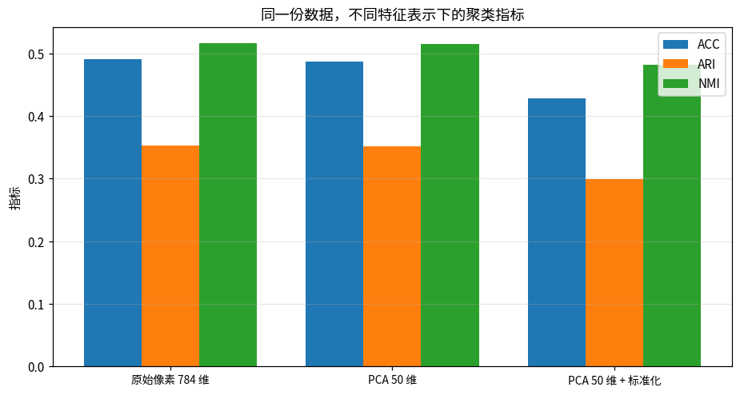

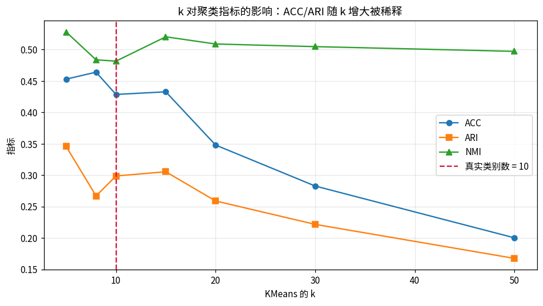

📖 **读图**：上图是三种特征的指标柱状图，标准化（右）明显低于前两者。下图是 k 的影响——**k 超过真实类别数后，ACC/ARI 持续下滑**，因为每类被拆得更碎。所以固定 k = 类别数是公平比较的前提。

---

## 小结

**KMeans 一句话**：交替"分配 → 更新中心"，最小化 $J=\sum_i\|x_i-\mu_{c_i}\|^2$。

**五个结论**
1. 每步都让 J 不增 → **必然收敛**，但可能到局部最优 → 用 k-means++ + 多次重启
2. **更新为均值**是平方误差下的最优（求导可得）
3. **k 的选择**：肘部法和轮廓系数在重叠数据上都会失效（实测轮廓系数给了 k=3）
4. **评测三件套** ACC/ARI/NMI 给出不同排名，必须一起报
5. **KMeans = GMM 的硬分配极限**，假设簇是同大小的球

**三个实测的反直觉点（最值钱的部分）**
1. k-means++ 的价值在**稳定性**不在迭代次数
2. 轮廓系数在类别重叠时**不可信**，直接设 k = 类别数
3. **PCA 特征别标准化**——会掉 6 个点的 ACC

## 动手题

1. 固定 k=10，只改 `random_state` 跑 20 次，看 ACC 的波动范围（感受报告里"显著性"这个概念）
2. 只用"上半身 4 类"（T恤/套衫/衬衫/外套）做聚类，看 ACC 掉多少
3. 把 KMeans 换成 `GaussianMixture`，对比 ACC/ARI/NMI
4. 拿你 v3 训练出来的特征跑一遍本课流程，对比 PCA 特征的差距
