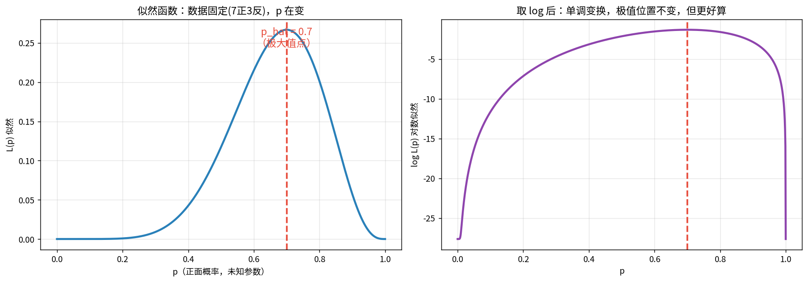
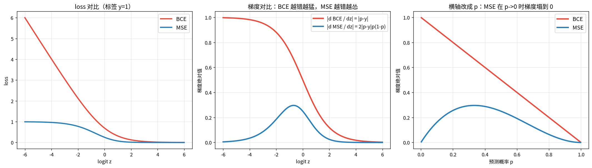
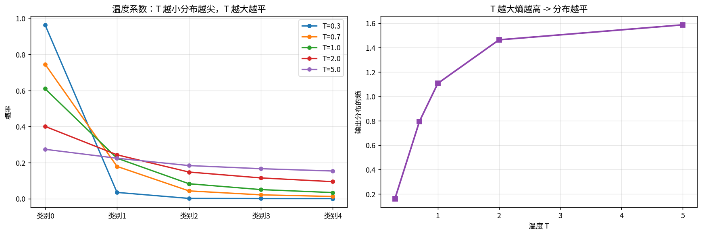
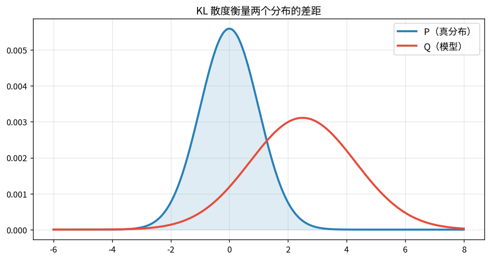
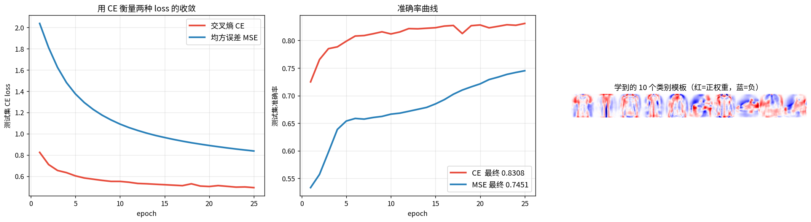
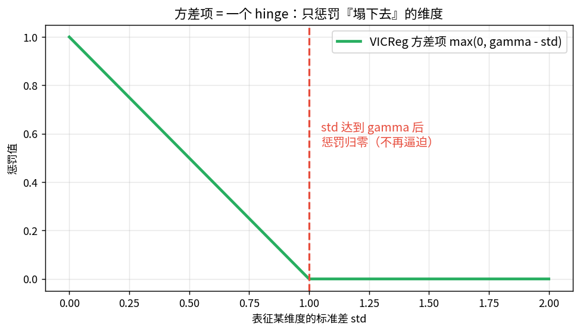

# 极大似然估计与交叉熵（第四课 · 概率统计开篇）

> **训练时那个一直在降的 loss，本质就是负对数似然。**
> 交叉熵不是拍脑袋设计的，它是「让模型分布接近真实分布」这个目标推导出来的必然结果。

---

## 0 · 核心链条

$$\text{假设噪声分布} \xrightarrow{\text{写似然}} L(\theta)
\xrightarrow{\text{取负对数}} \text{NLL}
\xrightarrow{} \text{我们的 loss}
\xrightarrow{\text{梯度下降}} \theta^*$$

**loss 不是随便挑的，它编码了你对数据的概率假设。**

| 你看到的 loss | 背后的概率假设 |
|---|---|
| MSE | 噪声是高斯 $\mathcal N(0,\sigma^2)$ |
| MAE (L1) | 噪声是拉普拉斯 |
| Huber | 高斯 + 少量重尾 |
| BCE | 标签是伯努利 |
| 交叉熵 CE | 标签是类别分布 |
| InfoNCE | 正样本 vs 负样本的分类 |
| VICReg 方差项 | 无显式分布，直接约束（hinge） |

---

## 1 · 概率和似然：同一个公式的两种读法

抛 10 次硬币，7 正 3 反，正面概率 $p$：

$$P(7正3反\mid p)=\binom{10}{7}p^7(1-p)^3$$

- **当概率用**：$p$ 已知，数据在变
- **当似然用**：数据已知，**$p$ 在变**

$$L(p)=\binom{10}{7}p^7(1-p)^3$$

⚠️ **$L(p)$ 不是概率分布**，它对 $p$ 积分不必等于 1，只是一个打分函数。

### 📖 这张图怎么读

- **左**：似然曲线。横轴是「未知的 $p$」，纵轴是「看到 7 正 3 反的可能性」。峰值在 **p = 0.7**。
- **右**：对数似然。形状不同（更凹），但**峰值位置完全一样** —— log 是单调的，不改变 argmax。
- 手算验证：$\frac{d}{dp}\log L=\frac{7}{p}-\frac{3}{1-p}=0\Rightarrow p=\frac{7}{10}$。
- notebook 里数值搜索得到 0.6997，与理论 0.7 一致。

---

## 2 · 为什么要取 log

$$\ell(\theta)=\log\prod_{i=1}^{n}P(x_i\mid\theta)=\sum_{i=1}^{n}\log P(x_i\mid\theta)$$

1. **乘积变求和**：1000 个样本概率 0.5 → $0.5^{1000}\approx10^{-301}$，float64 直接下溢成 0；log 后是 −693。
2. **导数好算**：$\frac{d}{dp}\log(p^k)=k/p$。
3. **和「信息量」对上了**（最重要）：$-\log P(x)$ 就是事件的自信息（惊讶程度）。
   **最小化 NLL = 最小化模型对真实数据的平均惊讶程度。** 这就是 loss 的物理意义。

**实测**：`torch.log(torch.softmax([1000,1001,1002]))` 会丢精度，而 `log_softmax` 精确。
所有库都实现 `log_softmax` 而不是让你 softmax 再 log，原因就在这。

---

## 3 · 高斯 MLE：解开一个多年困惑

$$-\ell=\frac{n}{2}\log(2\pi\sigma^2)+\frac{1}{2\sigma^2}\sum_{i=1}^n(x_i-\mu)^2$$

对 $\mu$ 求导置零 → $\hat\mu=\frac1n\sum x_i$
对 $\sigma^2$ 求导置零 → $\hat\sigma^2=\frac1n\sum(x_i-\hat\mu)^2$

**⚠️ 除以 n，不是 n−1！** MLE 的方差估计是**有偏**的。实测偏差：

| n | MLE（÷n） | 无偏（÷n−1） | 真值 | MLE 低估 |
|---|---|---|---|---|
| 5 | 3.1924 | 3.9592 | 4.0 | **20.19%** |
| 10 | 3.6276 | 3.9928 | 4.0 | 9.31% |
| 30 | 3.8661 | 3.9786 | 4.0 | 3.35% |
| 100 | 3.9498 | 3.9874 | 4.0 | 1.25% |
| 1000 | 3.9988 | 3.9970 | 4.0 | 0.03% |

**为什么**：用样本均值代替真均值，已经「用掉」1 个自由度，残差被系统性压小。Bessel 校正（÷n−1）正好补回来。
注意 numpy/sklearn 默认 `ddof=0`（MLE），pandas 默认 `ddof=1`（无偏）。

**用优化器最小化 NLL**：得到 $\hat\mu=3.13322,\ \hat\sigma=1.99550$，与闭式解逐位一致。
→ **神经网络没有闭式解，所以我们才必须用梯度下降去最小化 NLL。**

---

## 4 · 两个最重要的对应关系

### ① 高斯 MLE ⟹ MSE
$\sigma$ 固定时 $-\ell\propto\sum(x_i-\hat\mu)^2$。
**回归用 MSE = 假设噪声是高斯的。** 换噪声分布就该换 loss。

### ② 伯努利 MLE ⟹ BCE
$$\mathcal L=-\big[y\log\hat y+(1-y)\log(1-\hat y)\big]$$
**分类用交叉熵 = 假设标签是伯努利/类别分布。**

---

## 5 · 分类为什么不能用 MSE：梯度饱和

| | loss | $\partial\text{loss}/\partial z$ |
|---|---|---|
| BCE | $-\log p$ | $p-y$ ← **越错梯度越大** |
| MSE | $(p-y)^2$ | $2(p-y)\cdot p(1-p)$ ← **多乘了 $\sigma'$** |

$\sigma'(z)=p(1-p)$ 在 $p\to0$ 或 $1$ 时趋于 0 → **错得最离谱时梯度反而最小**。

### 📖 这张图怎么读

- **左**：loss 曲线（y=1）。BCE 在预测错时冲得很高，MSE 却封顶在 1。
- **中**：梯度曲线。**红（BCE）在左边（错得离谱）梯度接近 1；蓝（MSE）在左边塌到 0。**
- **右**：横轴换成预测概率 p，MSE 的梯度是「两头小中间大」的钟形 —— 两头正是最需要学习的地方。
- **实测差距**：Fashion-MNIST 线性模型，CE 最终 acc **0.8308**，MSE **0.7451**，差 **8.57 个百分点**。

---

## 6 · BCE 梯度：结果漂亮到必须记住

$$\frac{\partial\mathcal L}{\partial z}
=\left(-\frac{y}{p}+\frac{1-y}{1-p}\right)\cdot p(1-p)=p-y$$

**sigmoid + BCE 的梯度就是「预测 − 标签」。**
实测：手算 −0.31002551，torch −0.31002548，数值梯度 −0.30964613（差分误差）。

---

## 7 · 多分类 softmax + CE

$$\frac{\partial\mathcal L}{\partial z_c}=\hat y_c-y_c$$

**所有类别梯度之和恒为 0**（因为 $\sum\hat y=\sum y=1$）——梯度只是在类别间「搬运概率质量」。
实测梯度之和 = 5.2×10⁻⁸ ≈ 0。

两个数值细节：
1. softmax 平移不变（所有 $z$ 加常数输出不变），实现时先减最大值防 $e^z$ 溢出
2. 用 `log_softmax` + `nll_loss`，不要 softmax 再 log

### 📖 温度系数怎么读

- **左**：$\mathrm{softmax}(z/T)$。T 越小分布越尖（近乎 argmax），T 越大越平（近乎均匀）。
- **右**：输出分布的熵随 T 单调上升。
- **接自监督**：对比学习里的温度 τ 就是这里的 T，控制对「困难负样本」的关注度。

---

## 8 · KL 散度：交叉熵 − 熵

$$D_{\mathrm{KL}}(P\|Q)=H(P,Q)-H(P)$$

做分类时 $P$ 是 one-hot（熵 = 0），所以 $D_{\mathrm{KL}}(P\|Q)=H(P,Q)$ —— 两个词因此经常混用。

**实测**：$D_{\mathrm{KL}}(P\|Q)=1.2055$，$D_{\mathrm{KL}}(Q\|P)=3.6009$ —— **不对称**。

**前向/反向 KL 的直觉（自监督里会用到）**
- 用 $\mathrm{KL}(P\|Q)$ 训练 → $Q$ 必须覆盖 $P$ 的每一个峰（zero-avoiding / 求全）
- 用 $\mathrm{KL}(Q\|P)$ 训练 → $Q$ 挤在 $P$ 的一个峰上就行（zero-forcing / 求准）
- **生成模型的 mode collapse 常和这个选择有关**

---

## 9 · 标签平滑

$$y_c^{\text{smooth}}=(1-\varepsilon)y_c+\frac{\varepsilon}{C}$$

从 MLE 看：不再宣称「100% 确定」，承认标注有噪声。好处是改善校准、抗错误标注。

⚠️ **对你的代价**：类间距离被压小，表征可分性变差。
**如果你要拿表征去跑 KNN / KMeans 评测，标签平滑可能让 ACC 下降。**

实测（C=10）：ε=0.1 时真类目标 0.910、其他各类 0.010、熵 0.5003。

---

## 10 · 实战：Fashion-MNIST 上的 CE vs MSE

### 📖 这张图怎么读

- **左**：测试集 CE loss。CE 一路降到很低，MSE 卡在高位。
- **中**：准确率。**CE 0.8308 vs MSE 0.7451**，差 8.57 个百分点。
- **右**：学到的 10 个类别模板（权重摊回 28×28）。红色 = 该类特有、其他类没有的像素。
  这就是「线性模型到底学到了什么」——每个类别的**加权平均长相**。

---

## 11 · 接自监督：InfoNCE 就是一个多分类交叉熵

$$\mathcal L_{\text{InfoNCE}}=-\log\frac{e^{\mathrm{sim}(z_i,z_i^{+})/\tau}}{e^{\mathrm{sim}(z_i,z_i^{+})/\tau}+\sum_j e^{\mathrm{sim}(z_i,z_j^{-})/\tau}}$$

和 softmax 放一起看，**完全同构**：把每个负样本当成一个类别，$z_c$ 换成「相似度/温度」，
InfoNCE 就是**类别数 = 1 + 负样本数的多分类 CE**，标签永远是第 0 类（正样本）。

这解释了几个经验规律：
- **负样本越多越好**：类别数越多任务越难，学到的特征越有区分度
- **温度 τ 关键**：就是第 7 段的温度系数
- **不需显式标签**：正样本由数据增强自动给出

**实测（1 正 5 负，正样本相似度 0.85）**

| τ | loss | P(正样本) | P(最难负样本) |
|---|---|---|---|
| 0.05 | 0.1044 | 0.9008 | 0.0986 |
| 0.10 | 0.5317 | 0.5876 | 0.3564 |
| 0.20 | 1.2011 | 0.3009 | 0.4119 |
| 0.50 | 2.0871 | 0.1241 | 0.2132 |
| 1.00 | 2.5014 | 0.0819 | 0.1194 |

τ 越小：loss 越大（任务越难），模型被迫把概率质量压到最难的负样本上。实践常用 0.1~0.2。

### 📖 VICReg 方差项

$\max(0,\gamma-\mathrm{std}(z))$ 是**和 SVM 的 hinge 同构**的惩罚：够了不罚、不够才罚。
这一点很关键 —— 它不像 L2 那样会把 std 无限推大，所以不会破坏表征结构。

**对比两条防塌缩路线**
- **对比方法**：负样本 + 交叉熵，间接防塌缩
- **VICReg**：方差项（防止维度塌掉）+ 协方差项（去相关 → 谱变平 → 有效秩升高），直接约束

---

## 12 · 三个容易踩的坑

1. **用 MSE 做分类** → 梯度饱和，错得越离谱学得越慢（实测差 8.57 个百分点）
2. **自己写 softmax 再 log** → 数值下溢，必须用 `log_softmax`
3. **高斯 MLE 方差除以 n 是有偏的**，需要无偏时除以 n−1

---

## 关联

- 本课是[[05-梯度下降与反向传播/梯度下降与反向传播|第五课]]的前置：loss 定好了，下一步是怎么求梯度去最小化它
- 第二课的[[02-SVD奇异值分解/SVD奇异值分解|有效秩]]在 VICReg 协方差项那里再次出现
- 你的「师生距离比值路线」：KNN/ARI 评测用的是 CE 训练出来的表征，标签平滑会影响它
