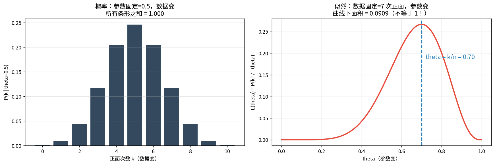
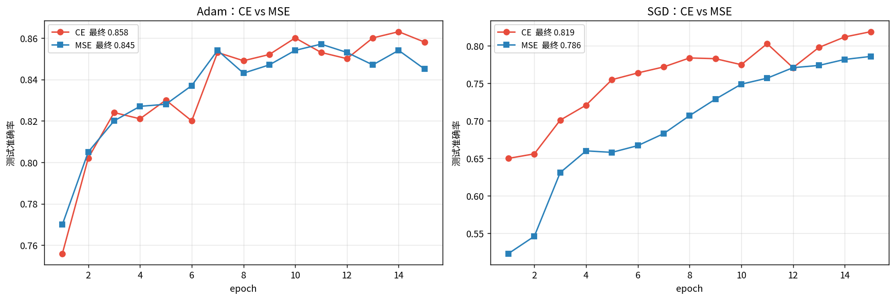
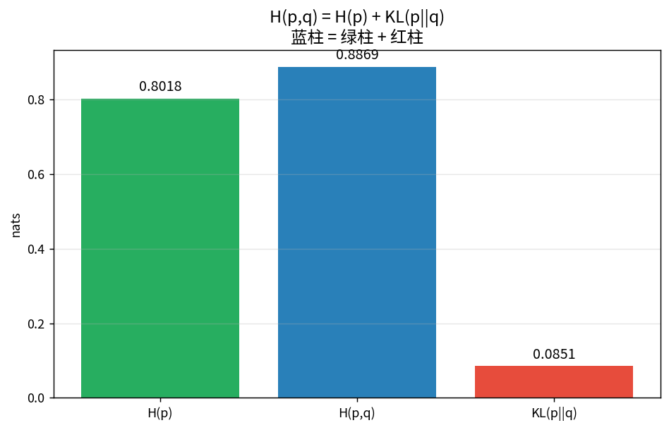
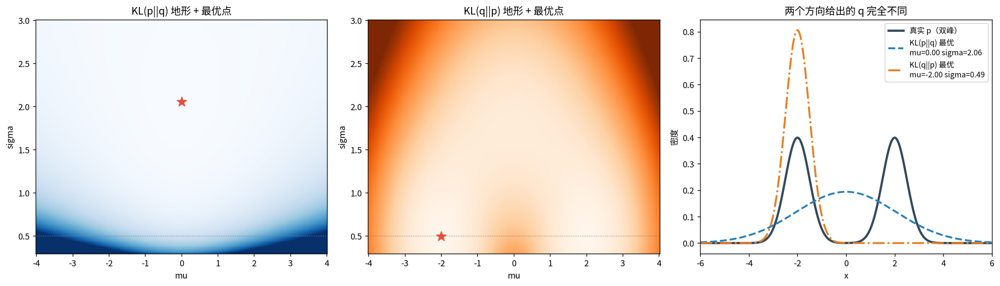
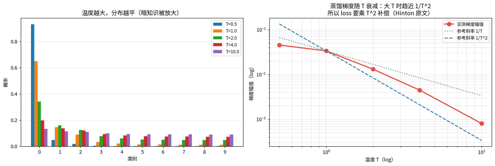
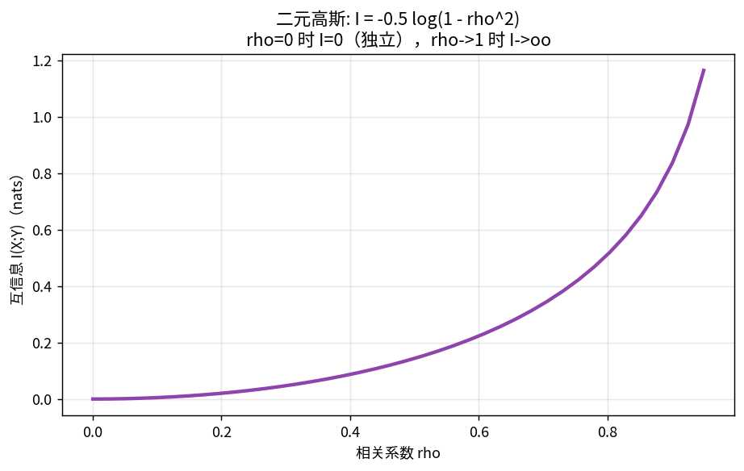
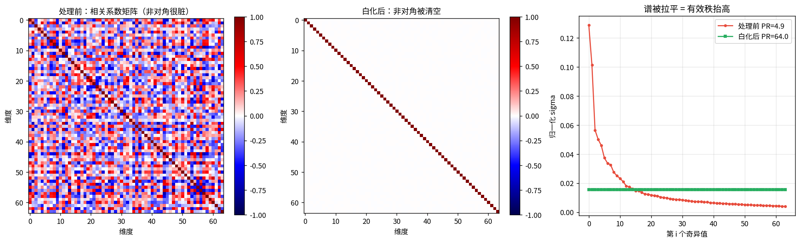
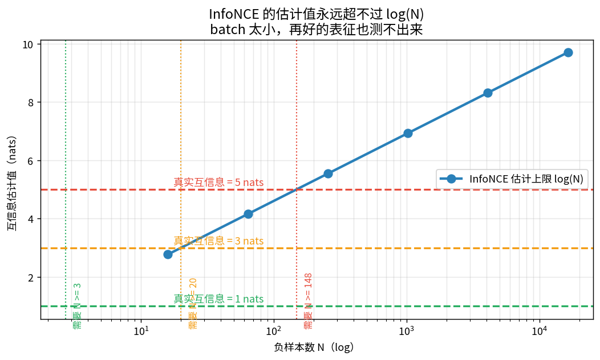

# 概率统计第一课：极大似然 → 交叉熵 → KL → 互信息

> 前三课是线性代数，这一课是概率统计。**两条线在这一课合流**：
> 最小二乘（02b 的伪逆）= 高斯噪声下的 MLE；NMI（03 的评测）= 归一化互信息。

**一句话主线**：所有损失函数都来自同一个动作——**最大化数据的对数似然**。
交叉熵、MSE、KL、InfoNCE 全是它的不同马甲。

---

## 1 · 概率 vs 似然：同一个公式，谁固定谁变

抛硬币 10 次正面 7 次：$P(k\,|\,\theta)=\binom{n}{k}\theta^{k}(1-\theta)^{n-k}$

| | 概率 | 似然 |
|---|---|---|
| 固定 | 参数 $\theta=0.5$ | 数据 $k=7$ |
| 变 | 数据 $k$ | 参数 $\theta$ |
| 归一化 | 所有 k 加和 = 1 | **对 θ 积分 ≠ 1，不是概率分布** |

### 📖 这张图怎么读

- **左（概率）**：横轴是数据 k。θ 固定 0.5 时，k=7 的概率只有 0.117。
- **右（似然）**：横轴是参数 θ。数据固定 7 次正面时，θ=0.7 的似然 0.267，θ=0.5 只有 0.117 —— **数据更支持 0.7，支持力度是 2.28 倍**。
- 蓝虚线是 $\hat\theta=k/n=0.7$，正好是曲线最高点（下一节证明）。

**训练模型做的事 = 每一步都在做右图这个动作**：拿当前 batch，找让这批数据最说得通的参数。

---

## 2 · 极大似然 MLE：谁最解释得通数据

$$\hat\theta=\arg\max_\theta \log L(\theta)$$

### 三个手算结果（notebook 里逐条验证）

**伯努利**：$\ell(\theta)=k\log\theta+(n-k)\log(1-\theta)$，求导=0 → $\hat\theta=k/n$。
数值网格搜索最大值 0.699 ≈ 手算 0.700 ✓

**高斯**：$\hat\mu=\bar x$，$\hat\sigma^2=\frac1n\sum(x_i-\bar x)^2$。
**注意是 1/n 不是 1/(n-1)** —— MLE 的方差系统偏小（实测比值 = n/(n-1) = 1.0526）。
这就是 `np.var` 与 `np.cov` 默认差一个 `ddof` 的原因。

**回归（接 02b）**：假设 $y=w^\top x+\varepsilon,\ \varepsilon\sim\mathcal N(0,\sigma^2)$，
最大化似然 = 最小化 $\sum(y_i-w^\top x_i)^2$。实测三条路给出**同一个解** w=[1.7326, -0.5654]：

| 方法 | w |
|---|---|
| SVD 伪逆（02b 的做法） | [1.7326, -0.5654] |
| 正规方程 | [1.7326, -0.5654] |
| 数值最大化似然 | [1.7326, -0.5654] |

三者之差 = 8×10⁻⁹。**最小二乘不是一条独立的规则，它是高斯噪声假设下的 MLE。**

---

## 3 · 从 MLE 到交叉熵

分类输出分布 $q_\theta(y|x)$，真实标签 one-hot $p$。则该样本的对数似然：
$$\log p(y|x,\theta)=\sum_c p_c\log q_c=\log q_y$$

所以 **最大化对数似然 = 最小化 $-\log q_y$ = 最小化交叉熵 $H(p,q)$**。一般形式（p 可以是软标签）：
$$H(p,q)=-\sum_c p_c\log q_c$$

手算（3 类，logits=[2,1,0.1]）：softmax 后 q=[0.659, 0.242, 0.099]，H(p,q) = −log q₀ = **0.417**。
模型更准时（logits=[5,1,0.1]）→ 0.025；完全猜错 → **4.93**（而 3 类随机猜的期望 CE = log 3 = 1.099）。

---

## 4 · CE 为什么不是 MSE：手算梯度 + 真实训练

对 logits 求导：

$$\text{CE: }\frac{\partial H}{\partial z_c}=q_c-p_c\qquad
\text{MSE: 每一项都被 } q_j \text{ 乘了一遍}$$

**实测**（autograd，真实类别 0，模型自信地猜错 logits=[1,10,1,1]，q₀=0.00012）：

| | CE 梯度 | MSE 梯度 |
|---|---|---|
| 最大幅值 | **0.9999**（全力纠错） | **0.00099**（几乎死了） |
| 比值 | \multicolumn{2}{c}{**CE 是 MSE 的 1014 倍**} |

原因：MSE 的梯度里每项都被 $q_j$ 乘过，$q_j\to0$ 和 $q_j\to1$ 都让它趋于 0。

### 📖 这张图怎么读 + 一个反直觉结论

- **左（Adam）**：CE 0.858 vs MSE 0.845，只差 1.3 个百分点。
- **右（SGD）**：CE 0.819 vs MSE 0.786，差 3.3 个百分点，且全程被压着打。
- **反直觉点：Adam 把梯度消失给掩盖了。** Adam 对每个参数做梯度归一化，MSE 梯度缩水 1000 倍，
  它一除，又变回正常量级。**要看清损失函数的差别，得用朴素 SGD。**
- 这也是为什么你看别人论文用 Adam 时「CE 和 MSE 差不多」、用 SGD 训 CNN 时差别巨大。

---

## 5 · 熵、交叉熵、KL：三角关系

$$\boxed{H(p,q)=H(p)+\mathrm{KL}(p\|q)}$$

| 量 | 公式 | 含义 |
|---|---|---|
| 熵 $H(p)$ | $-\sum p_c\log p_c$ | p 本身多不确定（最短平均码长） |
| 交叉熵 $H(p,q)$ | $-\sum p_c\log q_c$ | 用 q 的码编 p 的样本要多付多少 |
| KL | $\sum p_c\log\frac{p_c}{q_c}$ | **额外**代价 |

### 📖 这张图怎么读

p=[0.7,0.2,0.1]，q=[0.5,0.3,0.2]：
H(p)=0.8018，H(p,q)=0.8869，KL=0.0851。**蓝柱 = 绿柱 + 红柱**，验证到 1e-12。

三个推论：
1. KL ≥ 0（Jensen）→ 交叉熵永远 ≥ 熵
2. **最小化交叉熵（p 固定）= 最小化 KL** → 训练分类模型 = 让 $q_\theta$ 逼近真实分布
3. q=p 时 H(p,p)=H(p)、KL(p,p)=0，交叉熵退化为熵

反向 KL(q‖p) = 0.0920 ≠ 0.0851 —— **不对称就是 KL 最大的坑**，见下。

---

## 6 · KL 不对称：你的「师生距离」第一个坑

$$\mathrm{KL}(p\|q)\neq\mathrm{KL}(q\|p)$$

差别在**按谁加权**。用真实 p（双峰混合）+ 单高斯 q（capacity 不够）看：

| 方向 | 最优 q | 行为 |
|---|---|---|
| $\mathrm{KL}(p\|q)$ forward | $\mu=0,\ \sigma=2.06$ | **mass-covering**：p>0 的地方绝不让 q≈0，摊开盖住两峰 |
| $\mathrm{KL}(q\|p)$ reverse | $\mu=-2,\ \sigma=0.49$ | **mode-seeking**：p≈0 的地方绝不让 q>0，锁死一个峰 |

### 📖 这张图怎么读

- **左**：KL(p‖q) 地形（蓝）。最优点（红星）在 μ=0、σ=2.06 —— 一口吃下两个峰。
- **中**：KL(q‖p) 地形（橙）。最优点在 μ=-2、σ=0.49 —— 锁死左峰。该处 KL(q‖p)=0.6932=log 2，**正好丢掉一半概率质量**。
- **右**：两种 q 叠在真实 p 上。蓝虚线盖住双峰但中间虚；橙点划线完全放弃右峰。
- **注意两个方向的交叉惩罚**：把 reverse 的最优解拿去算 KL(p‖q) = **17.05**，而 forward 最优只有 2.14 —— 差 8 倍。

**对你项目的直接后果**：蒸馏用 $\mathrm{KL}(p_{teacher}\|p_{student})$（Hinton 原文方向），
学生倾向于覆盖老师的全部模式；反过来会只学最自信的几个模式。**你量「师生距离」时，方向必须固定并写进实验记录。**

---

## 7 · 温度 T 与蒸馏

蒸馏 soft target：$q_c^{(T)}=\mathrm{softmax}(z_c/T)$。T 越大分布越平，**类别间的相对关系（暗知识）被放大**。

### 📖 这张图怎么读

- **左**：同一组 teacher logits 在 T=0.5~10 下的分布。T=0.5 几乎 one-hot；T=10 已经很平。
- **右**：蒸馏梯度随 T 的衰减（log-log）。实测衰减指数 **0.43 → 1.36 → 1.56 → 1.87**，
  **T 越大越逼近 2** —— 这就是 Hinton 说「蒸馏 loss 要乘 $T^2$」的来源：
  大 T 时梯度被压掉 $1/T^2$，不补回来软标签就学不动。
- **注意**：T 小的时候指数明显小于 2（T=0.5→1 只有 0.43），所以「乘 T²」这个补偿在**大 T** 才准确。

**对你项目的提醒**：KL 的绝对数值强烈依赖 T。你那个「师生距离**比值**」能消掉一部分量纲，
**消不掉 T 带来的非线性**。换 T 必须重跑基线，不能拿不同 T 下的数直接比。

---

## 8 · 互信息 I(X;Y)：连回 NMI

$$I(X;Y)=\sum_{x,y}p(x,y)\log\frac{p(x,y)}{p(x)p(y)}=\mathrm{KL}\big(p(x,y)\|p(x)p(y)\big)$$

**一句话**：互信息 = 联合分布与「假设独立」之间的 KL。三种等价写法：
$I=H(X)-H(X|Y)=H(Y)-H(Y|X)=H(X)+H(Y)-H(X,Y)$。

手算 2×2 联合表（p_xy=[[0.35,0.05],[0.10,0.50]]）：
H(X)=0.6730，H(Y)=0.6881，H(X,Y)=1.0940 → **I = 0.2671**，两种算法逐位一致 ✓。

### NMI 的分母坑（实测，跨论文比数前必看）

同一个 I=0.2671，四种分母：

| 分母 | NMI |
|---|---|
| $2I/(H_X+H_Y)$（算术平均，**sklearn 默认**） | 0.3925 |
| $I/\sqrt{H_XH_Y}$（几何平均） | 0.3925 |
| $I/\max(H_X,H_Y)$ | 见 notebook |
| $I/\min(H_X,H_Y)$ | 见 notebook |

本例 H(X)、H(Y) 接近所以前两种一样；**真实聚类里两熵差得多时差距会放大**。

### sklearn 默认分母验证（用你第三课同款 pipeline）

5000 样本 TruncatedSVD-50 + KMeans(10)：
I = 1.2196，H(真实)=2.3015，H(聚类)=2.2365。
- 2I/(H+H) = **0.537507**，sklearn `arithmetic` = 0.537507 → **一致** ✓
- I/√(H·H) = 0.537559，sklearn `geometric` = 0.537559 → 一致 ✓

**结论：sklearn 的 `normalized_mutual_info_score` 默认是算术平均**。第三课报的 NMI=0.5147 用的就是这个分母。

### 📖 这张图怎么读

二元高斯的解析解 $I=-\tfrac12\log(1-\rho^2)$：ρ=0 → I=0（独立）；ρ→1 → I→∞。
这是后面所有「表征里含多少信息」讨论的基准曲线。

---

## 9 · 回扣自监督

### 9.1 VICReg 三项的统计学身份

| 项 | 公式 | 统计身份 |
|---|---|---|
| 方差项 | $\frac1d\sum_j\max(0,\gamma-\mathrm{Std}(z_j))$ | 每个维度的**边际**方差下界 → 不许塌成常数 → 直接抬**有效秩** |
| 协方差项 | $\frac1d\sum_{i\neq j}C_{ij}^2$ | 协方差往对角推 = 维度间**独立** = **最小化维度间互信息** |
| 不变项 | $\mathbb E\|z-z'\|^2$ | 几何项，不是概率项 |

**和第一课的关系**：协方差项拉满 = **ZCA 白化**（协方差变单位阵）。PCA 是旋转到不相关，
ZCA 是旋转到不相关**且方差归一**。VICReg 是软版 ZCA。

### 📖 这张图怎么读

- **左**：人造表征（正交混合 + 逐维压缩）的相关系数矩阵，非对角平均 |相关| = **0.2664**，一锅粥。
- **中**：ZCA 白化后，非对角 → **0.000000**，只剩对角线。
- **右**：奇异值谱被拉平，有效秩 **4.89 → 64.00**，最小维度 std **0.068 → 1.000**。
- **关键提醒**：白化只动表征空间的几何，不动样本间关系，所以 KNN/ARI 评测基本不变 ——
  它改的是「维度用没用上」，这正是自监督要管的事。

### 9.2 InfoNCE 是互信息的下界（为什么必须开大 batch）

$$I(X;Y)\ \ge\ \log N-\mathcal L_{NCE}$$

估计值的天花板是 $\log N$：

| N | log(N) |
|---|---|
| 16 | 2.77 |
| 256 | 5.55 |
| 4096 | 8.32 |

### 📖 这张图怎么读

- 蓝线是天花板 log(N)。真实互信息若是 5 nats，N=16 时**永远测不出来**，至少要 N=e⁵≈148。
- 这就是 SimCLR 用 4096 batch、MoCo 用队列的真正原因 —— 不是「负样本多」，是**抬天花板**。
- **对你的评测**：小 batch InfoNCE 训出来的 backbone，表征可分性天然被 log N 卡住。
  比较方法时必须对齐 batch size，否则你比的不是方法，是 batch。

---

## 10 · 总结速查

| 概念 | 公式 | 从哪来 | 用在哪 |
|---|---|---|---|
| 似然 | $L(\theta)=\prod p(x_i\|\theta)$ | 数据固定、参数变 | MLE 起点 |
| 极大似然 | $\arg\max\log L$ | 让数据最说得通 | 一切 loss 的祖宗 |
| 最小二乘 | $\min\|y-Xw\|^2$ | 高斯噪声下的 MLE | 02b SVD 伪逆 |
| 交叉熵 | $H(p,q)$ | 分类的 MLE | 分类、语言模型 |
| 熵 | $H(p)$ | 不确定性 | 决策树、NMI 分母 |
| KL | $\sum p\log\frac pq$ | $H(p,q)-H(p)$ | 蒸馏、VAE、RL |
| 温度 | $\mathrm{softmax}(z/T)$ | 分布尖锐度 | 蒸馏（梯度 ~1/T²） |
| 互信息 | $\mathrm{KL}(p_{xy}\|p_xp_y)$ | 不确定性减少量 | NMI、InfoNCE、VICReg |

**三句话记住**
1. 所有 loss 都是「最大化对数似然」的变体
2. $H(p,q)=H(p)+\mathrm{KL}(p\|q)$，训练分类 = 让 KL 逼近 0
3. **KL 不对称**（蒸馏方向要固定）、**InfoNCE 有 log N 天花板**（batch 要对齐）—— 你项目里最容易踩的两个坑

**下一课候选**：贝叶斯视角（先验/后验/ELBO → VAE）｜ 梯度下降与反向传播 ｜ 谱聚类与图拉普拉斯

---

## 关联

- [01 PCA](../01-PCA%E4%B8%BB%E6%88%90%E5%88%86%E5%88%86%E6%9E%90/PCA%E4%B8%BB%E6%88%90%E5%88%86%E5%88%86%E6%9E%90.md) → 协方差对角化 ↔ 本课「去相关 = 压互信息」
- [02 SVD](../02-SVD%E5%A5%87%E5%BC%82%E5%80%BC%E5%88%86%E8%A7%A3/SVD%E5%A5%87%E5%BC%82%E5%80%BC%E5%88%86%E8%A7%A3.md) · [02b 手算](../02b-SVD%E6%89%8B%E7%AE%97%E4%B8%8E%E5%AE%9E%E4%BE%8B%E6%98%A0%E5%B0%84/SVD%E6%89%8B%E7%AE%97%E4%B8%8E%E5%AE%9E%E4%BE%8B%E6%98%A0%E5%B0%84.md) → 伪逆/最小二乘 = 高斯 MLE
- [03 KMeans](../03-KMeans%E8%81%9A%E7%B1%BB/KMeans%E8%81%9A%E7%B1%BB.md) → NMI = 归一化互信息
- 项目：`师生距离比值路线` —— KL 方向、温度 T、batch 天花板三个坑都直接影响这条线
