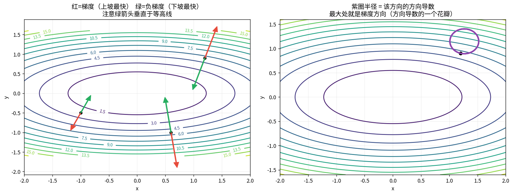
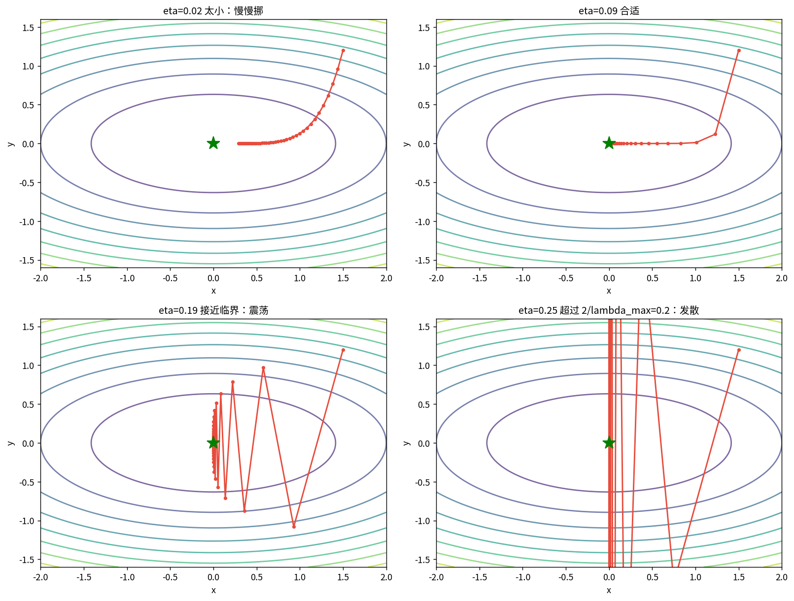
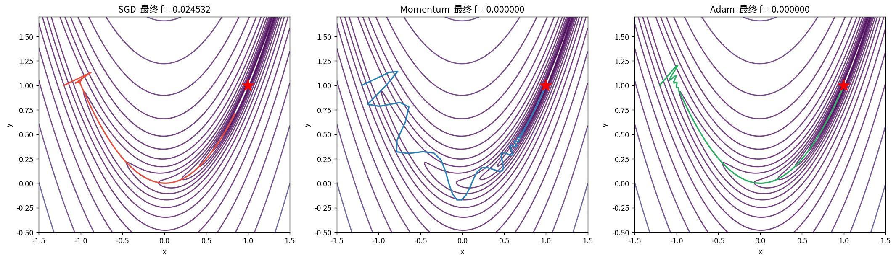
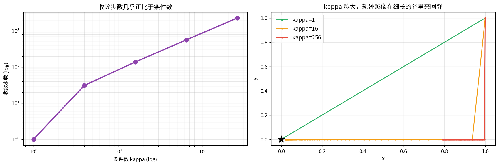
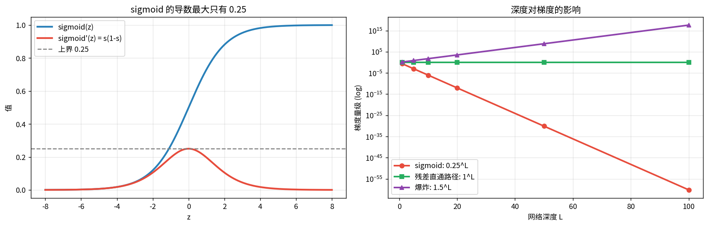
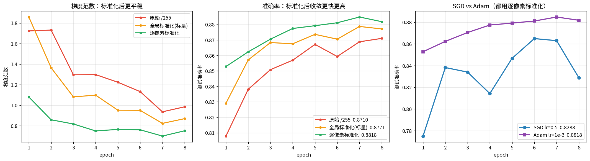

# 梯度下降与反向传播（第五课 · 高数部分）

> **反向传播 = 链式法则 + 从后往前复用中间结果；梯度下降 = 沿最陡下坡一小步一小步挪。**

**课程链条**
- 第四课：loss 是什么（负对数似然）
- **本课：怎么把 loss 降到最低**（求梯度 → 沿负梯度走）
- 第二课的**条件数**在这里复活：它决定梯度下降好不好走

---

## 1 · 梯度是什么（几何直觉）

$$\nabla f=\begin{bmatrix}\partial f/\partial x\\ \partial f/\partial y\end{bmatrix}$$

**梯度方向 = 上升最快方向；梯度模 = 那个方向的斜率。**

### 📖 这张图怎么读

- **左**：黑点是等高线。红箭头 = 梯度（上坡最快），绿箭头 = 负梯度（下坡最快）。
  **两者都垂直于等高线** —— 这是「沿等高线走高度不变」的直接推论。
- **右**：紫圈半径 = 该方向的方向导数。形状像个花瓣，**最长的花瓣就是梯度方向**。
  实测：最大方向导数 9.313，出现在方向 [0.241, 0.970]，与归一化梯度 [0.240, 0.971] 一致。

### 为什么负梯度是最陡下坡

方向导数 $=\nabla f\cdot v=\|\nabla f\|\cos\theta$。要最小就要 $\cos\theta=-1$，即 $v=-\nabla f/\|\nabla f\|$。

**这就是梯度下降的全部原理**，剩下都是工程细节。

---

## 2 · 链式法则手算

$$z=f(x,y),\ x=g(t),\ y=h(t)\ \Rightarrow\ \frac{dz}{dt}=\frac{\partial z}{\partial x}\frac{dx}{dt}+\frac{\partial z}{\partial y}\frac{dy}{dt}$$

**关键理解：一条路径贡献一个乘积，多条路径就相加。**

**实测**（$z=(xy+\sin x)^2$，$x=2,y=3$）：

| 量 | 手算 | torch |
|---|---|---|
| $z$ | 32.4377 | — |
| $\partial z/\partial x$ | 35.70522 | 35.705219 |
| $\partial z/\partial y$ | 27.63719 | 27.637190 |

$\partial z/\partial x$ 走**两条路径**（经 $u_1=xy$、经 $u_2=\sin x$），所以需要相加。

---

## 3 · 手写 2 层 MLP 的完整反向传播

结构：$x\in\mathbb R^3 \to z_1=W_1x+b_1\ (4) \to h=\mathrm{ReLU}(z_1) \to \hat y=W_2h+b_2\ (1)$，loss = MSE。

**反向公式（逐层往回推）**

$$\frac{\partial\mathcal L}{\partial\hat y}=2(\hat y-y)
\ \to\ \frac{\partial\mathcal L}{\partial W_2}=\frac{\partial\mathcal L}{\partial\hat y}h^\top
\ \to\ \frac{\partial\mathcal L}{\partial h}=W_2^\top\frac{\partial\mathcal L}{\partial\hat y}$$

$$\frac{\partial\mathcal L}{\partial z_1}=\frac{\partial\mathcal L}{\partial h}\odot[z_1>0]
\ \to\ \frac{\partial\mathcal L}{\partial W_1}=\frac{\partial\mathcal L}{\partial z_1}x^\top,\quad
\frac{\partial\mathcal L}{\partial b_1}=\frac{\partial\mathcal L}{\partial z_1}$$

**ReLU 那一步是门控**：$z_1>0$ 通、$z_1\le0$ 断，被关掉的神经元梯度恒为 0。

**实测对照**：手算与 `torch.autograd` 的差异全部在 **2.2×10⁻¹⁶**（机器精度），
`torch.autograd.gradcheck` 官方校验 **通过**。
→ 你手写的就是 PyTorch 内部在做的事。

---

## 4 · 矩阵形式：雅可比与 VJP

$y=f(x)$，$x\in\mathbb R^n,\ y\in\mathbb R^m$ → 导数是 **m×n 雅可比** $J_{ij}=\partial y_i/\partial x_j$。

**但框架从来不真的构造这个矩阵**：

| 维度 | 完整雅可比 | VJP |
|---|---|---|
| 100 | 0.08 MB/层 | 0.0008 MB |
| 1000 | 8 MB/层 | 0.008 MB |
| 4096 | **134 MB/层** | **0.03 MB** |

4096 维表征（你跑的 ViT/ResNet 常见尺寸）：显式雅可比 = 134 MB/层，反向传播还要存下来 → 直接爆显存。

**VJP（Vector-Jacobian Product）**：$v^\top J$，只存向量不存矩阵。
这就是 `backward()` 需要上游梯度作为输入的原因（最上游的 $v=1$，即 $\partial\mathcal L/\partial\mathcal L$）。

**口诀**：反向传播 = 从 loss 出发，把梯度向量一层层**左乘雅可比**往回传。

---

## 5 · 学习率：太小太慢、太大爆炸

对 $f(\theta)=\frac12 a\theta^2$，迭代是 $\theta_{t+1}=(1-\eta a)\theta_t$，收敛要求 $|1-\eta a|<1$：

$$0<\eta<\frac{2}{a}$$

多维时 $a$ 换成 Hessian 的**最大特征值** $\lambda_{\max}$。

### 📖 这张图怎么读

$f=x^2+5y^2$，Hessian = diag(2, 10)，$\lambda_{\max}=10$，稳定条件 $\eta<0.2$。

| η | 现象 |
|---|---|
| 0.02 | 太小，慢慢挪 |
| 0.09 | 合适（接近 $1/\lambda_{\max}=0.1$） |
| 0.19 | 接近临界 0.2，剧烈震荡 |
| 0.25 | **超过 0.2，发散** |

⚠️ 注意：x 方向最优步长是 0.5，y 方向最优步长是 0.1 —— **两个方向要求冲突**，这就是条件数问题。

---

## 6 · 动量与 Adam

Rosenbrock 函数 $f=(1-x)^2+100(y-x^2)^2$：狭长弯曲山谷，两侧陡、谷底平。

| 优化器 | 更新规则 | 解决什么 |
|---|---|---|
| SGD | $\theta\leftarrow\theta-\eta g$ | 基准 |
| Momentum | $v\leftarrow\mu v+g;\ \theta\leftarrow\theta-\eta v$ | 沿一致方向加速、抑制震荡 |
| RMSProp | 按梯度平方滑动平均缩放步长 | 各方向曲率差异大 |
| Adam | 动量 + 二阶矩归一化 | 两者结合，默认首选 |

### 📖 这张图怎么读

- 绿星是最优点 (1,1)。三条轨迹：**SGD 在谷里来回弹**，Momentum 和 Adam 沿谷底顺畅推进。
- 实测 2000 步后：SGD $f=0.0245$（距离 0.329）、Momentum $f=0.000000$、Adam $f=0.000000$。
- ⚠️ **Adam 的 lr 尺度完全不同**（0.05 vs SGD 的 0.0015）：Adam 把梯度按二阶矩归一化后，
  更新量大致是 ±lr，所以 lr 要按「你想让参数一步走多远」来定；SGD 的 lr 要按 $1/\lambda_{\max}$ 来定。
  **这是调参时最常见的混淆点。**

---

## 7 · 条件数如何毁掉梯度下降（第二课在这里复活）

对二次函数，收敛速度由 Hessian 条件数 $\kappa=\lambda_{\max}/\lambda_{\min}$ 决定：

$$\text{收敛步数}\ \propto\ \kappa$$

### 📖 这张图怎么读

**左**（双对数坐标）：条件数与收敛步数几乎正比。

| $\lambda$ | $\kappa$ | 收敛步数 |
|---|---|---|
| (1, 1) | 1 | **1** |
| (1, 4) | 4 | 31 |
| (1, 16) | 16 | 138 |
| (1, 64) | 64 | 563 |
| (1, 256) | 256 | **2265** |

**右**：κ 越大，轨迹越像在细长谷里来回弹。

**与第二课的联系**：Hessian 的条件数就是**矩阵的奇异值之比**，同一个概念。
第二课用它衡量「解对噪声有多敏感」，这里衡量「优化有多难走」。**同一个数，两种后果。**

这就是为什么要用归一化 / Adam —— 都是在把 κ 往下拉。

---

## 8 · 梯度消失与爆炸

$L$ 层网络要连乘 $L$ 次雅可比，若每层谱范数平均为 $c$，总量级 ≈ $c^L$：

| 每层谱范数 | L=10 | L=20 | L=50 |
|---|---|---|---|
| 0.5（类似 sigmoid） | 9.8×10⁻⁴ | 9.5×10⁻⁷ | **8.9×10⁻¹⁶** |
| 1.0（理想） | 1 | 1 | 1 |
| 1.5（爆炸） | 57.7 | 3325 | 6.4×10⁸ |

### 📖 深度 20 实测：初始化才是关键

| 初始化 | 激活 | 第 1 层梯度 | 第 20 层梯度 |
|---|---|---|---|
| 默认 | ReLU | **6.4×10⁻¹⁰** | 5.3×10⁻³ |
| 默认 | sigmoid | **2.4×10⁻¹⁸** | 1.2×10⁻¹ |
| **He** | ReLU | **1.16** ✅ | 1.51 |
| He | sigmoid | **1.0×10⁻¹¹** | 1.2×10⁻¹ |

**三条结论（很重要）**
1. ReLU 只是「不主动衰减」，**梯度实际量级还取决于权重矩阵的谱范数**（第二课的奇异值！）
2. **He 初始化**做的事就是让每层 $W$ 的谱范数 ≈ 1.4，连乘后不爆不灭
3. **sigmoid 的 0.25 上界是硬伤，无论怎么初始化都会消失** —— 这才是它被淘汰的真正原因

**残差连接为什么有效**：$h_{l+1}=h_l+f(h_l)$，求导得 $\partial h_{l+1}/\partial h_l=I+\partial f/\partial h_l$。
那个 $I$ 保证梯度至少有一条**增益恒为 1 的直通路径**。

---

## 9 · 实战：训练 MLP，监控梯度范数

### 📖 这张图怎么读

**输入标准化的三种方案**（⚠️ 测试集必须用训练集算出的同一套统计量）：

| 方案 | 输入协方差 κ | 最终 acc |
|---|---|---|
| 原始 /255 | 2.334×10⁴ | 0.8710 |
| 全局标准化（标量） | 2.333×10⁴ | 0.8771 |
| **逐像素标准化** | **3.636×10²** | **0.8818** |

- **左**：梯度范数。标准化后更平稳。
- **中**：准确率。条件数从 2.3×10⁴ 降到 3.6×10²，acc 从 0.8710 升到 0.8818。
- **右**：SGD(lr=0.5) vs Adam(lr=1e-3)。

⚠️ **一个必须知道的副作用**：有 **48 个像素的 std < 0.05**（几乎恒定的背景像素），
逐像素标准化会把它们的噪声放大约 **44 倍**。
所以「条件数变小」和「模型变好」不是一回事 —— 本例恰好都变好，换数据集未必。

---

## 10 · 三个实用体检指标

1. **各层梯度范数**（是否消失/爆炸）
2. **输入协方差条件数**（是否该标准化）
3. **loss 曲线的抖动程度**（学习率是否过大）

## 11 · 两个经典病的解药

| 病 | 原因 | 解药 |
|---|---|---|
| 梯度消失 | 雅可比连乘、sigmoid 导数 ≤0.25、初始化谱范数过小 | ReLU、**He 初始化**、残差连接、归一化 |
| 梯度爆炸 | 雅可比谱范数 >1 | 梯度裁剪、残差、合理初始化 |

---

## 关联

- 前置：[[04-极大似然与交叉熵/极大似然与交叉熵|第四课]]（loss 从哪来）
- 第二课的[[02-SVD奇异值分解/SVD奇异值分解|条件数]]在本课变成「优化难走程度」
- 下一课：[[06-tSNE与UMAP流形可视化/tSNE与UMAP流形可视化|t-SNE / UMAP]]看表征几何
