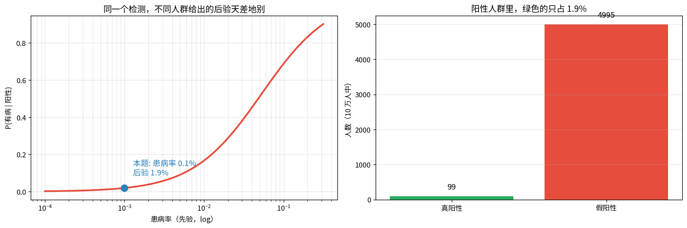
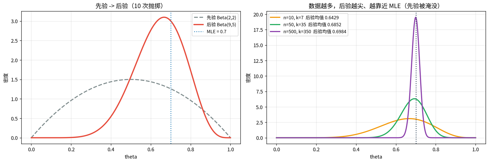
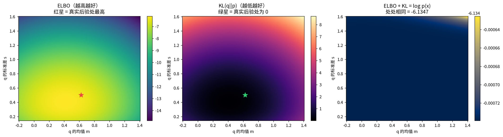
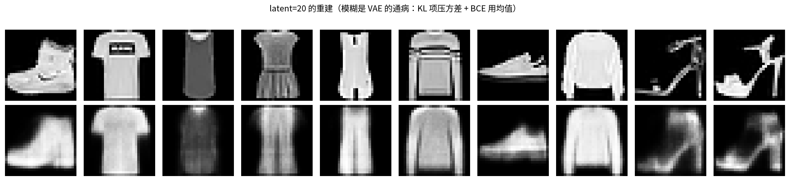
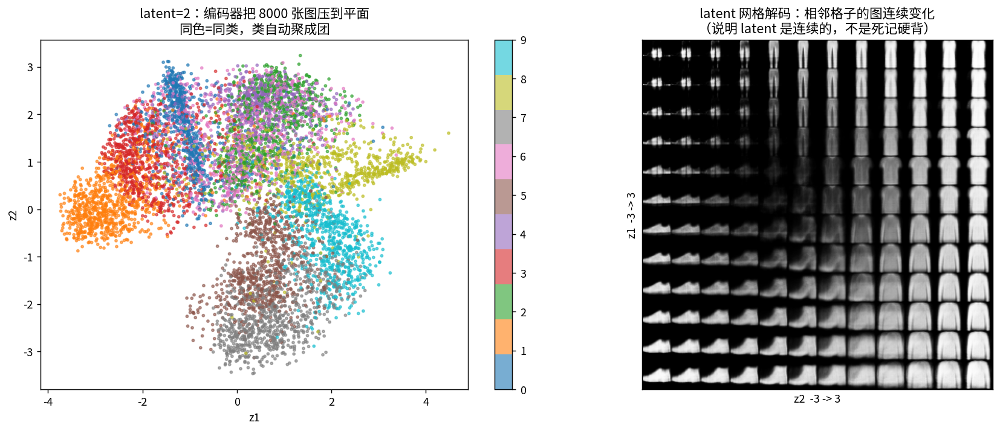
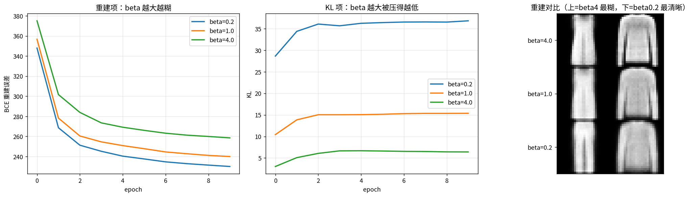

# 贝叶斯视角：先验 → 后验 → ELBO → VAE

> 第四课是**频率派**：参数固定未知，用 MLE 点估计。这一课是**贝叶斯派**：参数本身是随机变量，要的是分布。

**为什么必须学**：你项目里的每个正则项，本质上都是一个先验 —— 只是没人这么叫它。

---

## 1 · 贝叶斯公式：手算一道反直觉题

$$p(\theta\,|\,D)=\frac{p(D\,|\,\theta)\,p(\theta)}{p(D)}$$

| 量 | 含义 |
|---|---|
| 先验 $p(\theta)$ | 看到数据**之前**的信念 |
| 似然 $p(D\|\theta)$ | 第四课学过 |
| 后验 $p(\theta\|D)$ | 看到数据**之后**的信念 |
| 证据 $p(D)$ | 归一化常数，**高维时算不出来，这是后面一切麻烦的源头** |

**题**：患病率 0.1%，有病检出阳性 99%，没病误报 5%。你阳了，真有病的概率？

### 📖 这张图怎么读

- **左**：后验随先验剧烈变化。本题（蓝点）患病率 0.1% → **后验只有 1.94%**。
- **右**：10 万人里真阳性 99 人，假阳性 **4995 人** —— 假阳性是真阳性的 **50 倍**。

**手算**：99 / (99+4995) = **1.94%**。检测「99% 准确」，阳性结果只有 1.9% 是真的。
直觉犯错的原因是**只看似然、忽略先验**（这叫基准率谬误）。

---

## 2 · 共轭先验：先验被数据一口口吃掉

$$\theta\sim\mathrm{Beta}(\alpha,\beta),\ k\,|\,\theta\sim\mathrm{Bin}(n,\theta)
\;\Longrightarrow\; \theta\,|\,k\sim\mathrm{Beta}(\alpha+k,\ \beta+n-k)$$

**读法**：$\alpha,\beta$ 就是**伪计数**。实测（先验 Beta(2,2)，10 次抛掷 7 正面）：

| | 值 |
|---|---|
| 先验均值 | 0.500 |
| **后验均值** | **0.643** = 9/14 |
| MLE（第四课） | 0.700 |

### 📖 这张图怎么读

- **左**：先验（灰虚线，宽而平）→ 后验（红，窄而尖且右移）。
- **右**：数据量 ×1 / ×5 / ×50，后验越来越尖、越来越贴近 MLE 0.7。
- **一句话**：先验 = 正则项。$\hat\theta_{MAP}\to\hat\theta_{MLE}$（样本无穷时），
  所以 **MLE 是 MAP 的极限，MAP = MLE + 先验**。

---

## 3 · 后验算不出来 → ELBO

证据 $p(D)=\int p(D|\theta)p(\theta)d\theta$ 是高维积分。换个思路：拿好算的 $q$ 去逼近后验。
关键一步（乘一个除一个 + Jensen）给出**恒等式**：

$$\boxed{\log p(x)=\mathrm{ELBO}(q)\;+\;\mathrm{KL}\big(q(z|x)\,\|\,p(z|x)\big)}$$

**手算验证**（高斯小模型，观测 x=[0.8,1.2,0.5]，证据 log p(x) = −6.134739）：

| q | ELBO | KL | ELBO+KL |
|---|---|---|---|
| N(0.00, 1.00²) | −8.2597 | 2.1250 | **−6.1347** |
| N(0.62, 0.50²) ← 真实后验 | −6.3122 | 0.1775 | **−6.1347** |
| N(0.50, 0.90²) | −7.2951 | 1.1603 | **−6.1347** |
| N(1.50, 0.30²) | −9.7337 | 3.5989 | **−6.1347** |

**不管 q 取什么，两项之和恒等于 log p(x)**（误差 2.8e-11）。

### 📖 这张图怎么读

- **左（ELBO）**：越亮越高，红星（真实后验处）最亮。
- **中（KL）**：越暗越低，绿星处为 0。
- **右（ELBO+KL）**：**完全平坦** —— 这就是恒等式的含义。
- **推论**：$\log p(x)$ 与 q 无关 → **抬高 ELBO ⇔ 压低 KL**，别无他法。
- **注意 KL 方向**：这里是 $\mathrm{KL}(q\|p)$，第四课讲过是 **mode-seeking** 方向
  → 变分推断倾向**低估后验方差** → 这是 VAE 生成模糊的根因之一。

---

## 4 · VAE

选择 $q(z|x)=\mathcal N(\mu(x),\mathrm{diag}(\sigma^2(x)))$、先验 $\mathcal N(0,I)$，ELBO 变成：

$$\mathcal L=\underbrace{\mathbb E_q[\log p(x|z)]}_{\text{重建}}\;-\;\underbrace{\mathrm{KL}(q\|p)}_{\text{正则}}$$

**两个高斯间 KL 有闭式解**：$\mathrm{KL}=\frac12\sum_j(\mu_j^2+\sigma_j^2-\log\sigma_j^2-1)$
实测闭式解 2.015668 vs 20 万样本蒙特卡洛 2.013584（差 2e-3）—— **不用采样，直接算，且可导**。

**重参数化** $z=\mu+\sigma\odot\varepsilon$：把随机性挪到 $\varepsilon$，梯度才能穿过采样。
实测两种估计均值一致，但 score function 的**标准差大 3.5 倍** → 收敛慢。

### 📖 这两张图怎么读

- **fig04**：latent=20 的重建。轮廓对但**糊** —— VAE 通病，因为 KL 压方差 + BCE 倾向输出均值。
- **fig05 左**：latent=2，8000 张图压到平面，同色同类**自动聚团**（接第三课 KMeans 的观察）。
- **fig05 右**：在 latent 网格上解码。**相邻格子的图连续变化** → latent 是连续的，不是死记硬背。
  这是自监督表征想要的性质。

### β-VAE：把「正则 = 先验」看清楚

$\mathcal L=\mathrm{BCE}+\beta\cdot\mathrm{KL}$，实测 10 epoch：

| β | BCE 重建误差 | KL |
|---|---|---|
| 0.2 | **230.06**（最清晰） | 36.82 |
| 1.0 | 239.98 | 15.37 |
| 4.0 | 258.54（最糊） | **6.41** |

**β 大 → 后验被强压向先验 → latent 规整但重建糊。** 这就是「先验正则化」明码标价的演示。
**你的 VICReg 方差项/协方差项，本质是同一句话**，只是先验不是标准正态，而是「各维独立且方差够大」。

---

## 总结

| 概念 | 要点 |
|---|---|
| 贝叶斯公式 | 先验 × 似然 → 后验；忽略先验 = 基准率谬误 |
| 共轭先验 | 先验 = 伪计数；MAP → MLE（样本无穷） |
| **先验 = 正则项** | L2 正则 = 高斯先验的 MAP |
| ELBO | $\log p(x)=\mathrm{ELBO}+\mathrm{KL}$，恒等式不是近似 |
| VAE KL 闭式 | $\frac12\sum(\mu^2+\sigma^2-\log\sigma^2-1)$ |
| 重参数化 | 梯度方差比 score function 小 3.5 倍 |
| β-VAE | β 大 → 规整但糊 |

**三句话**
1. **先验就是正则项，正则项就是先验。**
2. ELBO 是恒等式：$\log p(x)$ 固定，抬高下界只能靠压低 KL。
3. 变分推断用 $\mathrm{KL}(q\|p)$（mode-seeking）→ 低估方差 → VAE 偏模糊。

## 关联

- 前置：[[04-概率统计_极大似然与交叉熵/概率统计_极大似然与交叉熵|04 概率统计]]（似然、KL、互信息）
- 接：[[07-优化器/优化器|07 优化器]]（ELBO 写出来之后怎么优化）
- 项目：VICReg 的方差/协方差项 = 显式先验；你的「师生距离」里的 KL 方向问题见 04
