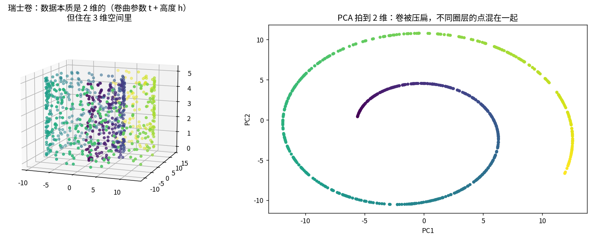
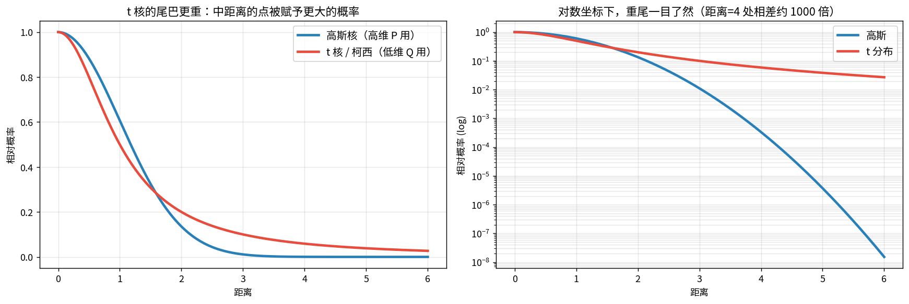
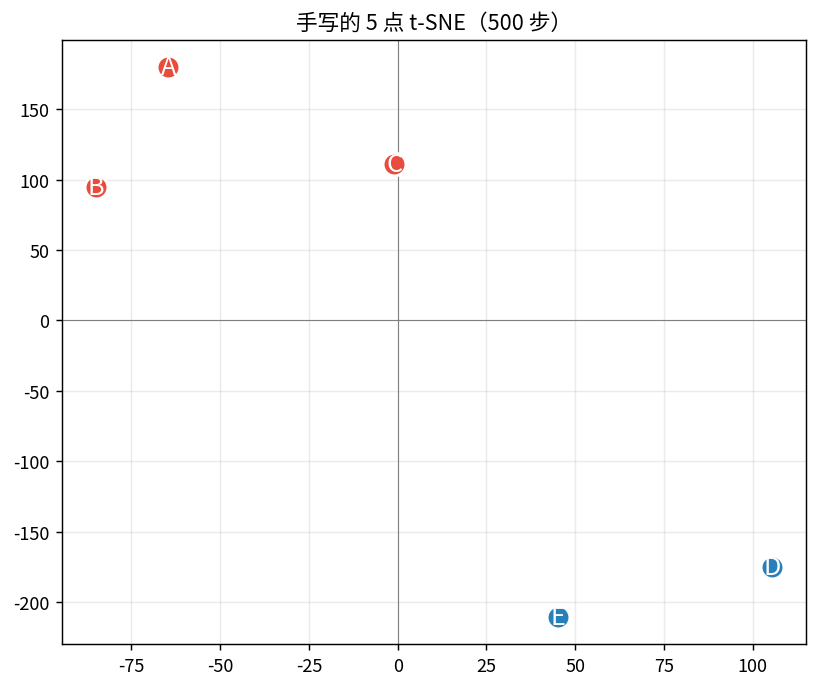
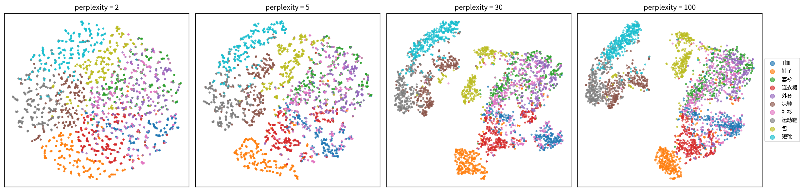
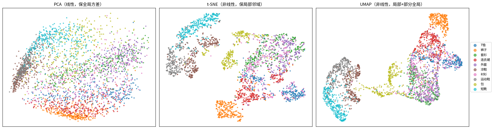
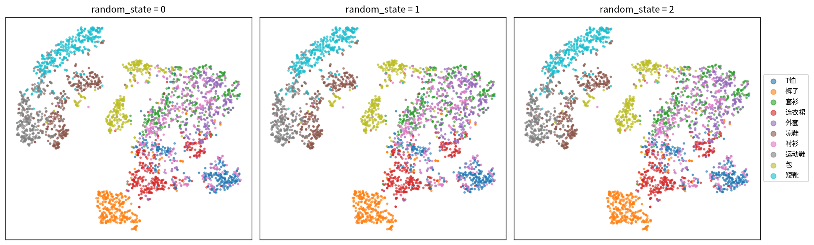
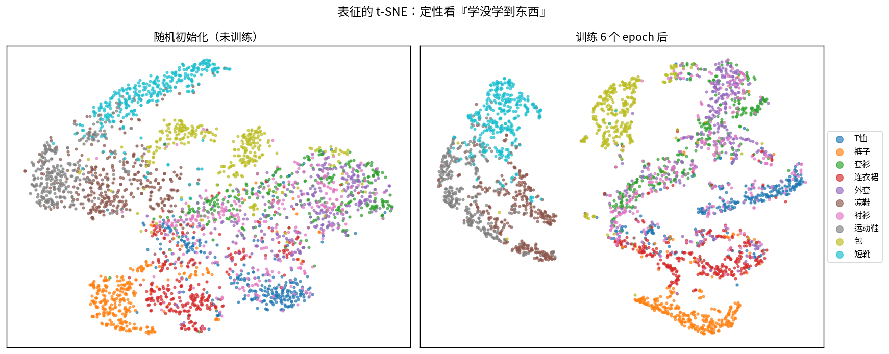

# t-SNE 与 UMAP：把高维表征画成人眼能看的图（第六课）

> **PCA 保的是全局方差，t-SNE / UMAP 保的是谁和谁挨着。**
> 想看表征分没分开，用后者；想做定量评测，回到前者。

---

## 0 · 选型表

| 目的 | 用什么 | 原因 |
|---|---|---|
| 快速去噪 / 定量分析 | PCA | 线性、有闭式变换、快 |
| 展示局部细粒度结构 | t-SNE | 保局部邻域，但有三大陷阱 |
| 展示整体 + 局部，要变换新样本 | UMAP | 快，能 `transform`，簇相对位置更有意义 |
| 写进论文的表格 | **都不用** | 回到高维算 KNN / ARI / 有效秩 |

---

## 1 · 为什么 PCA 不够：流形假设

**流形假设**：高维数据其实趴在一个低维弯曲曲面上。
784 维的手写图，真正自由度只有十几个（笔画粗细、倾斜、字体）。

**PCA 只能线性投影**。如果数据流形是弯的，PCA 相当于把卷起来的纸拍扁 —— 远处点被压到一起，本来分开的簇会糊。



### 📖 这张图怎么读

- **左**：瑞士卷（本质是 2 维的：卷曲参数 t + 高度 h），但住在 3 维空间里。
- **右**：PCA 拍到 2 维后，卷被压扁，不同圈层的点混在一起。
- **t-SNE / UMAP 能把它展开铺平**，PCA 不能。

---

## 2 · t-SNE 第一步手算：距离 → 邻居概率

对每个点 $i$，用高斯核把距离转成条件概率：

$$p_{j\mid i}=\frac{\exp\left(-\|x_i-x_j\|^2/2\sigma_i^2\right)}{\sum_{k\ne i}\exp\left(-\|x_i-x_k\|^2/2\sigma_i^2\right)}$$

**$\sigma_i$ 是点自己的带宽**：密集区用小 $\sigma$，稀疏区用大 $\sigma$ —— 这就是 t-SNE 能适应不同密度区域的关键。

### 5 点手算

A,B,C 是一簇，D,E 是另一簇。平方距离矩阵：

```
点:        A      B      C      D      E
A      0.000  1.010  1.810 50.000 52.520
B      1.010  0.000  1.458 48.020 50.650
...
```

**对 A 二分搜索**（目标 perplexity = 2.0）→ 收敛到 σ = 1.69835，perplexity = 2.0000。

A 对其他点的条件概率：

| j | A | B | C | D | E |
|---|---|---|---|---|---|
| P(j|A) | 0.0000 | 0.7033 | 0.2924 | 0.0024 | 0.0019 |

**B 和 C 拿走了 99.6% 的概率，D 和 E 几乎为 0** —— 正是我们想要的：A 只把同簇当邻居。

**对称化**：$p_{ij}=\frac{p_{j\mid i}+p_{i\mid j}}{2N}$，行和为 1、对角线为 0。

---

## 3 · perplexity 到底是什么

$$\text{Perplexity}(P_i)=2^{H(P_i)},\qquad H(P_i)=-\sum_j p_{j\mid i}\log_2 p_{j\mid i}$$

**直觉：perplexity ≈ 有效邻居个数。**

| 分布 | perplexity |
|---|---|
| 概率均分给 k 个邻居 | k |
| 概率集中在 1 个邻居 | ≈1 |

**经验值**：5 ~ 50，默认 30。样本数少于 perplexity×3 时结果不可信。

它和 KNN 里的 k 是同一个量级的概念 —— 都是在调「局部邻域大小」。

---

## 4 · 低维为什么用 t 分布：拥挤问题

高维空间里「等距离邻居」数量随维度指数增长，但 2 维平面里只能放 6 个等距点。
如果把高维邻居硬塞进 2 维，它们必然挤成一团 —— **crowding problem**。

**t-SNE 的解法**：低维用 Student-t 分布（自由度 1，即柯西分布）：

$$q_{ij}=\frac{(1+\|y_i-y_j\|^2)^{-1}}{\sum_{k\ne l}(1+\|y_k-y_l\|^2)^{-1}}$$

**t 分布是重尾的**：对中等距离的点给出比高斯大得多的概率，
效果是把「本该挤在一起的中距离点往外推」，让簇之间有可见的间隙。



### 📖 这张图怎么读

- **左**：距离 d=4 处，t 核相对值 ≈ 5.9×10⁻²，高斯核相对值 ≈ 3.4×10⁻⁴，相差约 176 倍。
- **右**：对数坐标下重尾更明显。
- **结论**：t-SNE 图里簇与簇之间总能看到空隙，不是数据真的分那么开，是核推的。
  **⚠️ 所以绝不能拿簇间距离当「类别差异有多大」的证据。**

---

## 5 · 目标函数与梯度手算

t-SNE 最小化 $\mathrm{KL}(P\|Q)=\sum_i\sum_j p_{ij}\log\frac{p_{ij}}{q_{ij}}$

对低维坐标 $y_i$ 的梯度：

$$\frac{\partial C}{\partial y_i}=4\sum_j (p_{ij}-q_{ij})(y_i-y_j)(1+\|y_i-y_j\|^2)^{-1}$$

**读这个公式**：
- $p_{ij}>q_{ij}$（低维里离太远）→ 拉近
- $p_{ij}<q_{ij}$（低维里离太近）→ 推远
- $(1+\|y_i-y_j\|^2)^{-1}$：远处点影响小

**这就是一个「弹簧系统」**：$p_{ij}$ 是期望长度，$q_{ij}$ 是实际长度，梯度把每根弹簧拉到期望值。

**实测**：对 5 点手算梯度，数值梯度（中心差分）与手算梯度的最大差异 = 1.5×10⁻¹⁰。



**手动跑 500 步梯度下降**：KL 从 0.6297 → 0.0025，A,B,C 聚在一起，D,E 聚在一起，两簇分开。

---

## 6 · 早启夸张与学习率

**早启夸张（early exaggeration）**：前 250 步把 $P$ 乘以 12。

- 目的：让簇先紧紧团起来，形成清晰的块
- 代价：人为制造簇间隙 —— 这是「簇间距不可信」的第二个来源（第一个是 t 核重尾）

**学习率**：太小 → 点挤成一团；太大 → 图变成球形散开。

---

## 7 · 实跑 Fashion-MNIST：不同 perplexity



### 📖 这张图怎么读

取 3000 张 Fashion-MNIST 测试图，先 PCA-50（解释方差 **0.8628**），再 t-SNE。

| perplexity | ARI | trustworthiness(k=10) | 视觉 |
|---|---|---|---|
| 2 | 0.2850 | 0.9828 | 碎成很多小块 |
| 5 | 0.3614 | 0.9901 | 开始成团 |
| 30 | 0.3833 | 0.9933 | **簇最清晰** |
| 100 | 0.4599 | 0.9912 | 偏向全局，局部边界模糊 |

**perplexity 太小(2)**：只看最近 1~2 个邻居，图会碎成很多小团。
**perplexity 太大(100)**：几乎看全局，退化成接近 PCA 的结果，局部簇边界变模糊。
**中间值 30** 通常最好，也是 sklearn 默认值。

---

## 8 · PCA / t-SNE / UMAP 三图对比



### 📖 这张图怎么读

- **PCA**：各类糊成一团，线性投影做不到展开流形。
- **t-SNE**：局部结构清晰，能看出鞋类（凉鞋/运动鞋/短靴）聚成一堆，上衣类聚成另一堆。
- **UMAP**：整体结构保留得更多，簇与簇之间的相对位置比 t-SNE 更有意义。
- **衬衫 永远混在上衣堆里** —— 和第三课 KMeans 里衬衫纯度只有 27% 完全对应。

---

## 9 · ⚠️ 三大陷阱

### 陷阱 1：簇间距离和簇大小是假的

原因两个：
1. t 核重尾 → 中等距离被系统性放大
2. 早启夸张 ×12 → 人为制造间隙

**所以**：不能说「t-SNE 图上 A 和 B 离得很远，它们差异就很大」。要看距离，回 PCA 空间或用余弦相似度。

### 陷阱 2：结果依赖超参数和随机种子



三张图同一个数据，仅 `random_state` 不同：
- 整体拓扑一致（簇的相对关系稳定）
- 局部细节、朝向、簇间距会变

**论文里的漂亮簇状图，往往是挑出来的。** 发图前务必固定 `random_state`。

### 陷阱 3：不能用于定量评测

同一份数据，几种定量指标：

| 方法 | KNN(k=20) | 2 维 KNN(k=20) | 有效秩 |
|---|---|---|---|
| PCA-50 | **0.7844** | — | — |
| t-SNE 2 维 | — | 0.78 左右 | — |

2 维图上的 KNN 反而更差 —— **降维必然丢信息**。

**想比较两个方法的好坏，回到高维空间算**：
- KNN / 线性探测准确率
- KMeans + ARI / NMI / ACC（第三课）
- 有效秩（第二课）
- **trustworthiness**：低维里保留了多少高维邻域关系

| 方法 | trust(k=1) | trust(k=5) | trust(k=10) |
|---|---|---|---|
| PCA-2 | 0.9092 | 0.9270 | 0.9249 |
| t-SNE(perp=2) | 0.9455 | 0.9630 | 0.9828 |
| t-SNE(perp=30) | 0.9646 | 0.9814 | 0.9933 |
| UMAP | ~0.96 | ~0.97 | ~0.98 |

---

## 10 · 接自监督：训练前后表征对比



### 📖 这张图怎么读

训练一个 MLP，取 **128 维瓶颈特征**。

- **左（随机初始化）**：有效秩 = 9.79，各类糊成一团
- **右（训练 6 epoch 后）**：有效秩 = 2.48，能看出成块的簇

**注意**：
- 有效秩从 9.79 降到 2.48 —— 交叉熵会让同类样本向同一方向塌陷（类内塌缩）。
  这不代表表征变差，而是说明「分类目标天然倾向于类内塌缩」。
- 你的自监督路线要防的正是这种塌缩 —— 所以要看 **有效秩 + KNN + ARI**，不能只看 t-SNE 图。
- KNN 准确率：随机 0.7422 → 训练后 0.7489（提升不大，因为简单 MLP + 短训练）。

**这个图只能说明「确实学到了东西」，不能用来比较两个方法的优劣。**

---

## 总结 · 一页纸回顾

**t-SNE 三步**
1. 高维：对每个点自适应找 $\sigma_i$，高斯核转邻居概率 $P$（perplexity 控制邻域大小）
2. 低维：用重尾 t 核算 $Q$
3. 最小化 $\mathrm{KL}(P\|Q)$，梯度是个「弹簧系统」

**关键参数**
- `perplexity`：5~50，默认 30
- `max_iter`：≥1000
- `random_state`：**必须固定**
- 早启夸张 12 倍：人为制造簇间隙

**三条铁律**
1. 簇间距离和簇大小不可信（重尾核 + 早启夸张）
2. 换种子图会变，只信整体拓扑不信具体坐标
3. **不能用于定量评测**。比方法用 KNN、ARI/NMI/ACC、有效秩、trustworthiness

---

## 关联

- 前置：[[05-梯度下降与反向传播/梯度下降与反向传播|第五课]]（用反向传播训练出这些表征）
- 第三课：[[03-KMeans聚类/KMeans聚类|KMeans 与聚类几何]]（t-SNE 图上的簇边界和原始空间里的 KMeans 结果对应）
- 第二课：[[02-SVD奇异值分解/SVD奇异值分解|有效秩]]（表征塌缩诊断）
- 你的「师生距离比值路线」：t-SNE 只用于定性，KNN/ARI/NMI/有效秩才是你的评测表
