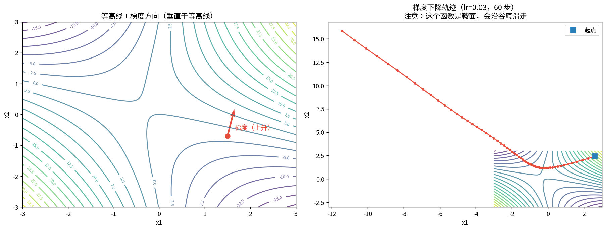
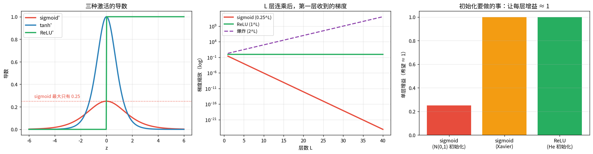
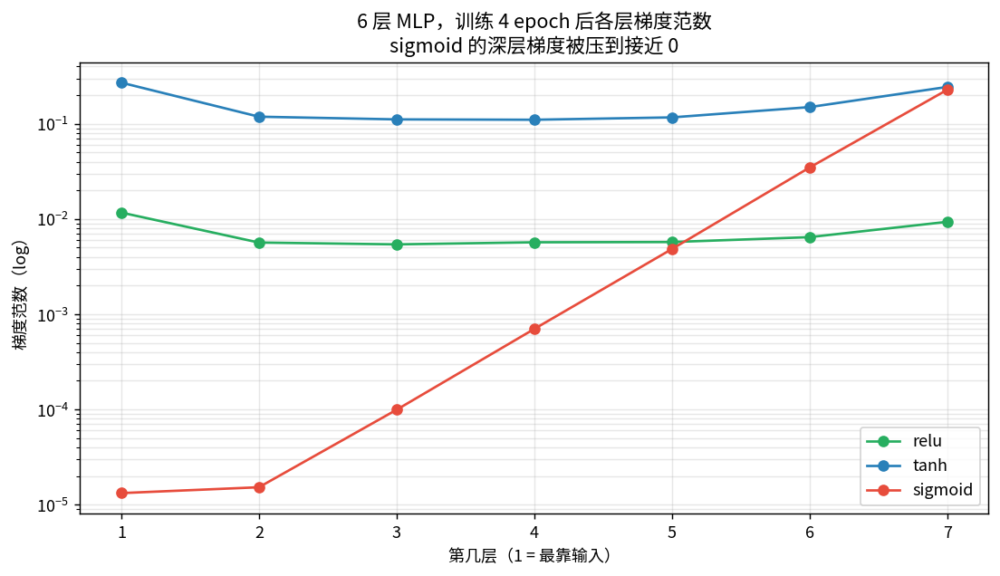

# 梯度下降与反向传播

> 第四课把问题变成 loss，第五课把 loss 写成 ELBO。这一课是最后一公里：
> **loss 对几千万个参数的梯度，怎么算出来？**

**核心只有一条：链式法则 + 复用中间结果。**

---

## 1 · 梯度与数值校验

梯度 = 上升最快方向。数值校验（**gradient checking**，写自定义层必做）：
$$\frac{\partial f}{\partial x_i}\approx\frac{f(x_i+\varepsilon)-f(x_i-\varepsilon)}{2\varepsilon}$$

实测解析梯度 vs 数值梯度最大差 **1.5e-10**。



### 📖 这张图怎么读

- **左**：等高线 + 梯度箭头。**箭头垂直于等高线**（这是梯度的几何性质）。
  数值验证：在单位圆上搜 720 个方向找增益最大的，结果与归一化梯度几乎重合。
- **右**：lr=0.03 走 60 步的轨迹。**注意它一直沿谷底滑走，不收敛** ——
  因为这个函数 $f=x_1^2+3x_1x_2+\sin x_2$ 的 Hessian 不定，是**鞍面**，没有最小值。
- **教训**：损失在下降 ≠ 训练正常。要看梯度和曲率，不能只看曲线。

---

## 2 · 手算一个两层网络的完整 backward

网络（取小数，全程可笔算）：
```
x(2) --W1--> z1(3) --ReLU--> a1(3) --W2--> z2(2) --softmax--> p(2) --> 交叉熵 L
```

$$\frac{\partial L}{\partial z_2}=p-y,\quad
\frac{\partial L}{\partial W_2}=a_1\,\delta_2^\top,\quad
\delta_1=(W_2\delta_2)\odot\mathbb 1[z_1>0],\quad
\frac{\partial L}{\partial W_1}=x\,\delta_1^\top$$

**ReLU 的导数就是个开关**（$z>0$ 传 1，否则 0），这是反向便宜的来源。

### 对拍结果（这是本课最硬的数字）

| 项 | 最大差 |
|---|---|
| loss（手算 vs PyTorch） | **2.78e-17** |
| dW1 | **2.78e-17** |
| dW2 | 5.55e-17 |
| db1 / db2 | 2.95e-17 / 2.78e-17 |
| 手算 vs 数值梯度（全参数） | **1.01e-09** |

**反向传播没有魔法，就是把链式法则按从后往前的顺序复用中间结果。**

---

## 3 · 反向传播 ≠ 矩阵连乘：括号怎么加

雅可比是连乘 $J=J_n\cdots J_1$，结合律成立但**计算量差几个数量级**。

- **左乘（VJP，反向传播）**：$\bar z_{\ell}=J_{\ell+1}^\top \bar z_{\ell+1}$，每步是**向量×矩阵**
- **右乘（先算完整雅可比）**：每步是**矩阵×矩阵**

实测（784-512-256-128-10）：右乘/左乘 = **10 倍**。层数越深差距越大。

**反向传播成本 ≈ 一次前向**，所以「后向约等于两次前向」这个经验说法是对的。

---

## 4 · 梯度消失：手算 $\sigma'$ 连乘

$$\frac{\partial L}{\partial W_1}\sim\prod_{\ell}\big(W_\ell^\top\mathrm{diag}(\sigma'(z_\ell))\big)$$

**sigmoid 导数最大只有 0.25**（$\sigma'=\sigma(1-\sigma)$）。L 层连乘 → $0.25^L$：

| L | sigmoid 连乘 | ReLU |
|---|---|---|
| 5 | 9.8e-04 | 1.0 |
| 10 | 9.5e-07 | 1.0 |
| 20 | 9.1e-13 | 1.0 |
| 30 | **8.7e-19** | 1.0 |



### 📖 这张图怎么读

- **左**：sigmoid' 峰值只有 0.25（红）；tanh' 峰值 1；ReLU' 在激活区恒为 1。
- **中**：L 层连乘后的梯度缩放（log 轴）。sigmoid 30 层就到 $10^{-19}$，等于**彻底断流**。
  ReLU 恒为 1 —— 这就是 ReLU 革命性解决梯度消失的原因。
- **右**：好初始化（Xavier/He）的目标就是让**每层增益 ≈ 1**。

### 真实实验：6 层 MLP 各层梯度范数



| 激活 | 第 1 层 / 最后一层 |
|---|---|
| ReLU | 1.25 |
| tanh | 1.11 |
| **sigmoid** | **5.8e-05** |

sigmoid 的首层梯度范数 0.00001，末层 0.22757 —— **差 4 个数量级**。
第一层基本学不到东西，网络白堆了 6 层。

---

## 总结

| 概念 | 要点 |
|---|---|
| 梯度 | 上升最快方向；中心差分校验 |
| softmax+CE 梯度 | $p-y$（第四课） |
| ReLU 梯度 | 开关：0 或 1 |
| 反向传播 | **左乘** VJP，成本 ≈ 一次前向 |
| sigmoid' | ≤ 0.25 → 30 层 $10^{-19}$ |
| 好初始化 | 让每层增益 ≈ 1（Xavier / He） |

**三句话**
1. 反向传播 = 链式法则 + 从后往前复用。手算一个 2-3-2 的网络就能全懂。
2. 它快的原因是**左乘**（VJP），不是先算雅可比矩阵。
3. 梯度消失的根源是**每层增益 < 1 的连乘**。

## 关联

- 前置：[04](../04-%E6%A6%82%E7%8E%87%E7%BB%9F%E8%AE%A1_%E6%9E%81%E5%A4%A7%E4%BC%BC%E7%84%B6%E4%B8%8E%E4%BA%A4%E5%8F%89%E7%86%B5/%E6%A6%82%E7%8E%87%E7%BB%9F%E8%AE%A1_%E6%9E%81%E5%A4%A7%E4%BC%BC%E7%84%B6%E4%B8%8E%E4%BA%A4%E5%8F%89%E7%86%B5.md)（CE 梯度）、[05](../05-%E8%B4%9D%E5%8F%B6%E6%96%AF%E4%B8%8EVAE/%E8%B4%9D%E5%8F%B6%E6%96%AF%E4%B8%8EVAE.md)（ELBO）
- 后续：[07 优化器](../07-%E4%BC%98%E5%8C%96%E5%99%A8/%E4%BC%98%E5%8C%96%E5%99%A8.md)（拿到梯度之后怎么用）
