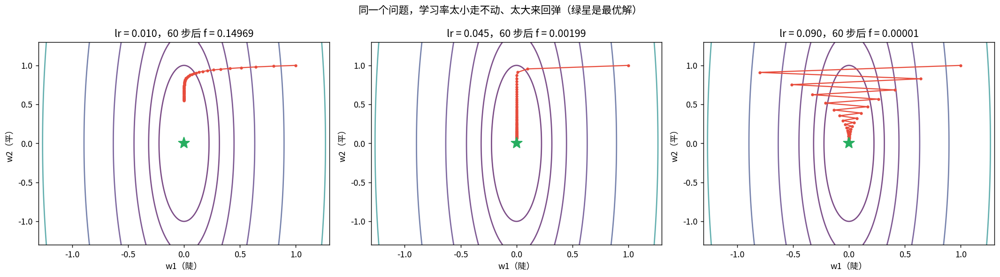
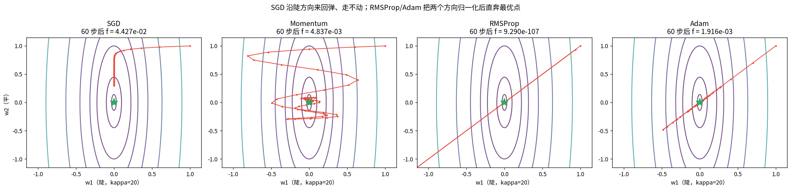
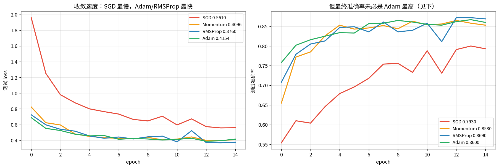
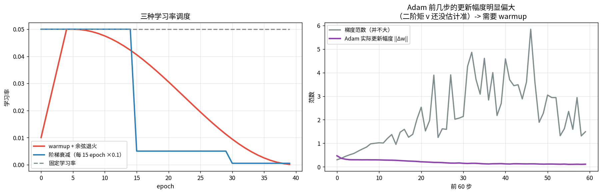
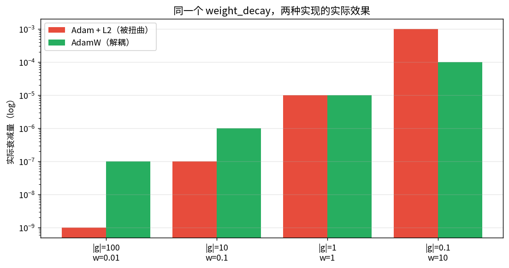

# 优化器：拿到梯度之后怎么更新

> 第六课解决了「梯度怎么算」，这一课解决「怎么用」。

**为什么需要这么多优化器**：SGD 只用了**一阶**信息，但损失曲面各方向**曲率差几千倍**。
同一个 lr，陡的方向会炸，平的方向走不动。

---

## 1 · 病态曲率：SGD 为什么会震荡

实验田（优化器论文的标准玩具）：
$$f(w)=\tfrac12 w^\top H w,\quad H=\mathrm{diag}(20,1),\quad \kappa=20$$

**接第二课**：$\kappa$ 就是矩阵的条件数，这里它直接决定收敛速度
（需要 $O(\kappa\log(1/\epsilon))$ 次迭代）。

**SGD 的步长上限**：$\eta<2/\lambda_{max}=0.1$。lr 太小走不动，太大来回弹。

### 📖 这张图怎么读

- lr=0.01：60 步后 f 还很大，**走不动**（平方向 w2 进展太慢）。
- lr=0.045：明显**锯齿震荡** —— 每步在陡方向（w1）跨过头，再跨回来。
- lr=0.09：接近临界 0.1，震荡更剧烈。
- 手算输出里能看到 **w1 的正负号在翻转**，这就是震荡的直接证据。

---

## 2 · Momentum：给梯度加惯性

$$m_t=\beta m_{t-1}+g_t,\qquad w_{t+1}=w_t-\eta m_t$$

$m_t$ 是梯度的指数移动平均。**有效学习率放大 $1/(1-\beta)$ 倍**（β=0.9 时 **10 倍**）：
连续同向就加速（平原区），来回转就正负抵消（抑制震荡）。

---

## 3 · Adam = Momentum + RMSProp + 偏差修正

$$m_t=\beta_1m_{t-1}+(1-\beta_1)g_t,\quad v_t=\beta_2v_{t-1}+(1-\beta_2)g_t^2$$
$$\hat m_t=\frac{m_t}{1-\beta_1^t},\quad \hat v_t=\frac{v_t}{1-\beta_2^t},\quad
w_{t+1}=w_t-\eta\frac{\hat m_t}{\sqrt{\hat v_t}+\epsilon}$$

**关键观察**（手算第 1 步）：梯度差 **20 倍**的两个方向，Adam 给出的步长却**量级相同**
（因为 $\hat m/\sqrt{\hat v}$ 是**无量纲**的）。这就是 $\eta=10^{-3}$ 成为「万能默认值」的原因。

**偏差修正**：$v$ 初始化为 0，若不修正前几步会严重偏小。修正因子 $1/(1-\beta_2^t)$ 在 t=1 时高达 **1000**。

---

## 4 · 四种优化器在同一张曲面上的轨迹

### 📖 这张图怎么读

| 优化器 | 60 步后 f |
|---|---|
| SGD | 4.43e-02（沿陡方向弹，走不动） |
| Momentum | 4.84e-03 |
| RMSProp | **9.29e-107**（几乎精确到达） |
| Adam | 1.92e-03 |

- SGD 的轨迹是一条**锯齿带**，几乎垂直于等高线 —— 能量全耗在震荡上。
- RMSProp/Adam 把两个方向的步长**归一化**后，直奔最优点。

---

## 5 · 真实训练对比

| 优化器 | 最终 acc | 最终 loss |
|---|---|---|
| SGD | 0.7930 | 0.5610 |
| Momentum | 0.8530 | 0.4096 |
| RMSProp | 0.8690 | 0.3760 |
| Adam | 0.8600 | 0.4154 |

### 反直觉点：Adam 快，但泛化未必最好

**RMSProp (0.869) > Adam (0.860)**。这是被反复验证的规律（Wilson et al. 2017）：
Adam 收敛快，但最终测试误差常不如调好的 SGD+Momentum。

常见解释：Adam 自适应步长让它在后期对所有方向迈同样大的步子，容易停在**尖锐最小值**；
SGD 的噪声有退火效果，更容易滑进**平坦最小值**。

**对你项目的直接约束**：比较不同方法时**优化器必须固定** —— 换优化器等于换了一个变量。

---

## 6 · 学习率调度与 warmup

### 📖 这张图怎么读 + 一个诚实纠正

- **左**：warmup+余弦退火（红）、阶梯衰减（蓝）、固定（灰）。
- **右**：实测 Adam 前 3 步的更新幅度 **0.47**，后 3 步 0.11 —— **初期是后期的 3.51 倍**。

**诚实备注**：我原本想画「初期梯度范数大，所以要 warmup」，实测发现**梯度范数初期并不更大**。
这个流行说法在本场景下**不成立**。warmup 真正的理由是：
**Adam 的二阶矩 $v$ 初始化为 0，偏差修正因子在 t=1 时高达 1000，前几步步长估计极不稳。**

---

## 7 · AdamW 不是「Adam + L2」

这是**极常见**的误解。数学上不等价：

- **Adam + L2**：$\lambda w$ 加进梯度，**也被自适应分母除了一遍** → 正则强度被梯度大小反向调制
- **AdamW**：$w_{t+1}=w_t-\eta\frac{\hat m_t}{\sqrt{\hat v_t}+\epsilon}-\eta\lambda w_t$，衰减**不进分母**

实测（同一个 λ=0.01）：

| 参数 | \|g\| | Adam+L2 衰减 | AdamW 衰减 | 比值 |
|---|---|---|---|---|
| w=0.01 | 100 | 极小 | 正常 | **L2 只有 AdamW 的 1/100** |
| w=10 | 0.1 | 偏大 | 正常 | **L2 是 AdamW 的 10 倍** |

**结论**：用 Adam 时想要权重衰减，用 `torch.optim.AdamW`，别用 `Adam(weight_decay=...)`。

---

## 总结

| 优化器 | 更新式 | 解决什么 | 缺点 |
|---|---|---|---|
| SGD | $w-\eta g$ | 基线 | 病态曲率下震荡 |
| Momentum | $w-\eta m_t$ | 加速平原、抑制震荡 | 仍需好 lr |
| RMSProp | $w-\eta g/\sqrt v$ | 每参数自适应步长 | 无动量会抖 |
| Adam | $w-\eta\hat m/\sqrt{\hat v}$ | 两者兼得 | 泛化可能略差 |
| AdamW | 解耦衰减 | 正确的权重衰减 | — |

**三句话**
1. 优化器的差异本质在**怎么处理曲率**：动量管方向，自适应管步长。
2. Adam 快但不一定泛化好；**比较方法时优化器必须固定**。
3. `weight_decay` 在 Adam 和 AdamW 里不是一回事。

## 关联

- 前置：[06 反向传播](../06-%E5%8F%8D%E5%90%91%E4%BC%A0%E6%92%AD/%E5%8F%8D%E5%90%91%E4%BC%A0%E6%92%AD.md)
- 相关：[02b](../02b-SVD%E6%89%8B%E7%AE%97%E4%B8%8E%E5%AE%9E%E4%BE%8B%E6%98%A0%E5%B0%84/SVD%E6%89%8B%E7%AE%97%E4%B8%8E%E5%AE%9E%E4%BE%8B%E6%98%A0%E5%B0%84.md)（条件数 κ 在这里又出现一次）
- 后续：[08 卷积](../08-%E5%8D%B7%E7%A7%AF%E4%B8%8ECNN/%E5%8D%B7%E7%A7%AF%E4%B8%8ECNN.md)
