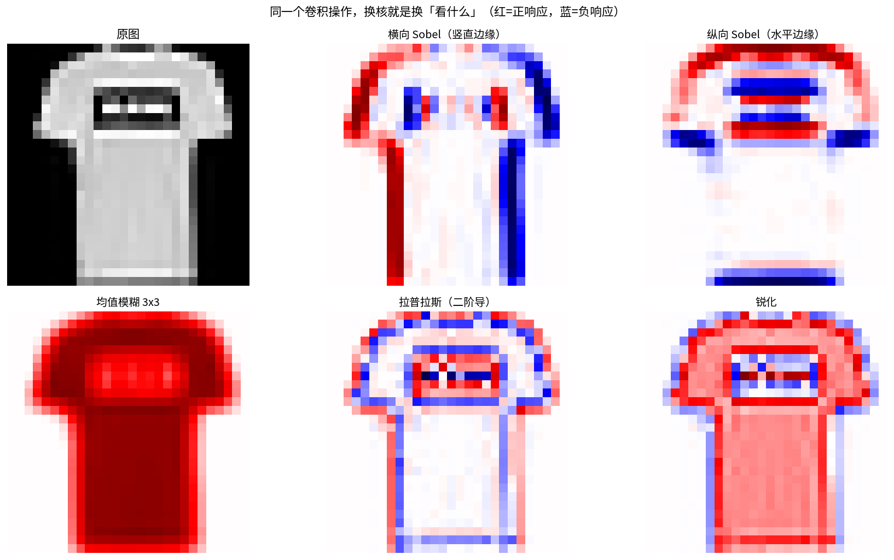
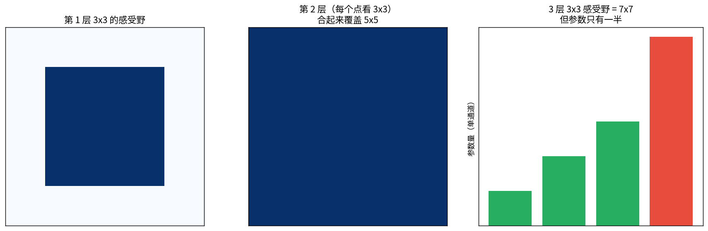
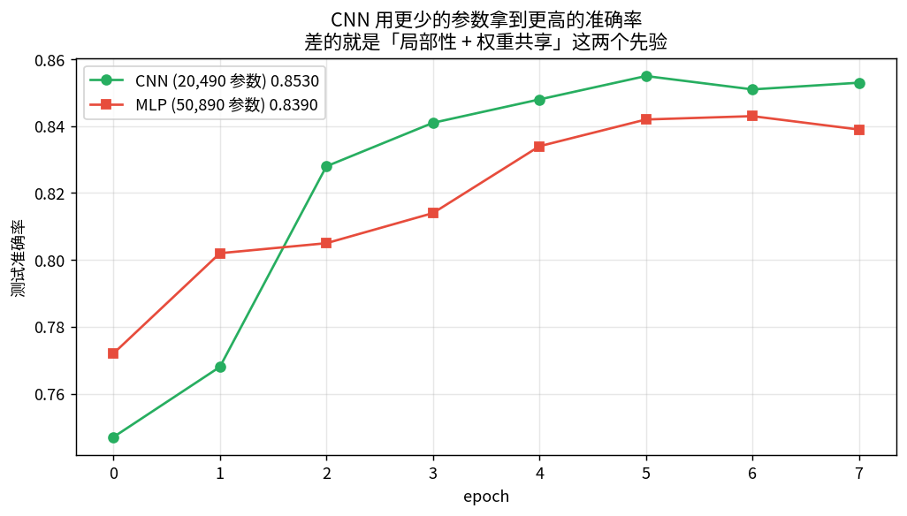
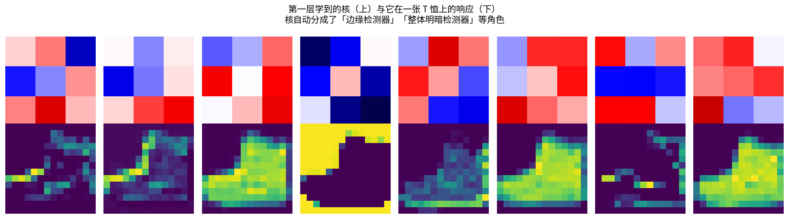

# 卷积与 CNN

> 前七课都是全连接。图像 784 像素，第一层就 20 万参数，而且**对「平移一格」毫无抵抗力**。

卷积解决两件事：**局部性**（只看附近）+ **权重共享**（特征在全图通用）。

---

## 1 · 一维卷积：先搞清「翻转」

- **数学卷积** $(f*g)[n]=\sum_k f[k]g[n-k]$ —— $g$ 会被**翻转**
- **互相关** $(f\star g)[n]=\sum_k f[n+k]g[k]$ —— 不翻转

**深度学习说的「卷积」实际是互相关**。区别只有一个翻转，而核是学出来的，
翻转与否只是参数换个位置，**对表达能力毫无影响**。框架沿用旧名而已。

**输出长度**：$L_{out}=\lfloor(L_{in}+2p-K)/s\rfloor+1$

| L_in | K | pad | stride | L_out |
|---|---|---|---|---|
| 5 | 3 | 0 | 1 | 3 |
| 5 | 3 | 1 | 1 | 5 |
| 5 | 3 | 0 | 2 | 2 |
| 28 | 3 | 1 | 1 | 28 |

---

## 2 · 手算二维卷积：5×5 + 3×3，逐格打印

把核在图上滑动，每个位置「逐元素相乘再求和」。notebook 里把**每个窗口都打出来**了。
**手算 vs PyTorch 最大差 = 0.00e+00**（完全一致）。

---

## 3 · 经典核：卷积到底在「看」什么

### 📖 这张图怎么读

| 核 | 作用 | 数学意义 |
|---|---|---|
| 横向 Sobel | 抓**竖直**边缘 | $x$ 方向导数 |
| 纵向 Sobel | 抓**水平**边缘 | $y$ 方向导数 |
| 均值 3×3 | 模糊/降噪 | 局部平均（低通） |
| 拉普拉斯 | 边缘的再求导 | 二阶导（零交叉点定位边缘） |
| 锐化 | 增强细节 | 高通 = 原图 − 低频 |

**关键洞察**：边缘 = 图像**变化剧烈**的地方 = **导数大**的地方。
所以**边缘检测就是数值微分，数值微分就是卷积**。notebook 里直接对比了
`row[1:]-row[:-1]` 与卷积 `[1,0,-1]`，只差一个平移。

---

## 4 · 参数量：为什么卷积这么省

$$\text{参数量}=C_{out}\,C_{in}\,K^2+C_{out}$$

**与输入分辨率无关** —— 这是卷积能处理任意尺寸图像的原因。

| | 参数量 |
|---|---|
| 全连接 784→256 | 200,960 |
| 3×3 卷积 1→32 通道 | **320** |

差 **600 倍**。省下的参数量就是 CNN 能堆很深的原因。

---

## 5 · 感受野：小核堆叠为什么优于大核

$$RF_\ell=RF_{\ell-1}+(K_\ell-1)\prod_{i=1}^{\ell-1}s_i$$

### 📖 这张图怎么读

- **左→中**：两个 3×3 叠加，等效 5×5 感受野。
- **右**：3 层 3×3 的感受野 = 7×7，参数 **27**；单个 7×7 卷积参数 **49**。
  **同样感受野，参数只有 55%，还多了两次非线性**。这就是 VGG 的核心发现。

---

## 6 · 卷积 = 矩阵乘法（im2col）：接回第二课

把每个滑动窗口拉成一行、核拉成列，卷积就变成 $Y=XA^\top$。

**手算 vs PyTorch 最大差 = 0.00e+00**。

代价：5×5 输入展开成 16×4 = 64 个数，**内存放大 2.6 倍**。
这是一笔「用内存换速度」的买卖 —— 换来的大矩阵乘法能被 BLAS/GPU 极致优化。

**意义**：卷积**没有跳出第二课的线性代数框架**，SVD / 伪逆 / 条件数全都能用上。

---

## 7 · 真实训练：CNN vs MLP

| 模型 | 参数量 | 最终 acc |
|---|---|---|
| **SmallCNN** (16/32 通道) | **20,490** | **0.8530** |
| MLP (hidden=64) | 50,890 | 0.8390 |

**CNN 用 40% 的参数拿到更高的准确率**。差的就是「局部性 + 权重共享」这两个先验。

### 📖 这张图怎么读

- **上排**：第一层学到的 16 个 3×3 核（红正蓝负）。
- **下排**：这些核在同一张 T 恤上的响应（特征图）。
- 统计发现核**自动分化成两种角色**：多数是「边缘/梯度检测器」（方向性强、权重和接近 0），
  少数是「均值/明暗检测器」（整体同号）。**没人教它这么做，是数据和任务逼出来的。**
- 这和第五课 VAE latent 的自动聚团是同一类现象。

---

## 总结

| 概念 | 要点 |
|---|---|
| 卷积 vs 互相关 | 差一个翻转；不影响表达能力 |
| 参数量 | $C_{out}C_{in}K^2+C_{out}$，与分辨率无关 |
| 感受野 | $RF_\ell=RF_{\ell-1}+(K_\ell-1)\prod s_i$ |
| 小核堆叠 | 3 层 3×3 ≈ 7×7 感受野，参数只有一半 |
| 卷积 = 矩阵乘法 | im2col 后是 $XA^\top$ |
| 边缘检测 | = 数值微分 = 带权差分核 |

**三句话**
1. 卷积的两个先验：**局部性** + **权重共享**。
2. 省下的参数就是能堆深度的本钱；小核堆叠比大核划算。
3. 卷积不是新数学，是**加了稀疏和共享约束的矩阵乘法**。

## 关联

- 前置：[07 优化器](../07-%E4%BC%98%E5%8C%96%E5%99%A8/%E4%BC%98%E5%8C%96%E5%99%A8.md)、[02 SVD](../02-SVD%E5%A5%87%E5%BC%82%E5%80%BC%E5%88%86%E8%A7%A3/SVD%E5%A5%87%E5%BC%82%E5%80%BC%E5%88%86%E8%A7%A3.md)（im2col 后就是矩阵乘法）
- 后续：[[09-决策树与信息增益]]、[[11-谱聚类与图拉普拉斯]]
