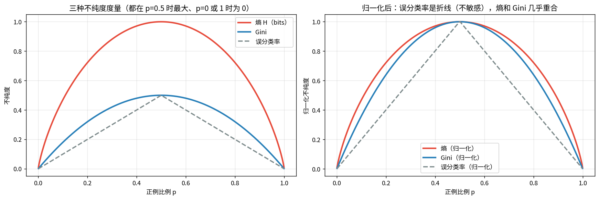
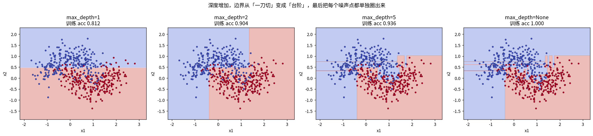
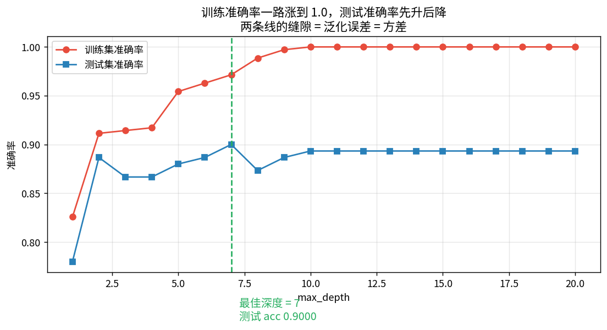
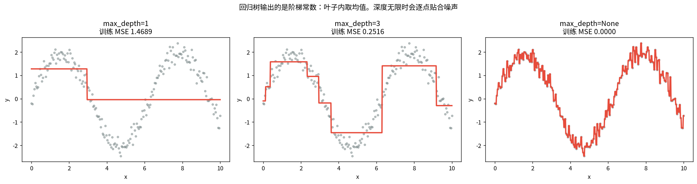
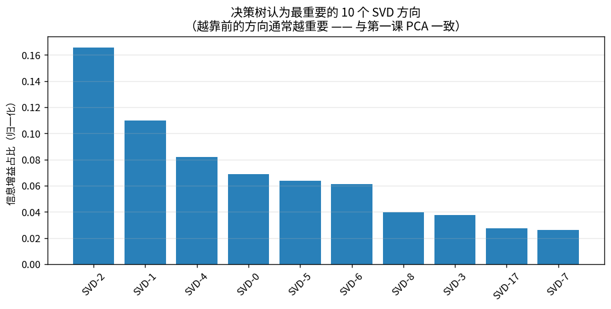

# 决策树与信息增益

> 第四课学了熵 $H(p)$。这一课是熵的第一个实际用处：**决定先问哪个问题**。

决策树就是一连串 if-else。核心只有一个问题：**每一步用哪个特征、在哪个阈值切？**
答案是：**选让子节点纯度提升最多的切法**。

---

## 1 · 信息增益：手算经典天气数据集

$$IG(D,A)=H(D)-\sum_v\frac{|D_v|}{|D|}H(D_v)=H(D)-H(D\,|\,A)$$

**读法**：分裂前的熵 − 分裂后各子节点熵的加权平均。降得越多，这次分裂越值。

实测（14 条样本，8 yes / 6 no）：

| 步骤 | 值 |
|---|---|
| $H(D)$（分裂前） | **0.985228** bits |
| 按 outlook 分裂 → 条件熵 | 0.278581 |
| **IG(outlook)** | **0.706647** |
| 按 humidity 分裂 → 条件熵 | 0.727397 |
| IG(humidity) | 0.257831 |

**先问 outlook**。因为 overcast 那一组熵直接为 0（纯了），一步到位。

---

## 2 · 三种不纯度度量

| 度量 | 公式（二分类，正例比例 p） | 最大值 | 特点 |
|---|---|---|---|
| 熵 | $-p\log_2p-(1-p)\log_2(1-p)$ | 1（p=0.5） | 对纯度变化最敏感 |
| Gini | $2p(1-p)$ | 0.5 | 不用算 log，快 |
| 误分类率 | $1-\max(p,1-p)$ | 0.5 | 太钝，几乎不用 |

### 📖 这张图怎么读

- **左**：三条曲线都在 p=0.5 时最大、p=0 或 1 时为 0。
- **右（归一化后）**：**误分类率是折线**（在 p=0.5 附近完全不敏感），熵和 Gini 几乎重合。
- **结论**：三者单调一致，绝大多数数据集上选出的分裂**相同**。sklearn 默认 Gini 纯粹因为没有 log 运算更快。

---

## 3 · 决策边界为什么是「方块状」

### 📖 这张图怎么读

- 每个节点只做一个 $x_j\le t$ 的判断，所以整棵树把空间切成**一堆与坐标轴平行的矩形**。
- 深度 1：一条水平或竖直的线。深度 2：出现台阶。深度不限：把每个噪声点都单独圈出来。
- **这是决策树的根本局限**：它学不出斜的边界。要斜的边界就得靠旋转特征（PCA，第一课）
  或者换模型。

---

## 4 · 过拟合：深度扫描

两弯月数据（500 点，noise=0.3）：

| 深度 | 训练 acc | 测试 acc | 叶子数 |
|---|---|---|---|
| 1 | 0.8257 | 0.7800 | 2 |
| 2 | 0.9114 | 0.8867 | 4 |
| **7** | 0.9714 | **0.9000** | 33 |
| 10 | **1.0000** | 0.8933 | 45 |

**最佳深度 7**。之后训练满分、测试下滑 —— 典型过拟合。
两条线的缝隙 = 泛化误差 = **方差**（下一课集成方法要治的就是它）。

---

## 5 · 连续特征与回归树

- **连续特征**：把所有取值排序，只在**相邻两个不同类别之间**的间隙试阈值。n 个样本只有 ≤ n−1 个候选，不是连续搜索。
- **回归树**：叶子输出**均值**，不纯度用 **MSE**。

### 📖 这张图怎么读

回归树输出的是**阶梯常数**。深度 1 是一条水平线，深度 3 是几级台阶，无限制时逐点贴合噪声。

**接第四课**：回归树用 MSE，而 MSE 正是**高斯噪声下的极大似然** —— 又回到那条主线。

---

## 6 · 与第三课 KMeans 的对照

同样是「把数据切成块」，区别只在**有没有标签**：

| | 决策树（有监督） | KMeans（无监督，第三课） |
|---|---|---|
| 切的准则 | 让**标签**变纯（信息增益 / Gini） | 让**簇内距离**变小（WCSS） |
| 边界 | 与轴平行的矩形 | Voronoi 区域（任意方向） |
| 需要标签 | 是 | 否 |
| 评估 | 准确率 | ARI / NMI / 轮廓系数 |

**实测**（Fashion-MNIST 6000 样本，SVD-50）：

| 方法 | ACC |
|---|---|
| 决策树 (max_depth=20) | **0.7056** |
| KMeans (k=10, 匈牙利匹配) | 0.5372（ARI 0.3727） |

**差 17 个百分点** —— 有监督的分割直接对准类别，无监督的簇只是「看起来成团」。
**这正是自监督表征要拼命缩小的差距。**

### 📖 这张图怎么读

决策树认为最重要的 10 个 SVD 方向，集中在**前若干个主成分**上（top10 = 2,1,4,0,5,6,8,3,17,7）。
和第一课「方差大的方向信息多」完全对上。

---

## 总结

| 概念 | 要点 |
|---|---|
| 信息增益 | $IG=H(D)-H(D\|A)$，选最大的分裂 |
| 熵 vs Gini | 单调一致，实际分裂几乎相同 |
| 误分类率 | 太钝，基本不用 |
| 连续特征 | 只在相邻异类间隙试阈值，≤ n−1 个候选 |
| 回归树 | 叶子取均值，不纯度用 MSE（= 高斯 MLE） |
| 决策边界 | 与轴平行的矩形，根本局限 |
| 过拟合 | 深度↑ → 训练满分、测试下滑 |

**三句话**
1. 决策树每一步就是「挑一个让标签最纯的切法」，判据是熵或 Gini 的下降。
2. 边界一定是**轴平行矩形**，学不出斜线 —— 这是它的天花板。
3. 单棵树**方差极大**（下一课用 Bagging / Boosting 治）。

## 关联
- 前置：[[04-概率统计_极大似然与交叉熵/概率统计_极大似然与交叉熵|04 概率统计]]、[[03-KMeans聚类/KMeans聚类|03 KMeans]]
- 后续：[[10-集成方法/集成方法|10 集成方法]]
