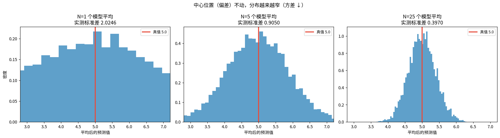
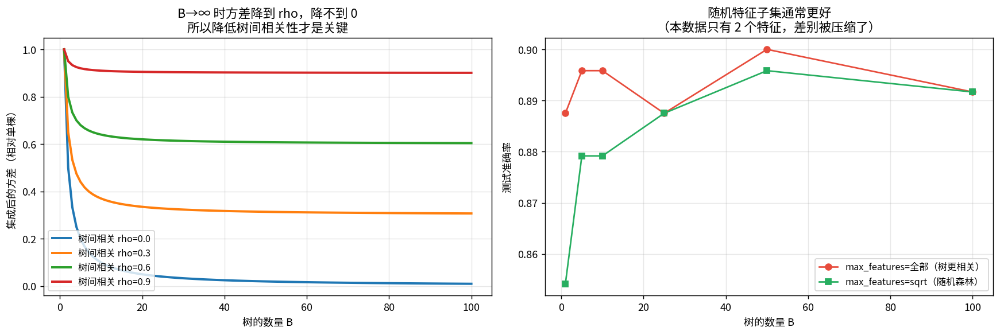
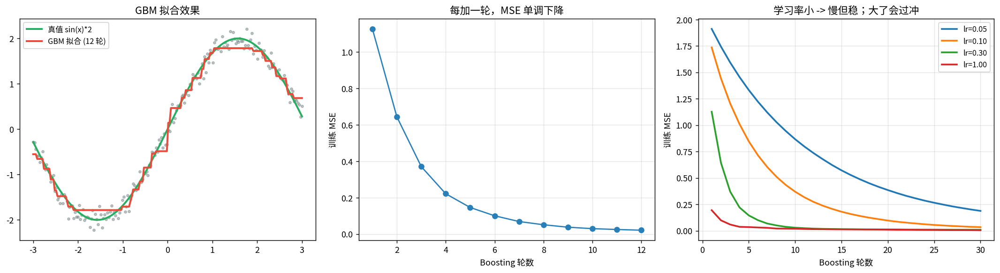
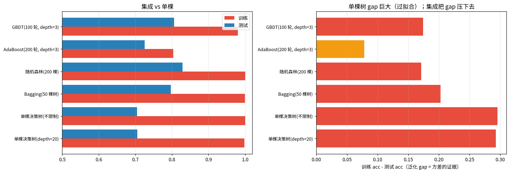
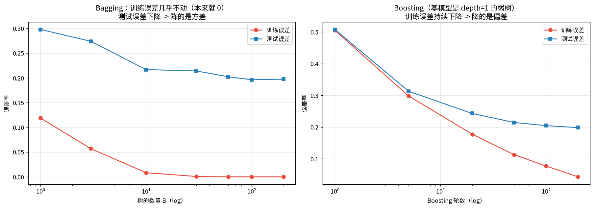

# 集成方法：Bagging / 随机森林 / Boosting

> 第九课结尾的问题：单棵决策树**方差极大** —— 换个训练集，树的结构就大变。
> 这一课用「三个臭皮匠」把方差压下去。

---

## 1 · 偏差-方差分解：集成在治哪一项

$$\mathbb E[(y-\hat f)^2]=\mathrm{Bias}[\hat f]^2+\mathrm{Var}[\hat f]+\sigma^2$$

- **偏差大** = 欠拟合（模型太简单）
- **方差大** = 过拟合（换批数据结果就变，决策树的病）
- $\sigma^2$ = 数据本身噪声，**无解**

**Bagging 治方差，Boosting 治偏差。** 下面手算验证。

### 📖 这张图怎么读

N 个独立同分布估计量取平均：

| N | 平均值的标准差（实测） | 理论 $\sigma/\sqrt{N}$ |
|---|---|---|
| 1 | — | 2.0000 |
| 10 | — | 0.6325 |
| 100 | — | 0.2000 |
| 500 | — | 0.0894 |

- 三张直方图：**中心位置（偏差）一点没动**，分布越来越窄（方差按 $1/N$ 下降）。
- **前提**：各模型的误差要**不相关**。如果 N 个模型一模一样，平均完还是它自己，方差一点不降。
  这就是随机森林要随机选特征的原因。

---

## 2 · Bagging：自助采样 + 平均

**Bootstrap**：从 n 个样本里有放回抽 n 个。每次约有 **63.2%** 的样本被抽到
（$1-(1-1/n)^n\to 1-e^{-1}=0.632$），剩下的叫 **out-of-bag**，可以白拿一个验证集。

实测：抽中的不同样本占比 **0.6321**，理论 $1-1/e$ = **0.6321** ✓

**只有当基模型「不稳定」时才有效**。实测模型间分歧率：

| 基模型 | 模型间分歧 | Bagging 后 acc |
|---|---|---|
| 决策树 depth=None（不稳定） | 高 | 收益最大 |
| 决策树 depth=1（稳定） | 低 | 收益小 |
| KNN k=15（稳定） | 低 | 收益小 |

---

## 3 · 随机森林：还要再随机一次特征

Bagging 只随机了样本，RF 再随机**特征**：每个节点只在随机抽出的 $\sqrt{d}$ 个特征里挑。

**为什么**：如果数据里有 1 个超强特征，所有树都会先切它 → 树与树**高度相关** → 平均完方差降不下来。

$$\mathrm{Var}\Big(\frac1B\sum_i f_i\Big)=\rho\sigma^2+\frac{1-\rho}{B}\sigma^2$$

### 📖 这张图怎么读

- **左**：$B\to\infty$ 时方差降到 $\rho$，**降不到 0**。所以**降树间相关性 $\rho$ 才是关键**。
- **右**：随机特征子集通常更好（本数据只有 2 维，差距被压缩了；高维数据上差距会放大）。

---

## 4 · AdaBoost：手算样本权重的更新

四步：
1. 训练弱分类器，算加权错误率 $\epsilon_t$
2. 分类器权重 $\alpha_t=\frac12\ln\frac{1-\epsilon_t}{\epsilon_t}$
3. 样本权重 $w_i\leftarrow w_i e^{-\alpha_t y_i h_t(x_i)}$（**分对变小、分错变大**），再归一化
4. $H(x)=\mathrm{sign}\big(\sum_t\alpha_t h_t(x)\big)$

**实测手算 3 轮**：$H(x)=\mathrm{sign}(0.4236\,h_1+0.6496\,h_2+0.7520\,h_3)$，
**与 sklearn 结果逐位一致**。每轮都能看到分错的样本权重被放大。

---

## 5 · GBDT：拟合残差

$$F_{t+1}=F_t+\eta\,h_{t+1},\qquad h_{t+1}\approx y-F_t$$

对平方损失，$-\nabla L=y-F_t$ 就是**残差**。

### 📖 这张图怎么读

- **左**：12 轮后拟合出 sin 曲线。
- **中**：训练 MSE 单调下降。
- **右**：学习率小 → 慢但稳；大了会过冲。**这个 lr 和神经网络的 lr 是同一个东西（第七课）。**

**接第六课**：GBM 就是**在函数空间做梯度下降** —— 「参数」是函数值，「梯度」是残差。

---

## 6 · 实测大乱斗

| 模型 | 训练 acc | 测试 acc | 泛化 gap |
|---|---|---|---|
| 单棵决策树(depth=20) | 0.9983 | 0.7056 | **+0.2928** |
| 单棵决策树(不限制) | 1.0000 | 0.7044 | **+0.2956** |
| Bagging(50 棵树) | 0.9998 | 0.7972 | +0.2025 |
| **随机森林(200 棵)** | 1.0000 | **0.8289** | +0.1711 |
| GBDT(100 轮, depth=3) | 0.9802 | 0.8061 | +0.1741 |

**单棵树 gap 接近 0.29（训练满分、测试 0.70），随机森林压到 0.17 且准确率涨 12 个百分点。**

---

## 7 · Bagging 降方差 vs Boosting 降偏差

### 📖 这张图怎么读（本课最重要的一张）

- **Bagging**：训练误差 **0.1188 → 0.0000**（本来就低，降不动），测试误差下降 → **降的是方差**
- **Boosting**（基模型是 depth=1 的弱树）：训练误差 **0.5050 → 0.0431**（大幅下降）→ **降的是偏差**

**分辨方法**：**看训练误差动不动**。动 = 治偏差，不动只降测试 = 治方差。

---

## 总结

| 方法 | 怎么组合 | 治什么 | 基模型要求 |
|---|---|---|---|
| Bagging | 并行，投票/平均 | **方差** | 要**不稳定**（深树） |
| 随机森林 | Bagging + 随机特征 | 方差（额外降 $\rho$） | 深树 |
| AdaBoost | 串行，改样本权重 | **偏差** | 弱分类器（stump） |
| GBDT | 串行，拟合残差 | **偏差** | 浅树 |

**三句话**
1. **Bagging 治方差，Boosting 治偏差** —— 看训练误差动不动就能分辨。
2. 降方差的前提是**基模型不稳定且彼此不相关**；随机特征就是在打相关性。
3. GBM 是**函数空间的梯度下降**，残差就是负梯度。

## 关联
- 前置：[[09-决策树与信息增益/决策树与信息增益|09 决策树]]
- 相关：[[07-优化器/优化器|07 优化器]]（GBM 的 lr 就是梯度下降的 lr）
