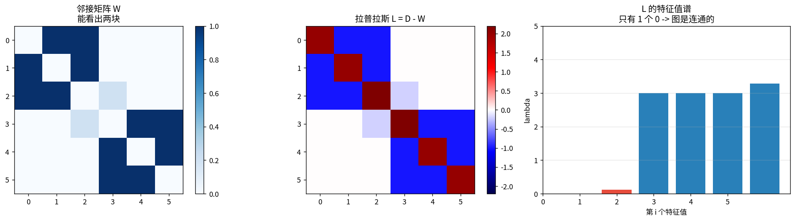
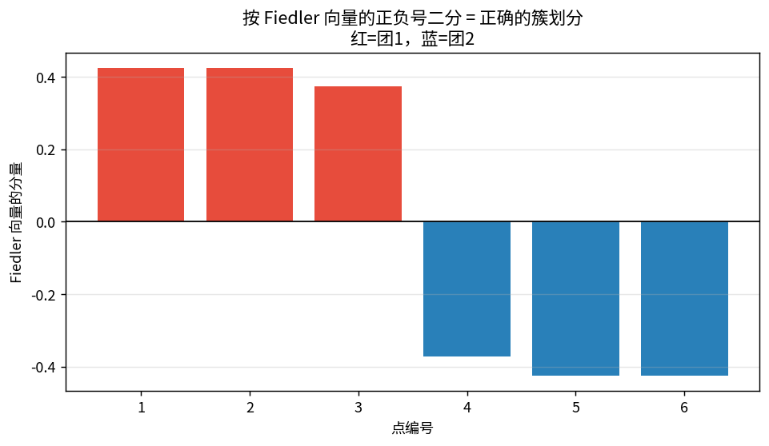
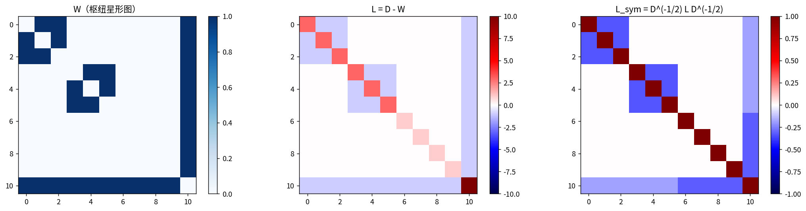
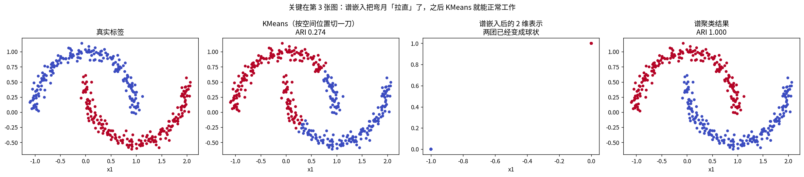
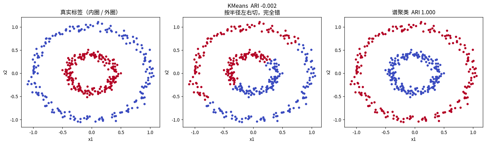
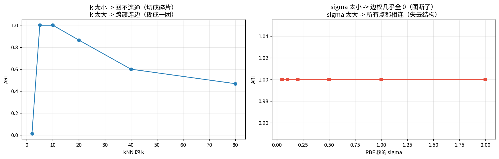

# 谱聚类与图拉普拉斯

> 第三课 KMeans 有个致命假设：**簇是凸的、大小相近的一坨**。
> 碰到两弯月、同心圆，KMeans 直接崩。这一课用**图**的视角解决它。

**核心思路**：不看点在空间的位置，只看**点之间的连接关系**。然后「切最少的边分成两块」。

---

## 1 · 图的三个矩阵

| 矩阵 | 定义 | 含义 |
|---|---|---|
| 邻接 $W$ | $W_{ij}=w_{ij}$ | 谁和谁连、连得多紧 |
| 度 $D$ | $D_{ii}=\sum_j w_{ij}$ | 每个点的总连接强度 |
| **拉普拉斯 $L$** | $L=D-W$ | 图上的**二阶导**算子 |

**为什么叫拉普拉斯**：连续的 $\Delta f$ 量「某点值与邻居平均值的差」，离散化后正好是 $D-W$。

---

## 2 · L 的两个关键性质（手算验证）

### 性质 1：行和恒为 0 → 至少有 1 个特征值 0
$L\mathbf 1=(D-W)\mathbf 1=\deg-\deg=0$

### 性质 2：**特征值 0 的个数 = 连通分量数**

### 📖 这张图怎么读

- **左**：邻接矩阵 W，能看出两块。
- **中**：$L=D-W$，对角是度、非对角是负的边权。
- **右**：特征值谱。**只有 1 个 0** → 图是连通的。

**把桥边权重从 0.2 调小**：

| 桥边权重 | 特征值 0 的个数 |
|---|---|
| 0.2 | 1 |
| 0.05 | 1 |
| **0.0**（断开） | **2** |
| 三个互不相连的三角形 | **3** |

**特征值 0 的个数直接告诉你有几个连通块** —— 这是谱聚类能「数出簇数」的理论基础。

---

## 3 · $x^\top Lx$ 到底在量什么

$$\boxed{x^\top Lx=\frac12\sum_{i,j}w_{ij}(x_i-x_j)^2}$$

**手算验证**：左边 2.26684788，右边 2.26684788，**差 4.44e-16** ✓

**读法**：给每个点赋值 $x_i$，这个二次型量的是「相连的点取值差了多少」的加权和。

**这就是谱聚类的钥匙**：
- 让 $x$ 取 0/1（表示属于哪一边），$x^\top Lx$ 就正比于**被切断的边的总权重**
- 团1=+1 / 团2=-1 时，二次型 = **0.8000**
  预期 = ½[0.2·(1−(−1))² + 0.2·((−1)−1)²] = **0.8** ✓ —— 只惩罚被切的那条 0.2 的边

**接第二课**：瑞利商 $R(L,x)=\frac{x^\top Lx}{x^\top x}$ 的最小值 = 最小特征值（Courant-Fischer 定理）。

---

## 4 · 从图割到 Fiedler 向量

直接最小化 cut 会切出**孤立点**（切一个点出去代价最小）。所以要归一化，常用 **NCut**：

$$\mathrm{NCut}(A,B)=\frac{\mathrm{cut}(A,B)}{\mathrm{vol}(A)}+\frac{\mathrm{cut}(A,B)}{\mathrm{vol}(B)}$$

放松成连续值后变成广义瑞利商 $\min\frac{x^\top Lx}{x^\top Dx}$，
解是 $Lx=\lambda Dx$ 的**第二小**特征值对应的特征向量。

- 最小特征值 0 → 全 1 向量（无信息）
- **第二小的特征向量 = Fiedler 向量** → **按正负号二分**

### 📖 这张图怎么读

实测 Fiedler 向量的正负号分组 = **{1,2,3} 和 {4,5,6}**，与图的真实结构完全一致。
$\lambda_2$ 也叫**代数连通度**：越小说明图越容易被切成两半。

---

## 5 · 归一化拉普拉斯

$$L_{sym}=D^{-1/2}LD^{-1/2}=I-D^{-1/2}WD^{-1/2}$$

非归一化的 $L$ 会被**度数大的点主导**（枢纽点）。$L_{sym}$ 对称、特征值落在 $[0,2]$，数值更稳。

实测（11 点枢纽星形图，枢纽度=10，其余度=3）：
$L$ 最大特征值 vs $L_{sym}$ 最大特征值 —— 后者被压到 2 以内。

---

## 6 · 谱聚类的完整步骤

1. **建图**：kNN 图或 RBF 全连接图
2. **算拉普拉斯**：通常用 $L_{sym}$
3. **特征分解**：取最小的 k 个特征向量，排成 $n\times k$ 的 $U$
4. **行归一化**：$u_i\leftarrow u_i/\|u_i\|$
5. **在 $U$ 的行上跑 KMeans**

**第 5 步是精髓**：谱聚类 = **先非线性降维，再跑 KMeans**。

### 📖 这张图怎么读

| | ARI |
|---|---|
| KMeans | **0.2738** |
| **谱聚类** | **1.0000** |

- 第 3 张图是关键：**谱嵌入把弯月「拉直」了**，两团变成球状，之后 KMeans 正常工作。
- **接第一课**：和 PCA+KMeans 同一个套路，只是 PCA 找方差最大方向，谱聚类找图割最小方向。

---

## 7 · 同心圆：KMeans 彻底崩掉的地方

| | ARI |
|---|---|
| KMeans | **−0.0019**（等于随机） |
| 谱聚类 | **1.0000** |

内圈和外圈的**质心重合**，KMeans 的「离哪个质心近」准则完全失效。
谱聚类不用坐标，只用相邻关系 —— 相邻关系在同心圆上依然清晰。

---

## 8 · 超参的影响

| k（kNN） | 2 | 5 | 10 | 20 | 40 | 80 |
|---|---|---|---|---|---|---|
| ARI | 0.013 | 1.000 | 1.000 | 0.865 | 0.600 | 0.468 |

- **k 太小** → 图不连通，切成碎片（ARI 0.013）
- **k 太大** → 跨簇连边，糊成一团（ARI 0.468）

**诚实观察**：用 kNN 图时 **sigma 几乎不影响结果**（全 1.0）。
因为 kNN 图的**拓扑**由 k 决定，sigma 只缩放边权大小，而谱聚类主要吃拓扑。
sigma 真正起作用是在全连接 RBF 图上。

---

## 总结

| 概念 | 要点 |
|---|---|
| 拉普拉斯 | $L=D-W$，图上的二阶导，行和恒为 0 |
| 特征值 0 的个数 | = **连通分量数** |
| 二次型 | $x^\top Lx=\frac12\sum w_{ij}(x_i-x_j)^2$ |
| Fiedler 向量 | 第 2 小特征值的特征向量，按正负号二分 |
| $L_{sym}$ | 特征值落在 $[0,2]$，数值更稳 |
| 谱聚类 | 建图 → 特征分解 → 行归一化 → **KMeans** |

**三句话**
1. 谱聚类 = **非线性降维 + KMeans**，把流形「拉直」让 KMeans 能干活。
2. 它不用坐标只用**相邻关系**，所以能处理弯月、同心圆。
3. 理论根基是瑞利商（第二课）+ 图割最小化；特征值 0 的个数直接告诉你有几个连通块。

**和你的项目的关系**：你算 KNN 准确率用的就是这张相似度图。**表征越好，图上簇结构越干净，谱聚类 ARI 也越高** —— 可以当作一个额外的诊断指标。

## 关联
- 前置：[03 KMeans](../03-KMeans%E8%81%9A%E7%B1%BB/KMeans%E8%81%9A%E7%B1%BB.md)、[02 SVD](../02-SVD%E5%A5%87%E5%BC%82%E5%80%BC%E5%88%86%E8%A7%A3/SVD%E5%A5%87%E5%BC%82%E5%80%BC%E5%88%86%E8%A7%A3.md)
- 后续：[12 流形学习](../12-%E6%B5%81%E5%BD%A2%E5%AD%A6%E4%B9%A0_tSNE%E4%B8%8EUMAP/%E6%B5%81%E5%BD%A2%E5%AD%A6%E4%B9%A0_tSNE%E4%B8%8EUMAP.md)
