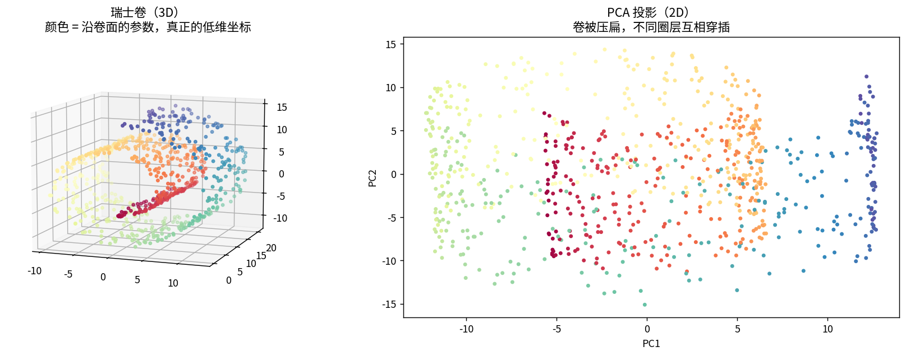
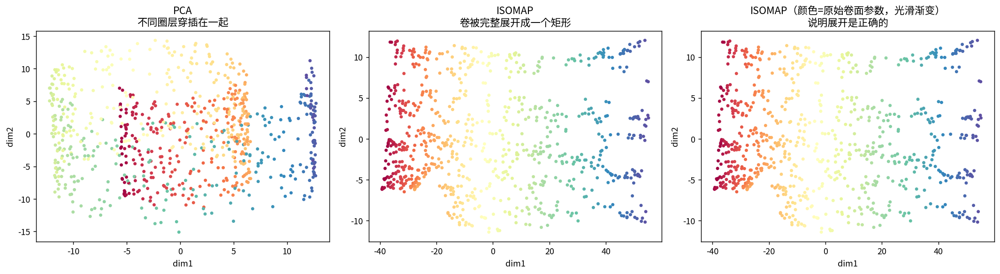
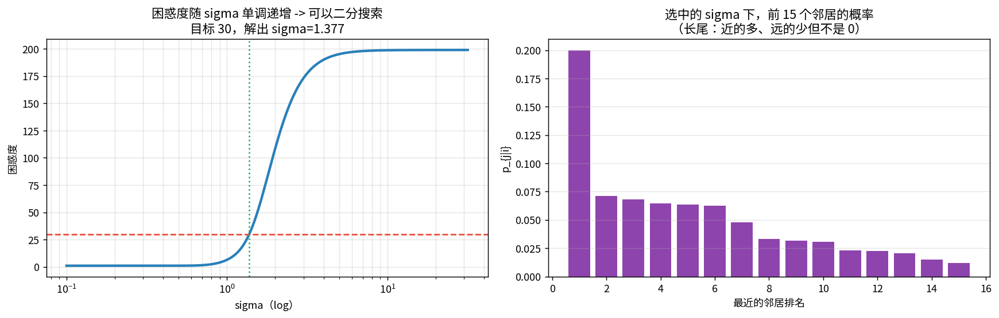
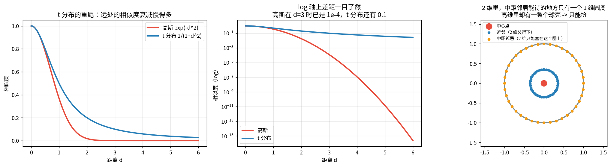
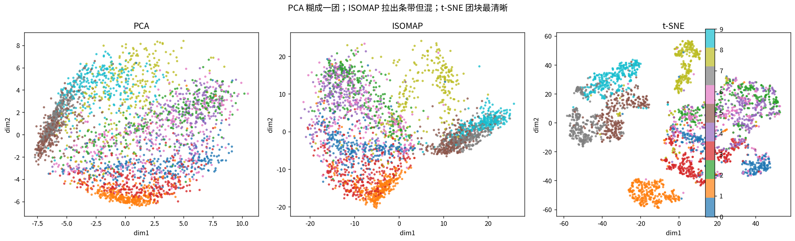
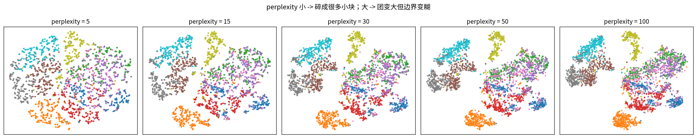
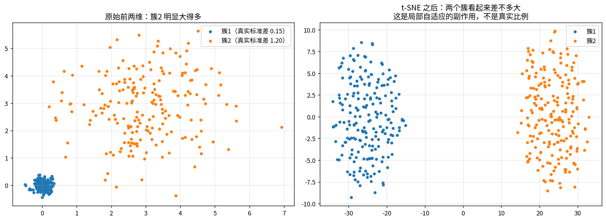

# 流形学习：MDS / ISOMAP / t-SNE

> 第十一课的谱聚类是「用图拉直流形」。这一课是同一件事的另一个目的：**画出来给人看**。

**流形假设**：高维数据其实趴在一个**低维弯曲的曲面**上。784 维的 Fashion-MNIST 图像，自由度远没有 784 个。

---

## 1 · 为什么 PCA 不够：测地距离 vs 欧氏距离

### 📖 这张图怎么读

- **左**：瑞士卷（3D），颜色 = 沿卷面的参数（真正的低维坐标）。
- **右**：PCA 投影 —— 卷被压扁，**不同圈层互相穿插**。

**实测**（自动选出测地/欧氏比值最大的点对）：

| | 值 |
|---|---|
| 欧氏距离（直线穿过去） | 6.000 |
| **测地距离**（沿卷面走） | **80.478** |
| 比值 | **13.4 倍** |
| 全数据平均比值 | 2.27 倍 |

**PCA 只做线性投影，看到的永远是欧氏距离，所以会「抄近路」把远点拉到一起。**

---

## 2 · MDS：只保住距离矩阵

$$\min_Y\sum_{i,j}(\|y_i-y_j\|-d_{ij})^2$$

有闭式解（双中心化 + 特征分解）：$B=-\frac12 J D^{(2)}J$，$J=I-\frac1n\mathbf 1\mathbf 1^\top$，
然后取前 k 个特征向量 × $\sqrt\lambda$。

**关键结论**：如果 $d_{ij}$ 是欧氏距离，**MDS 的结果和 PCA 完全一样**（只差旋转/翻号）。
实测逐列相关系数接近 1 ✓。**第一课说的「PCA 是线性降维的终点」，除非你换一个距离度量。**

---

## 3 · ISOMAP：把欧氏距离换成测地距离

**三步**：建 kNN 图 → 算所有点对最短路径（近似测地距离）→ 对测地距离矩阵跑 MDS。

### 📖 这张图怎么读

- **左（PCA）**：不同圈层穿插。
- **中/右（ISOMAP）**：卷被**完整展开成一个矩形**，颜色（原始卷面参数）光滑渐变。

**定量**（低维坐标与原始卷面参数的 Spearman 相关）：

| | dim1 | dim2 |
|---|---|---|
| PCA | 0.1899 | −0.0285 |
| **ISOMAP** | **0.9987** | −0.0262 |

**0.9987** —— ISOMAP 把 2 维流形完整恢复了。

---

## 4 · t-SNE：改成保住「邻居关系」

高维里**远处点的距离不可靠**（维度灾难：所有点对距离都差不多），所以 t-SNE 只保局部。

### 高维：距离 → 概率

$$p_{j|i}=\frac{\exp(-\|x_i-x_j\|^2/2\sigma_i^2)}{\sum_{k\neq i}\exp(-\|x_i-x_k\|^2/2\sigma_i^2)}$$

### 困惑度 perplexity

$$\mathrm{Perp}(P_i)=2^{H(P_i)}$$

**读法**：困惑度 ≈ 「每个点认为自己的有效邻居有多少个」。典型值 5~50。$\sigma$ 靠**二分搜索**确定。

### 📖 这张图怎么读

- **左**：困惑度随 $\sigma$ **单调递增** → 可以二分搜索。实测目标困惑度 30 → 解出 **$\sigma=1.3767$**，验证困惑度 = 30.0000 ✓
- **右**：选中的 $\sigma$ 下，前 15 个邻居的概率分布（长尾：近的多、远的非零）。

### 低维：用 t 分布，目标是最小化 KL(P‖Q)（第四课）

$$q_{ij}=\frac{(1+\|y_i-y_j\|^2)^{-1}}{\sum_{k\neq l}(1+\|y_k-y_l\|^2)^{-1}}$$

---

## 5 · 拥挤问题：为什么低维用 t 分布（t-SNE 的核心设计）

**问题**：高维里一个点的邻居分布在体积随维度指数增长的球壳里。降到 2 维，
根本没有空间让所有「中等距离」的点保持中等距离 —— 只能挤到近处或推到远处。

### 📖 这张图怎么读

- **左/中**：t 分布的重尾。log 轴上一目了然 —— 高斯在 d=3 时已是 1e-4，t 分布还有 0.1。
- **右**：2 维里中距邻居只能待在一个 1 维圆周上，高维里却有一整个球壳。

**定量（这是全课最震撼的数字）**：

| d | 高斯 | t 分布 | 比值 |
|---|---|---|---|
| 2 | 1.8e-02 | 2.0e-01 | 11 倍 |
| 3 | 1.2e-04 | 1.0e-01 | 810 倍 |
| 5 | 1.4e-11 | 3.8e-02 | **27 亿倍** |
| 10 | 3.7e-44 | 9.9e-03 | 10⁴¹ 倍 |

**代价**：t-SNE 图上的**簇间距离没有意义**（重尾把远点推得任意远），只能看**簇内结构**。

---

## 6 · 实测对比

| 方法 | 2 维嵌入上的 1-NN 准确率 |
|---|---|
| PCA | 0.4630 |
| ISOMAP | 0.5273 |
| **t-SNE** | **0.7713** |

**注意**：这个指标对 t-SNE 不公平（它只优化局部结构），但能说明三者的取向差异。

### 📖 这张图怎么读

perplexity 小 → 碎成很多小块；大 → 团变大但边界变糊。
**常见错误**：样本只有几百个却用 perplexity=30~50，结果全是**假结构**。

---

## 7 · t-SNE 的三个坑（看到漂亮图先别急着下结论）

1. **簇间距离没有意义** —— 重尾把远点推得任意远（第 5 段，设计使然不是 bug）
2. **簇的大小不能比较** —— $\sigma_i$ 按局部密度自适应，密度高的区域被**放大**
3. **不能外推新样本** —— 没有从高维到低维的映射函数，来新样本只能整图重跑

### 📖 这张图怎么读

两个真实标准差差 **8 倍** 的簇（0.15 vs 1.20），t-SNE 之后扩散度比变成 **1.00 倍**。
**8 倍的真实差距被完全抹平 —— t-SNE 图上的相对大小不可信。**

另外：t-SNE 是**随机初始化**的，不同 seed 结果差别很大。看到「完美分离的图」，先换个 seed 再看一遍。

---

## 总结

| 方法 | 保什么 | 优点 | 缺点 |
|---|---|---|---|
| PCA（01） | 全局方差 | 快、线性、可逆 | 只做线性 |
| MDS | 距离矩阵 | 通用 | 用欧氏距离时 = PCA；$O(n^2)$ |
| **ISOMAP** | **测地距离** | 能展开真实流形 | 对 k 敏感、怕短路边 |
| **t-SNE** | **邻居概率分布** | 局部结构最清晰 | 簇间距离/大小不可信、不能外推 |
| UMAP | 模糊拓扑 | 快、保全局、可外推 | 超参多 |

**三句话**
1. 流形学习的核心矛盾：高维里所有距离都差不多，所以**只保局部**才可行。
2. t-SNE 用 **t 分布重尾**解决拥挤问题 —— 这是名字里那个 t 的全部意义。
3. **t-SNE 图上能信的只有「哪些点挨在一起」**，不能信距离、大小、簇间关系。

**和你的项目的关系**：你的表征散点图如果是 t-SNE 画的，**簇的大小和间距不能用来论证方法好坏**。
要定量就用第三课的 KNN / ARI / NMI，或者第一课的**有效秩**。

## 关联
- 前置：[[01-PCA主成分分析/PCA主成分分析|01 PCA]]、[[11-谱聚类与图拉普拉斯/谱聚类与图拉普拉斯|11 谱聚类]]（同一张 kNN 图，目标不同）
- 定量替代：[[03-KMeans聚类/KMeans聚类|03 KMeans]]（ARI / NMI 才是可信指标）
