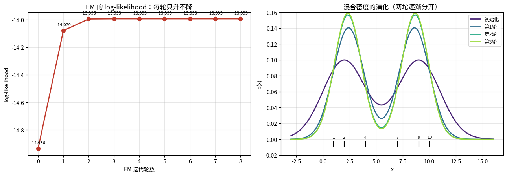
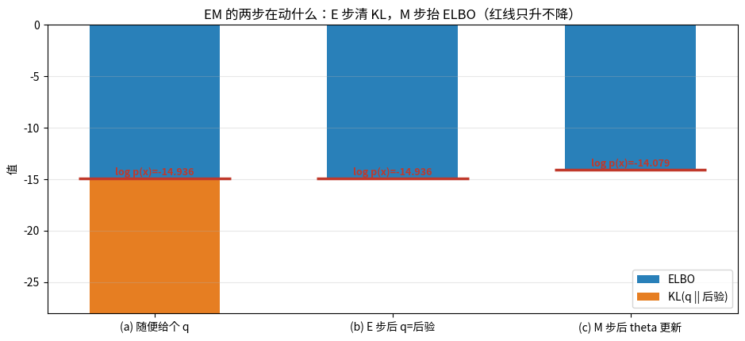
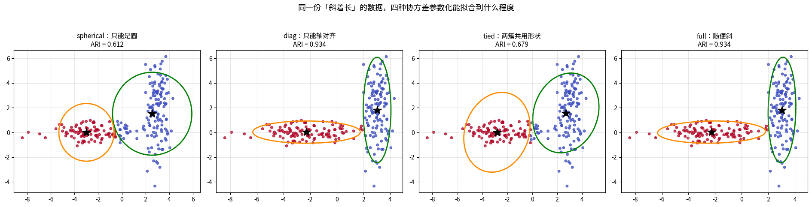
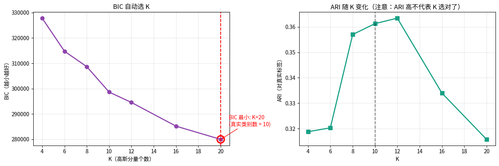
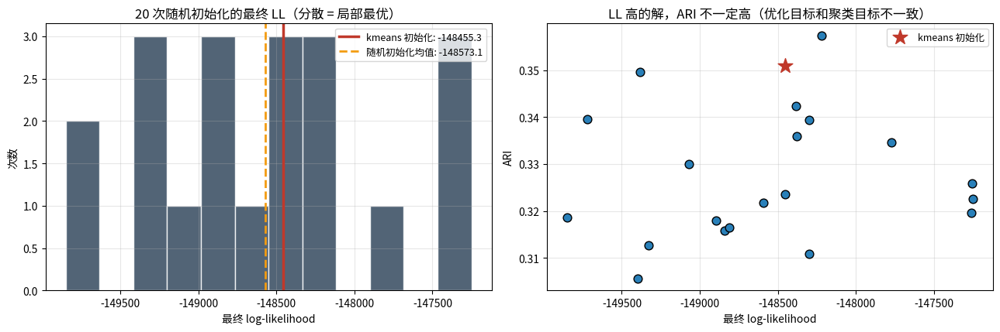

# GMM 与 EM 算法（第十三课）

## 数据来源

| 用途 | 数据 | 规模 |
|---|---|---|
| 手算 EM | 一维手工数据 `x=[1,2,4,7,9,10]` | 6 个点 |
| 协方差类型 | 自造二维数据：簇 0 横向拉长，簇 1 旋转 45° | 120 + 120 |
| 主实验 | Fashion-MNIST（`/home/cjc/桌面/imagination/fashion_mnist`） | 6000 训练，TruncatedSVD-20 |
| 局部最优 | 同上，20 组随机初始化 | 6000 |
| 奇异协方差 | 200 个正态点 + 12 个完全重复的点 | 212 |

图片目录：`images/`，由 notebook 先写到 `/tmp/gmm_vis/` 再复制过来。

---

## 一句话

> **KMeans 是「σ→0 的等方差 GMM」。** EM 治的是「log 里套求和」这个求导困境，
> 它保证单调、不保证最优；而 $\Sigma$ 这个矩阵，就是你项目里 VICReg 在约束的那个东西。

---

## 第 1 段 · 手算 EM（6 个点，2 个高斯）

### 公式拆解

模型：$p(x)=\sum_k\pi_k\mathcal N(x\mid\mu_k,\sigma_k)$

**E 步**（固定 $\theta$，算后验）：

$$\gamma_{ik}=\frac{\pi_k\mathcal N(x_i\mid\mu_k,\sigma_k)}{\sum_j\pi_j\mathcal N(x_i\mid\mu_j,\sigma_j)}$$

**M 步**（固定 $\gamma$，加权重估）：

$$N_k=\sum_i\gamma_{ik},\quad \pi_k=\frac{N_k}{n},\quad
\mu_k=\frac{\sum_i\gamma_{ik}x_i}{N_k},\quad
\sigma_k^2=\frac{\sum_i\gamma_{ik}(x_i-\mu_k)^2}{N_k}$$

### 实测数字

初始 $\mu=[2,9],\ \sigma=[2,2],\ \pi=[0.5,0.5]$，LL $=-14.936395$。

| 轮 | E 步后 LL | M 步后 LL | 增益 |
|---|---|---|---|
| 1 | -14.936395 | -14.079179 | **+0.857216** |
| 2 | -14.079179 | -13.994799 | +0.084380 |
| 3 | -13.994799 | -13.993429 | +0.001370 |
| 4 | -13.993429 | -13.993422 | +0.000006 |
| 5–8 | 收敛 | -13.993422 | ≈0 |

总增益 **+0.942972**，单调性检查 `True`（每一轮增量都 ≥ 0）。

最终 $\mu=[2.3357,\ 8.6643]$，$\sigma=[1.2532,\ 1.2532]$，$\pi=[0.5,\ 0.5]$。
与 `sklearn.GaussianMixture(n_init=20)` 的参数**最大绝对差 2.25e-05**。

初始时 $x=4$ 的 responsibility 是 **0.9325 / 0.0675**，收敛后变成 **0.9976 / 0.0024** ——
它一直是「软」的，只是越来越确定。KMeans 里没有这种状态。

### 读图：

- **左图**：LL 随轮数上升的曲线。形状是典型的「前快后慢」——
  EM 是一阶收敛，越到后面增益越小（第 3 轮之后基本不动了）。
  别把它当成 bug，这就是 EM 的正常节奏。
- **右图**：4 条曲线是「初始化 → 第1轮 → 第2轮 → 第3轮」的混合密度。
  看两坨峰怎么从模糊变尖、中间那个谷怎么变深。
  底部的小竖线是 6 个数据点的位置。
- **合起来看**：密度拟合变好（右）和 LL 上升（左）是同一件事的两种画法。

---

## 第 2 段 · EM 为什么单调：ELBO 分解（接第五课）

### 公式拆解

第五课 VAE 里写过的恒等式，这里再套一次（$z$ = 「这个点来自哪个高斯」）：

$$\log p(x_i)=\underbrace{\sum_k q_{ik}\big[\log\pi_k+\log\mathcal N(x_i\mid\mu_k,\sigma_k)-\log q_{ik}\big]}_{\text{ELBO}}
+\underbrace{\sum_k q_{ik}\log\frac{q_{ik}}{\gamma_{ik}}}_{\mathrm{KL}\ge0}$$

| 步骤 | 固定 | 动 | 效果 |
|---|---|---|---|
| E 步 | $\theta$ | $q\leftarrow\gamma$ | KL 打到 0，ELBO 跳到等于 $\log p(x)$ |
| M 步 | $q$ | $\theta\leftarrow\arg\max$ELBO | $\log p(x)$ 往上走 |

### 实测数字（这段是本课最漂亮的一组）

| 阶段 | ELBO | KL | $\log p(x)$ |
|---|---|---|---|
| (a) 随手给的 $q=[0.7,0.3]$ | -28.041212 | 13.104817 | **-14.936395** |
| (b) E 步后 $q=\gamma$ | -14.936395 | **0.000000** | -14.936395 |
| (c) M 步后 $\theta$ 更新 | -14.245572 | 0.166394 | **-14.079179** |

恒等式 `ELBO + KL == log p(x)` 验证误差 **3.55e-15**（浮点精度级别）。

关键点：**(b) 这一步 $\theta$ 一动没动，$\log p(x)$ 也没变**，ELBO 却涨了 +13.104817 ——
涨的这部分全是把 KL 挤掉换来的。

### 读图：

三根柱子，每根都是「ELBO（蓝）+ KL（橙）」，红线是 $\log p(x)$ 的水平线。

- **柱子 (a)**：橙色（KL）占了一大半 —— 说明 $q$ 猜得很离谱。
- **柱子 (b)**：橙色没了，柱子总高不变，红线没动 —— **E 步只重新分配，不抬升**。
- **柱子 (c)**：蓝橙总高一起上升，红线也跟着上去了 —— **M 步才是真正抬升的那一步**。
- **一句话读法**：红线只升不降，因为每一步都在「清 KL」或「抬 ELBO」里选一个做。

---

## 第 3 段 · KMeans 是 GMM 在 $\sigma\to0$ 时的极限

固定 $\mu=[2,9]$，把共享的 $\sigma$ 缩小，看 $x=4$ 的 responsibility：

| $\sigma$ | $\gamma(4\to$簇0$)$ | $\gamma(4\to$簇1$)$ |
|---|---|---|
| 4.0 | 0.658418 | 0.341582 |
| 2.0 | 0.932453 | 0.067547 |
| 1.0 | 0.999972 | 0.000028 |
| 0.5 | 1.000000 | 0.000000 |
| 0.1 | 1.000000 | 0.000000 |
| 0.01 | 1.000000 | 0.000000 |

再看中心：

- KMeans(2) 的中心：**[2.3333, 8.6667]**
- GMM 收敛的 $\mu$：**[2.3357, 8.6643]**

差在小数点后第 3 位，而这点差别完全来自 $x=4$ 这种边界点被软分摊。

> **注**：$\sigma$ 很小时直接算 `N(x;μ,σ)` 会下溢成 `0/0 = nan`。
> notebook 里改成了在对数域算（`resp_log`），这是工程上必须做的处理。

---

## 第 4 段 · 四种协方差参数化

| 类型 | $\Sigma_k$ | 形状 | 参数量 |
|---|---|---|---|
| spherical | $\sigma_k^2 I$ | 正圆 | $K$ |
| diag | 对角阵 | 轴对齐椭球 | $Kd$ |
| tied | 全体共用一个 $\Sigma$ | 同形状不同位置 | $d(d+1)/2$ |
| full | 每个簇自己的 $\Sigma$ | 任意倾斜椭球 | $K\,d(d+1)/2$ |

### 实测（二维斜簇，ARI 对真实标签）

| 类型 | ARI | BIC |
|---|---|---|
| spherical | 0.612 | 2045.6 |
| diag | **0.934** | **1731.6** |
| tied | 0.679 | 2058.9 |
| full | **0.934** | 1741.5 |

**这里有个反直觉的点，别跳过**：`full` 和 `diag` 的 ARI **打平**。
因为这两簇在位置上本来就分得很开，只要「哪个点归哪簇」判得清，形状对 ARI 影响不大。
形状假设真正拉开差距的是**密度拟合**——看下面 Fashion-MNIST 那组。

### 读图：

四张子图，绿色/橙色椭圆是 2 倍标准差的等高线。

- **spherical（第 1 格）**：两个椭圆都是正圆，明显罩不住斜着的数据。
- **diag（第 2 格）**：椭圆可以压扁，但**只能横着或竖着**，不能斜。
- **tied（第 3 格）**：两个椭圆形状完全一样，只是位置不同——这是 `tied` 的定义。
- **full（第 4 格）**：椭圆终于斜过来了。
- **注意**：第 2 格和第 4 格的分点结果其实一样（都 0.934），
  区别只在**椭圆的朝向**。这张图看的是「模型能表达什么形状」，不是「谁分得准」。

---

## 第 5 段 · Fashion-MNIST 主实验（6000 样本，SVD-20，K=10）

| 模型 | ARI | NMI | BIC |
|---|---|---|---|
| KMeans(10) | 0.3536 | 0.5170 | — |
| GMM-spherical | 0.3521 | 0.5316 | 344579.5 |
| GMM-diag | 0.3613 | 0.5381 | 298663.6 |
| GMM-tied | 0.3259 | 0.5241 | 316400.7 |
| **GMM-full** | **0.3813** | **0.5802** | **179430.8** |

- `full` 在 ARI/NMI 上都最好，BIC 比 `diag` 低了 **11.9 万**（差得非常夸张）。
- KMeans **没有似然**，所以没有 BIC —— 这是概率模型相对硬聚类的实打实的优势。

### BIC 选 K：两个对照实验

**(1) 模型设定正确时（合成数据，真的由 3 个高斯生成）**

| K | 1 | 2 | **3** | 4 | 5 | 6 | 7 |
|---|---|---|---|---|---|---|---|
| BIC | 8902.6 | 7640.5 | **7130.5** | 7167.3 | 7207.4 | 7247.5 | 7272.7 |

→ BIC 最小值落在 **K=3**，真值就是 3。✓

**(2) 模型设定错误时（Fashion-MNIST，真实类别 10）**

| K | 4 | 6 | 8 | 10 | 12 | 16 | 20 |
|---|---|---|---|---|---|---|---|
| BIC | 327842 | 314790 | 308693 | 298664 | 294556 | 285190 | **279981** |
| ARI | 0.3188 | 0.3203 | 0.3570 | 0.3613 | **0.3634** | 0.3339 | 0.3157 |

→ **BIC 一路降到 K=20 还没停，没找对。**

> **诚实的结论**：BIC 只在「数据真的是高斯混合」时才准。
> Fashion-MNIST 根本不是高斯混合，BIC 就会一直想拆下去。
> 无监督选 K 的指标（BIC / 轮廓系数 / Calinski-Harabasz）**只能当参考，别当圣旨**。
> 右图的 ARI 是你偷看答案才知道的，实际无标签场景下拿不到。

### 读图：

- **左图**：BIC 随 K 单调下降（本例），红圈标的是最小值。
  期望看到「先降后升的碗形」，但真实数据往往是单调下降——见上面那段。
- **右图**：ARI 随 K 变化，峰值在 K=12（0.3634），跟真实类别数 10 **不一致**。
- **两图对照**：ARI 最高的 K 和 BIC 最低的 K **不是同一个**。
  这说明「聚类质量最好」和「生成模型拟合最好」是两件不同的事，别混着用。

---

## 第 6 段 · 坑一：局部最优

20 组随机初始化（`init_params='random'`），同一个 GMM：

- 最终 LL：最好 **-147250.7**，最差 **-149849.7**，**差 2599.0 nats**
- 对应 ARI：0.3057 ~ 0.3573
- **LL 与 ARI 的相关系数只有 0.081**

最后一条才是重点：**似然更高的解，聚类不一定更好**。
EM 优化的目标（似然）和你真正在意的目标（聚类质量）不是同一个东西。

> 工程结论：永远用 `init_params='kmeans'`（sklearn 的默认值），不要用 `'random'`。

### 读图：

- **左图**：20 次随机初始化的最终 LL 直方图。红色竖线是 kmeans 初始化的结果。
  柱子有宽度 = 卡在不同的局部最优；红线的位置告诉你 kmeans 初始化省了多少事。
- **右图**：横轴 LL、纵轴 ARI 的散点。如果点排成一条上升的线，说明「LL 高 = 聚类好」；
  实测是**一团散点**（相关系数 0.081），说明两者几乎无关。
- **一句话**：EM 只保证爬到山顶，不保证是最高那座。

---

## 第 7 段 · 坑二：似然无上界（协方差奇异）

一个高斯罩住 5 个完全相同的点 $x=3$，缩小 $\sigma$：

| $\sigma$ | $\log p(x)$ |
|---|---|
| 1.0 | -4.5947 |
| 0.1 | +6.9182 |
| 0.01 | +18.4312 |
| 1e-3 | +29.9441 |
| 1e-6 | +64.4829 |

→ $\sigma\to0$ 时 $\log p\to+\infty$，**极大似然根本没有最大值**。

真实复现（200 个正态点 + 12 个重复点）：

| `reg_covar` | 两个协方差的行列式 | 总 LL |
|---|---|---|
| 1e-6 | [3.660e-01, **1.000e-12**] | -369.4 |
| 1e-3 | [3.672e-01, 1.000e-06] | -452.3 |
| 1e-1 | [4.979e-01, 1.000e-02] | -509.9 |

第二个簇的行列式掉到了 `reg_covar` 那个量级 —— 簇坍缩在一个点上。

> `reg_covar` 就是在协方差对角上加的常数，专门防止行列式掉到 0。
> 高维小样本时它是救命的；调太大又会把簇硬撑成球，丢掉形状信息。

---

## 接你的项目：GMM 的协方差 = 表征的形状

这课跟「师生距离比值路线」的关系比看上去紧得多：

1. **VICReg 方差项**要求每个维度上的标准差别塌掉（$\ge1$）——
   本质上就是**别让表征的协方差矩阵变成奇异的**。
   GMM 里协方差一奇异似然就爆，这是同一个病的两种表现。

2. **VICReg 协方差项**要求各维度不相关，等价于把表征协方差往**对角**推。
   GMM 的 `diag` 假设也是「维度之间不相关」。
   所以 **方差项 + 协方差项 ≈ 逼表征协方差趋近 $\sigma^2 I$，也就是 spherical GMM 的假设**。

3. **聚类式自监督**（SwAV / DeepCluster）直接在表征上跑 KMeans/GMM 当伪标签。
   这时你正站在本课的结论上：KMeans 假设簇是等大的球，GMM 允许椭球。
   **类内各向异性大时，GMM 的伪标签质量更高**（本实验：ARI 0.3536 → 0.3813）。

一句话：表征的协方差矩阵 $\Sigma$ 是「形状」的数学载体。
**VICReg 在约束它，GMM 在估计它**，两边是同一个对象的两种操作。

---

## 关键公式速查

- responsibility：$\gamma_{ik}=\dfrac{\pi_k\mathcal N(x_i\mid\mu_k,\Sigma_k)}{\sum_j\pi_j\mathcal N(x_i\mid\mu_j,\Sigma_j)}$
- M 步：$\pi_k=\frac{N_k}{n}$，$\mu_k=\frac{1}{N_k}\sum_i\gamma_{ik}x_i$，$\Sigma_k=\frac{1}{N_k}\sum_i\gamma_{ik}(x_i-\mu_k)(x_i-\mu_k)^\top$
- ELBO 恒等式：$\log p(x)=\mathrm{ELBO}(q,\theta)+\mathrm{KL}(q\|p(z\mid x))$
- BIC：$\mathrm{BIC}=-2\log\hat L+p\ln n$（$p$ = 参数量），越小越好

## 三句话

1. EM 治的是「**log 里套求和**」这个求导困境：引入隐变量 $z$，把难题拆成两个简单题。
2. EM **只保证单调，不保证最优**；而且**似然高不等于聚类好**（相关系数 0.081）。
3. $\Sigma$ 是 inductive bias，不是「越复杂越好」——
   参数量 $K\,d(d+1)/2$，高维下 `full` 必炸，必须配 `reg_covar`。

## 下一课

第十四课：序列模型与注意力。
GMM 的混合权重 $\pi_k$ 是**输入无关**的固定权重；
注意力做的就是——**让权重依赖输入 $x$**。从「固定混合」到「动态混合」的一步。
