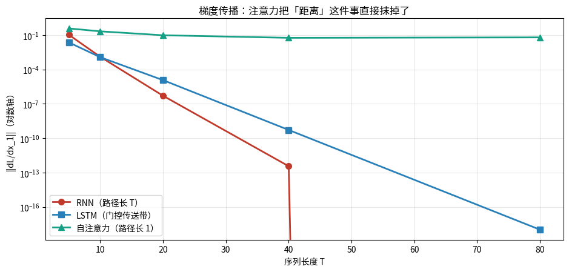
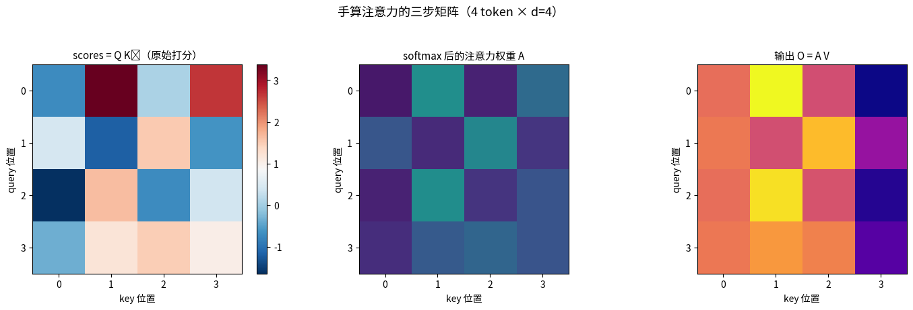
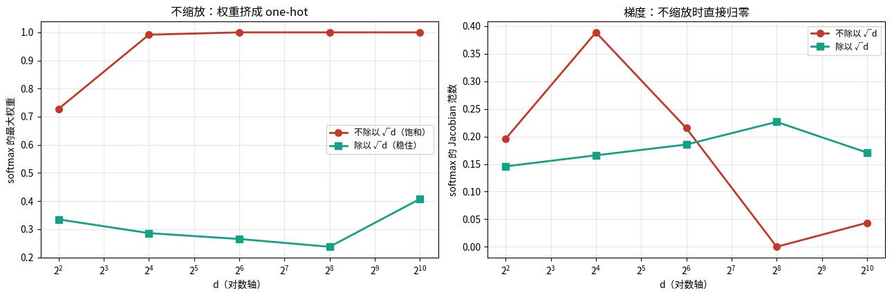
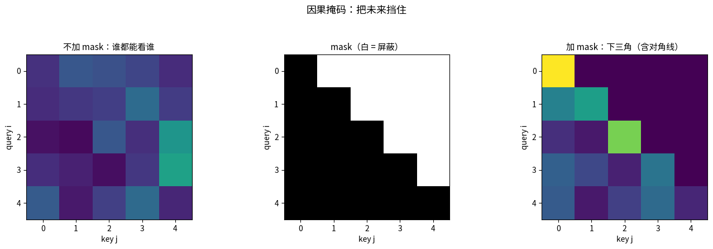
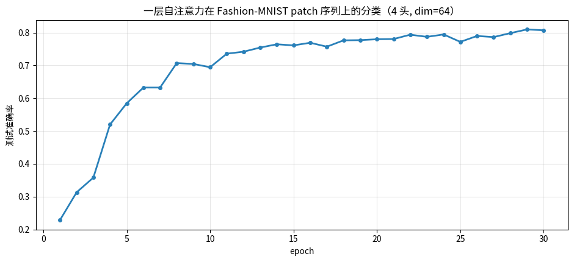
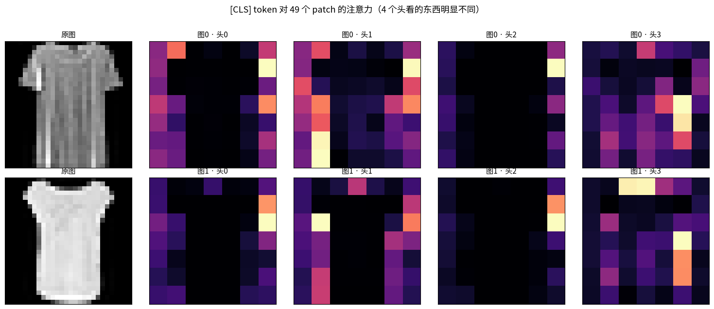

# 序列模型与注意力（第十四课）

## 数据来源

| 用途 | 数据 | 规模 |
|---|---|---|
| 手算 RNN | 手工 1 维序列 `x=[1,0,0,0,0]` | 5 步 |
| 梯度路径对比 | 随机张量（自造） | T ∈ {5,10,20,40,80}，dim=32 |
| 手算注意力 | 随机 4×4 矩阵（自造） | 4 token，d=4 |
| 缩放实验 | 随机高斯向量 | d ∈ {2…2048} |
| 多头实测 | Fashion-MNIST 切成 7×7=49 个 4×4 patch | 6000 训练 / 1500 测试 |

图片目录：`images/`，由 notebook 先写到 `/tmp/attn_vis/` 再复制过来。

---

## 一句话

> **注意力解决的不是「记不住」，是「梯度路径太长传不回来」。**
> 它把 $x_1$ 到输出的路径长度从 $O(T)$ 压成 $O(1)$，代价是**完全失去位置感**——
> 所以必须额外喂位置编码。

---

## 第 1 段 · 手算标量 RNN（前向 + BPTT）

模型 $h_t=\tanh(w h_{t-1}+u x_t)$，$w=0.5,\ u=1$，$x=[1,0,0,0,0]$，$L=(h_5-1)^2$。

**前向**：

| t | 计算 | 结果 |
|---|---|---|
| 1 | $\tanh(0.5\cdot0+1\cdot1)$ | 0.761594 |
| 2 | $\tanh(0.5\cdot0.7616)$ | 0.363399 |
| 3 | $\tanh(0.5\cdot0.3634)$ | 0.179726 |
| 4 | $\tanh(0.5\cdot0.1797)$ | 0.089622 |
| 5 | $\tanh(0.5\cdot0.0896)$ | 0.044781 |

**反向**（链式法则，注意每个因子都 $\le w=0.5$）：

$$\frac{\partial L}{\partial h_1}=\underbrace{2(h_5-1)}_{-1.910438}\prod_{t=2}^{5}\underbrace{w(1-h_t^2)}_{\le 0.5}$$

| 因子 | 值 | 累积到 $\partial L/\partial h_1$ |
|---|---|---|
| $\partial L/\partial h_5$ | −1.910438 | −1.910438 |
| $dh_5/dh_4$ | 0.498997 | −0.953303 |
| $dh_4/dh_3$ | 0.495984 | −0.472823 |
| $dh_3/dh_2$ | 0.483849 | −0.228775 |
| $dh_2/dh_1$ | 0.433970 | **−0.099282** |

- 手算 $\partial L/\partial h_1=-0.0992816451$，autograd `-0.0992816538`，**差 8.71e-09**。
- 4 步之后梯度只剩 **5.2%**。
- 外推（每步因子 ≈0.49）：10 步剩 8.0e-4，20 步剩 6.4e-7，50 步剩 3.2e-16，100 步剩 1.0e-31。

**这就是梯度消失的全部机制**：连乘把它吃掉了。tanh 的导数上界 1，乘上 $w=0.5$，
每一步最多只能保住一半。

---

## 第 2 段 · 定量实验：RNN / LSTM / 注意力

「第 1 个 token 收到的梯度范数」随序列长度 $T$（3 次随机平均）：

| T | RNN | LSTM | 注意力 |
|---|---|---|---|
| 5 | 1.059e-01 | 2.278e-02 | **3.746e-01** |
| 10 | 1.260e-03 | 1.163e-03 | 2.095e-01 |
| 20 | 5.032e-07 | 1.161e-05 | 9.500e-02 |
| 40 | 3.624e-13 | 5.239e-10 | 5.695e-02 |
| 80 | **0.000e+00** | 1.059e-18 | 6.226e-02 |

从 T=5 到 T=80 的衰减倍数：

- **RNN**：1.1e+29 倍（T=80 直接下溢成 0）
- **LSTM**：2.2e+16 倍
- **注意力**：**6.0 倍**

### 读图：

纵轴是对数轴。

- **红线（RNN）**：直线下坠，T=80 时贴地（实测 0）。
- **蓝线（LSTM）**：也下坠，但斜率明显更缓 —— 门控传送带 $c_t=f_tc_{t-1}+\dots$ 让梯度路径上的因子变成可学习的 $f_t$。
- **绿线（注意力）**：几乎水平，只掉了 6 倍（这点衰减来自层内变换，不是距离）。
- **一句话**：三条线的斜率差，就是「路径长度 $T$ vs $1$」的直接体现。

---

## 第 3 段 · 手算注意力（4 token，d=4）

四步，没有任何魔法：

1. $Q=XW_q,\ K=XW_k,\ V=XW_v$
2. $\text{scores}=QK^\top$
3. 除以 $\sqrt d$（d=4 → 除以 2），按行 softmax 得 $A$
4. $O=AV$

手算结果（$A$ 的每行和为 1，实测 `[1. 1. 1. 1.]`）：

```
A =
[ 0.0644  0.4936  0.0950  0.3470 ]
[ 0.2683  0.1184  0.4579  0.1554 ]
[ 0.0953  0.4920  0.1513  0.2614 ]
[ 0.1310  0.2820  0.3265  0.2604 ]
```

**对账**：把 $W_q,W_k,W_v$ 塞进 `nn.MultiheadAttention`（`out_proj=I`，bias 清零）后：

- 输出最大绝对差 **1.810e-07**
- 注意力权重最大绝对差 **5.402e-08**

> 接第十三课：GMM 的混合权重 $\pi_k$ 是**输入无关**的固定权重。
> 注意力的 softmax 每一行，就是「针对这个 query 的一组 $\pi$」——**动态混合**。

### 读图：

三张并排热力图：

- **左（scores）**：蓝红发散色，看谁跟谁像，数值可正可负。
- **中（A）**：viridis，全在 [0,1]，**每行之和为 1**。
- **右（O）**：输出，每个 token 都变成了别人的加权平均。
- **读法**：中间那张的第 $i$ 行 = 第 $i$ 个 token 在「看谁」。
  注意力本质是**加权平均**，不是「选择」——权重永远加和为 1，不存在「谁都不看」。

---

## 第 4 段 · 为什么必须除以 $\sqrt d$

若 $q,k$ 各分量独立标准正态，则 $q\cdot k=\sum_i q_ik_i$，故

$$\mathbb E[q\cdot k]=0,\quad \mathrm{Var}[q\cdot k]=d,\quad \text{标准差}=\sqrt d$$

**实测**（2000 组随机向量）：

| d | 实测 std | 理论 $\sqrt d$ | 缩放后 std |
|---|---|---|---|
| 2 | 1.390 | 1.414 | 0.983 |
| 32 | 5.536 | 5.657 | 0.979 |
| 512 | 22.826 | 22.627 | 1.009 |
| 2048 | 45.906 | 45.255 | 1.014 |

缩放后 std 稳稳钉在 1 —— 这就是除以 $\sqrt d$ 的唯一目的。

**不缩放的后果**（N=64 个 key）：

| d | 不缩放：最大权重 / $\\|J\\|$ | 缩放后：最大权重 / $\\|J\\|$ |
|---|---|---|
| 4 | 0.7892 / 0.3650 | 0.3610 / 0.2124 |
| 64 | 0.9999 / **0.00008** | 0.2798 / 0.2405 |
| 1024 | **1.0000 / 0.00000** | 0.2146 / 0.2217 |

$J$ 是 softmax 那一行的 Jacobian，$\\|J\\|\to 0$ 就是**梯度没了**。

### 读图：

- **左图**：不缩放（红）的最大权重随 $d$ 冲到 1（one-hot）；缩放（绿）稳在 0.2~0.36。
- **右图**：Jacobian 范数。不缩放时直接掉到接近 0；缩放后稳定在 0.2 附近。
- **一句话**：维度越高，点积越容易冒出极端值 → softmax 饱和 → 梯度消失。
  $\frac1{\sqrt d}$ 就是专门治这个的。

---

## 第 5 段 · 因果掩码

做法：把不允许的位置打分设成 $-\infty$，**必须在 softmax 之前加**。

实测（5×5）：加 mask 后上三角全 0，且**每行之和仍是 1**（实测 `[1. 1. 1. 1. 1.]`）。

> **常见 bug**：先 softmax 再乘 0。这样行和就不是 1 了，等于把权重整体缩小，
> 而且被 mask 掉的位置仍然参与了归一化 —— 结果完全不对。

### 读图：

三格：不加 mask（谁都能看谁）→ mask（白色是被屏蔽的上三角）→ 加 mask 后（下三角含对角线有值）。

---

## 第 6–7 段 · 多头实测：Fashion-MNIST 切成 patch 序列

把 $28\times28$ 切成 $7\times7=49$ 个 $4\times4$ patch，每个展平成 16 维 →
**一张图变成长度 49 的序列**，前面加 `[CLS]` token 做分类。

模型：1 层自注意力，d=64，4 头，**30.7k 参数**，30 epoch。

- 测试准确率：**0.8073**（最好 0.8100）

4 个头（8 张图平均）的两两相关系数：

```
[ 1.0000  0.9426  0.8970  0.2216 ]
[ 0.9426  1.0000  0.8399  0.3405 ]
[ 0.8970  0.8399  1.0000  0.3442 ]
[ 0.2216  0.3405  0.3442  1.0000 ]
```

非对角线平均相关 **0.598**。

> **诚实结论**：0.598 说明这几个头**还是挺像的**。
> 小模型 + 单层注意力时这很常见，别指望 4 个头能自动分出 4 种完全不同的模式。
> 多头真正的价值在**深层 + 大数据**时才体现出来。

### 读图：

测试准确率随 epoch 的曲线。看它**多久收敛**、后期有没有过拟合。

### 读图：

两行：第 1 列是原图，后 4 列是 4 个头的 `[CLS]` 注意力（reshape 成 7×7）。

- 亮的地方 = 这个头在看的 patch。
- **对比同一行的 4 张图**：如果它们几乎一样，说明头之间没有分工（本实验相关系数 0.598，确实偏像）。
- 第 4 个头（相关系数只有 ~0.2~0.34）明显跟前 3 个不一样 —— 这才是真正的「分工」。

---

## 第 8 段 · 接项目：注意力矩阵 = 相似度矩阵

归一化后（$q,k$ 都除以模长）：

$$S_{ij}=\frac{q_i\cdot k_j}{\sqrt d}=\frac{\cos(q_i,k_j)}{\tau},\quad \tau=\sqrt d$$

| | 行 $i$ | 列 $j$ | 目标 |
|---|---|---|---|
| 自注意力 | query | key | 加权平均 V |
| 对比学习 | 锚样本 | 正/负样本 | 让对角（正样本）最大 |

**差别只有损失**：注意力是重建/预测，InfoNCE 是「拉近正样本、推远负样本」。

### 温度 $\tau$ 的实测对照

构造有正样本对的数据（$q_i,k_i$ 共享同一个 base，d=64，m=16）：
对角线余弦 0.0562，非对角线 0.0194。

| $\tau$ | softmax 后对角线权重 | InfoNCE 损失 $-\log(\cdot)$ | 该行 $\\|J\\|$ |
|---|---|---|---|
| 0.05 | 0.0875 | 2.4359 | 0.3365 |
| 0.1 | 0.0848 | 2.4676 | 0.3131 |
| 0.5 | 0.0668 | 2.7054 | 0.2459 |
| 1.0 | 0.0647 | 2.7386 | 0.2430 |
| $\sqrt d=8$ | 0.0628 | 2.7683 | 0.2421 |

- $\tau$ 越小 → 正样本权重越高、损失越低，同时 $\\|J\\|$ **变大**（分布更尖，梯度集中在正样本）。
- $\tau$ 越大 → 分布越平，梯度摊薄到所有负样本，什么都推不动。

> **可直接用的经验**：注意力的 $\frac1{\sqrt d}$ 是一个**被动**温度，
> InfoNCE 的 $\tau$ 是**主动**超参数。
> **$d$ 越大，点积方差越大，需要的 $\tau$ 也越大** —— 换表征维度时记得重调。

---

## 关键公式速查

- $\mathrm{Attention}(Q,K,V)=\mathrm{softmax}\big(\frac{QK^\top}{\sqrt d}\big)V$
- $\mathrm{Var}[q\cdot k]=d\ \Rightarrow\ \mathrm{std}=\sqrt d$
- 多头 $\mathrm{head}_i=\mathrm{Attention}(XW_i^Q,XW_i^K,XW_i^V)$，输出 $\mathrm{Concat}\cdot W^O$
- 因果 mask：上三角 $-\infty$，**softmax 前**加
- BPTT：$\frac{\partial L}{\partial h_1}=\frac{\partial L}{\partial h_T}\prod_t w(1-h_t^2)$

## 三句话

1. 注意力治的是**梯度路径长度**，不是「记忆容量」。
2. $\frac1{\sqrt d}$ 不是玄学：把点积标准差从 $\sqrt d$ 拉回 1。忘了它，softmax 饱和成 one-hot，模型训不动。
3. 注意力矩阵 = 归一化后的余弦矩阵 / 温度。**自注意力和对比学习用的是同一个数学对象**，只是损失不同。

## 下一课

第十五课：Transformer —— 残差、LayerNorm、FFN、位置编码，最后手写一个能跑的 GPT。
