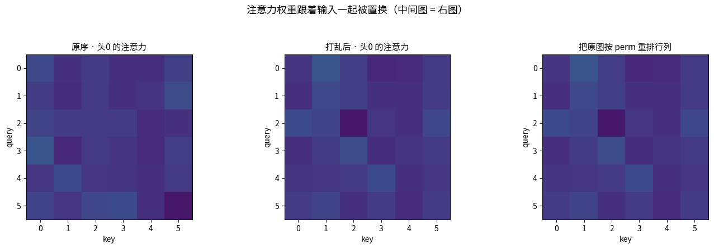
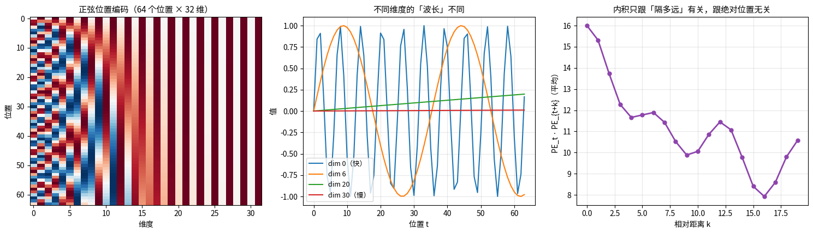
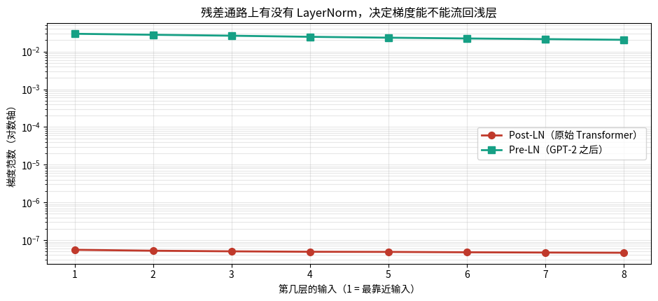
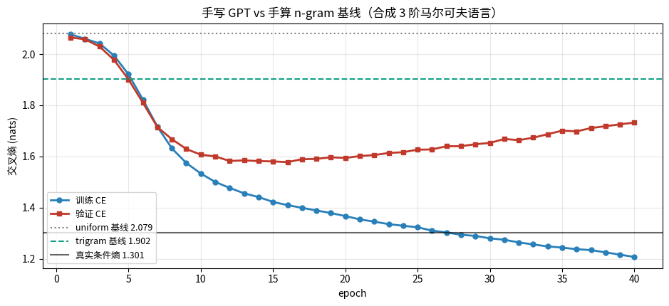
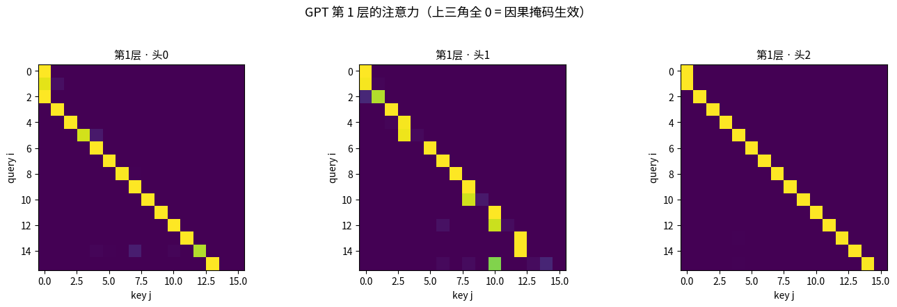

# Transformer：把注意力组装成能训练的深网络（第十五课）

## 数据来源

| 用途 | 数据 | 规模 |
|---|---|---|
| 置换等变性 | 随机张量 | 6 token，d=16 |
| 位置编码 | 正弦公式 + 可学习 embedding（自造） | 64 位置 × 32 维 / 32 位置 × 32 维 |
| Pre-LN vs Post-LN | `nn.TransformerEncoderLayer` 随机初始化 | 8 层 / 16 层，dim=64 |
| 手算 block | 随机 5 token × 8 维 | d=8，2 头 |
| FFN 升维 | 拟合 $\sin(3x)+0.3x^2$ | 400 点 |
| 手写 GPT | **合成的 3 阶马尔可夫语言**（词表 V=8） | 60000 token（50000 训练） |

图片目录：`images/`，由 notebook 先写到 `/tmp/tf_vis/` 再复制过来。

---

## 一句话

> Transformer 不是「注意力 + 随便堆」。
> **残差和 Pre-LN 才是它训得动深网络的原因**；位置编码是补上注意力天生缺失的顺序感。

---

## 第 1 段 · 注意力是置换等变的：它不知道顺序

把输入 token 顺序打乱，注意力的输出**按同样方式打乱**：

- 实测：`Y[perm]` 与 `Yp` 的最大差 = **4.47e-08**（浮点误差级别，完全相等）

这说明注意力「看到」的是**集合**，不是序列。
「我 打 你」和「你 打 我」对它来说是同一件事 —— 语言里这是致命的。

**所以必须显式喂位置信息。**

### 读图：

三张注意力热力图：原序 → 打乱后 → 把原图按同一个 perm 重排**行和列**。

- 中间图和右图**一模一样**，这就是置换等变性的可视化证明。
- 换个角度：如果你看到两张注意力图长得一样但 token 顺序不同，
  说明这个模型**根本没有用到顺序信息**。

---

## 第 2 段 · 位置编码：正弦的 vs 学出来的

**正弦式**（原始 Transformer）：

$$\mathrm{PE}_{(t,2i)}=\sin\frac{t}{10000^{2i/d}},\qquad \mathrm{PE}_{(t,2i+1)}=\cos\frac{t}{10000^{2i/d}}$$

第 $i$ 维对应一个波长 $10000^{2i/d}$：有的维度变化快（分辨相邻位置），
有的慢（分辨远近）—— 一把**多尺度的尺子**。

内积 $\mathrm{PE}_t\cdot\mathrm{PE}_{t+k}$ 实测（L=64, d=32）：

| k | 0 | 1 | 2 | 3 | 4 | 5 | 6 | 7 | 8 | 9 |
|---|---|---|---|---|---|---|---|---|---|---|
| 内积 | 16.00 | 15.31 | 13.73 | 12.27 | 11.66 | 11.78 | 11.89 | 11.43 | 10.52 | 9.88 |

→ 随 $k$ 单调下降，**内积只跟「隔多远」有关，跟绝对位置无关**。
这正是相对位置能被学到的原因。

**可学习位置编码**（GPT 系列）：造一个「输入全 0，只从位置编码预测位置编号」的任务，
最终 acc = **1.0000**（32 个位置全部预测正确）。

但按距离 $|i-j|$ 平均后的余弦相似度是：

| \|i−j\| | 0 | 1 | 2 | 3 | 4 | 5 | 6 | 7 | 8 |
|---|---|---|---|---|---|---|---|---|---|
| 平均余弦 | 1.0000 | −0.0345 | −0.0110 | −0.0274 | −0.0789 | 0.0003 | 0.0135 | −0.0440 | −0.0281 |

> **诚实结论**：除了自己和自己必然是 1，其余距离都在 0 附近，**趋势很弱**。
> 这个 toy 任务只要把 32 个位置区分开就行，不需要平滑的距离结构。
> 所以**可学习位置编码不一定自带「距离」语义** —— 想要就得用正弦式或相对位置编码（RoPE/ALiBi）。

### 读图：

- **左**：PE 矩阵热力图（横轴维度，纵轴位置）。竖条纹 = 不同维度有不同波长。
- **中**：挑 4 个维度画曲线，看它们随位置变化的**快慢差多少**。
- **右**：$\mathrm{PE}_t\cdot\mathrm{PE}_{t+k}$ 随 $k$ 的下降曲线 —— 相对距离被编码进去了。

---

## 第 3 段 · 残差：给梯度留一条恒等通路

$x\gets x+F(x)$，则

$$\frac{\partial L}{\partial x}=\frac{\partial L}{\partial y}\Big(I+\frac{\partial F}{\partial x}\Big)
=\underbrace{\frac{\partial L}{\partial y}}_{\text{直达}}+\dots$$

就算 $\partial F/\partial x$ 很小，那个 $I$ 也保证梯度**至少能原样传回来**。

**实测**（$F$ 的 Jacobian 每个元素 ≈0.02）：

| | 有残差 | 无残差 |
|---|---|---|
| 1 层后 $\\|dL/dx\\|$ | 3.983118 | 0.206442 |
| 5 层后 | 3.786279 | 1.358e-06 |
| 10 层后 | 3.687536 | 6.219e-13 |
| 20 层后 | 3.716085 | 1.398e-25 |

→ 无残差时 20 层后梯度只剩 1e-25；有残差时**几乎不动**。

---

## 第 4 段 · LayerNorm 放哪儿：Post-LN vs Pre-LN

- **Post-LN**（原始）：$z=\mathrm{LN}(y+\mathrm{FFN}(\mathrm{LN}(x+\mathrm{Attn}(x))))$
- **Pre-LN**（GPT-2 之后）：$y=x+\mathrm{Attn}(\mathrm{LN}(x))$，$z=y+\mathrm{FFN}(\mathrm{LN}(y))$

Pre-LN 里残差通路是**干净的恒等映射**，梯度可以从第 100 层直通第 1 层。

**实测**（8 层，每一层「输入处」收到的梯度范数，3 次随机平均）：

| 层 | Post-LN | Pre-LN |
|---|---|---|
| 1（最浅） | 5.5374e-08 | **2.9558e-02** |
| 8（最深） | 4.6270e-08 | 2.0462e-02 |

- 同一模型内部，从第 8 层到第 1 层只衰减 **Post 1.20 倍 / Pre 1.44 倍**（层数还太少）
- **两个模型之间（关键）**：第 1 层收到的梯度，Pre-LN 是 Post-LN 的 **5.338e+05 倍**（8 层）
- 堆到 16 层：比值变成 **8.225e+05 倍**，内部衰减 Post 1.63 / Pre 2.58

> **结论**：Post-LN 下浅层收到的梯度比 Pre-LN 小了 **6 个数量级**，且层数越多差得越远。
> 这就是 Post-LN 必须配 **warmup** 的原因 —— 浅层本来就没梯度，一开始还得用小 lr 稳住 LN 的统计量。

### 读图：

两条线（对数纵轴）。看**两条线之间的垂直距离**，而不是各自的斜率：
Post-LN 整条线被压在 1e-8 量级，Pre-LN 在 1e-2 量级 —— 差 6 个数量级。

---

## 第 5 段 · 手算一个完整 Transformer block

Post-LN block 的四步（$A$=注意力，$F$=FFN）：

1. $a=\mathrm{Attn}(x)$
2. $y=\mathrm{LN}_1(x+a)$
3. $f=W_2\,\mathrm{ReLU}(W_1y+b_1)+b_2$
4. $z=\mathrm{LN}_2(y+f)$

**对账**：把 `nn.TransformerEncoderLayer` 的权重抄出来逐项手算，
输出最大绝对差 = **2.082e-07**（完全一致）。

LN 的效果检查：$y$ 的每行均值 **0**、归一化部分每行标准差 **1**（再乘 $\gamma$ 后有偏移）。

---

## 第 6 段 · FFN：升维 → 非线性 → 降维

$$f=W_2\,\mathrm{ReLU}(W_1y+b_1)+b_2,\quad W_1\in\mathbb R^{4d\times d}$$

先升到 $4d$ 再做 ReLU，等于用 $4d$ 个半平面去切 $d$ 维空间 ——
**维度越高，能切出的区域越多**（跟第三课核方法「升维让线性可分」同一个思路）。

**实测**（拟合 $\sin(3x)+0.3x^2$，1500 步）：

| 升维倍率 | 参数量 | 最终 MSE |
|---|---|---|
| 1× | 4 | 0.650524 |
| 2× | 7 | 0.647159 |
| **4×** | 13 | 0.268234 |
| 8× | 25 | 0.095017 |
| 32× | 97 | **0.002073** |

> **诚实结论**：倍率越大拟合越好（32× 的 MSE 只有 4× 的 1/130），但参数量线性增长。
> Transformer 统一用 **4× 不是因为它「最好」**，而是模型 2/3 的参数都在 FFN 上，
> 再往上加性价比太低 —— 这是**参数预算下的折中**，不是理论最优。

---

## 第 7 段 · 手写 GPT：合成语言 + 手算 n-gram 基线

自己造一个 **3 阶马尔可夫语言**（词表 V=8，转移表从 Dirichlet 抽），好处是：

1. 真实条件熵可以**数数算出来**，作为理论下界
2. bigram / trigram 基线也能**纯靠计数**算出来（加 0.1 平滑）

**验证集交叉熵（nats，越低越好）**：

| 方法 | CE |
|---|---|
| uniform 基线 $\log V$ | 2.0794 |
| bigram（看 1 个上文，手算） | 2.0600 |
| trigram（看 2 个上文，手算） | 1.9015 |
| **GPT**（2 层，ctx=16，58.2k 参数，40 epoch） | **1.7323** |
| 真实条件熵（理论下界） | 1.3008 |

→ GPT 比 trigram 好 **0.1692 nats**，离下界还差 **0.4315 nats**。

### 读图：

四条水平参考线（uniform / trigram / 理论下界）+ 训练/验证 CE 曲线。

- 看验证曲线**停在哪两条参考线之间**：本例落在 trigram 和下界之间，更靠近 trigram。
- 训练 CE 一路降、验证 CE 在 epoch 10 附近开始回升 —— **典型的过拟合拐点**。
  这个 toy 数据只有 3124 个窗口，40 epoch 明显训过头了。

### 读图：

第 1 层 3 个头的注意力图。**上三角全 0** = 因果掩码生效（这一步先确认，掩码写错太常见）。

把注意力按「往回看几步」平均：

| k（往回看） | 头0 | 头1 | 头2 |
|---|---|---|---|
| 0 | 0.0650 | 0.0635 | 0.0625 |
| **1** | 0.0689 | **0.6729** | **0.9992** |
| **2** | **0.9866** | 0.2840 | 0.0001 |
| 3 | 0.0000 | 0.0000 | 0.0000 |
| ≥4 | ≈0 | ≈0 | ≈0 |

- 三个头**分工明确**：头0 专看 k=2，头1 主要看 k=1，头2 几乎只看 k=1。
- **k=3 那一行几乎全是 0**：模型只学到了 2 阶依赖，**没吃到第 3 阶**。
  这跟「验证 CE 1.73 vs 理论下界 1.30」完全对得上 —— 差的 0.43 nats 就是没学到的那一阶。

> 这是本课最有价值的一处：**看注意力图能直接诊断出「模型学到了几阶」**。

---

## 第 8 段 · KV cache

- 第 0 步喂整个 prompt，之后每步**只喂最新那一个 token**。
- **每一层都要有自己的 cache** —— 共用一个会直接串层（这是最容易写错的地方）。
- 掩码偏移：`off = len(K) - T + 1`，保证只看 $j\le i+(\text{len}(K)-T)$。

**实测**：两次生成（8 个 token）**逐 token 完全一致** ✓。
耗时 0.019 s vs 0.020 s —— **这个规模下 Python 循环开销占主导，cache 没体现速度优势**。
它省的是「每个新 token 都要把前面所有 token 的 K/V 重算一遍」，
计算量从 $O(n^2)$ 降到 $O(n)$，真正在长序列 / 大模型 / batch 推理时才看得出差距。

---

## 关键公式速查

- 位置编码：$\mathrm{PE}_{(t,2i)}=\sin(t/10000^{2i/d})$，$\mathrm{PE}_{(t,2i+1)}=\cos(t/10000^{2i/d})$
- 残差：$\frac{\partial L}{\partial x}=\frac{\partial L}{\partial y}(I+\frac{\partial F}{\partial x})$
- Post-LN：$z=\mathrm{LN}(y+\mathrm{FFN}(\mathrm{LN}(x+\mathrm{Attn}(x))))$
- Pre-LN：$y=x+\mathrm{Attn}(\mathrm{LN}(x))$，$z=y+\mathrm{FFN}(\mathrm{LN}(y))$
- FFN：$W_2\mathrm{ReLU}(W_1y+b_1)+b_2$，$W_1\in\mathbb R^{4d\times d}$

## 三句话

1. Transformer 训得动深网络靠的是**残差 + Pre-LN**，不是注意力本身。
2. 注意力**置换等变**，位置编码不是可选配件，是必需。
   可学习的不一定自带距离语义，想要距离得用正弦式或 RoPE/ALiBi。
3. 看注意力图能诊断模型**学到了几阶依赖** —— 比只看 loss 有用得多。

## 下一课

第十六课：归一化 —— BatchNorm / LayerNorm / RMSNorm。
这一课 LN 让训练稳定了，但**为什么**？下一课拆开讲，并且会做一个
「不加归一化，自监督直接表征坍塌」的真实验。
