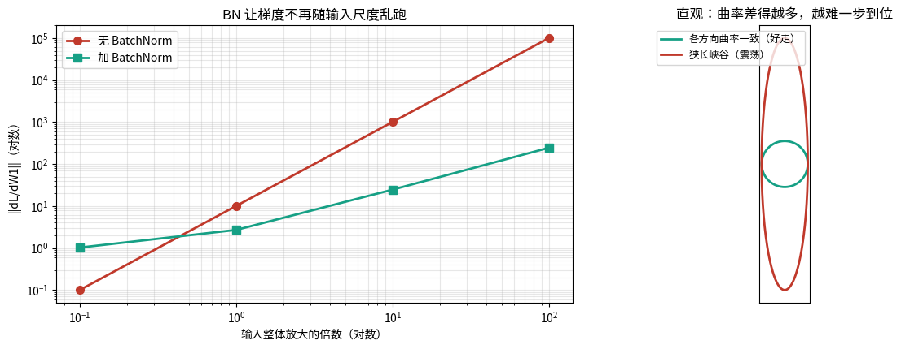
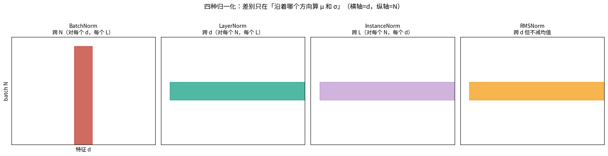
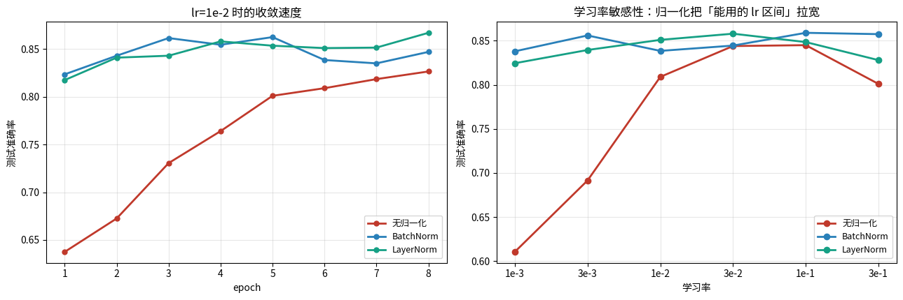
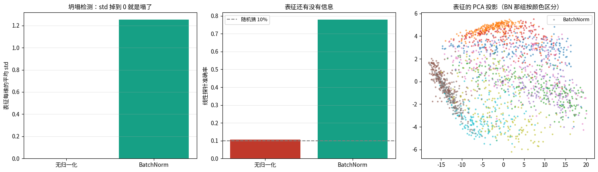

# 归一化：BatchNorm / LayerNorm / RMSNorm（第十六课）

## 数据来源

| 用途 | 数据 | 规模 |
|---|---|---|
| 梯度 vs 输入尺度 | 自造回归任务（3→4→1 两层网络） | 300 样本，5 次随机 |
| BatchNorm 手算 | 自造 5×3 矩阵（第 3 维尺度故意放大） | N=5, d=3 |
| batch size 实验 | Fashion-MNIST | 12000 训练 / 2000 测试 |
| LN / RMSNorm 手算 | 自造 4×5 矩阵 | — |
| 学习率扫描 | Fashion-MNIST MLP(784→256→256→10) | 12000 / 2000 |
| **表征坍塌实验** | Fashion-MNIST 加噪做增强视图 | 6000，encoder 784→64 |

图片目录：`images/`，由 notebook 先写到 `/tmp/norm_vis/` 再复制过来。

---

## 一句话

> 三种归一化都是 $x\to\frac{x-\mu}{\sigma}$，差别只在 **$\mu,\sigma$ 在哪些维度上算**。
> 而自监督里，归一化是**防表征坍塌的结构性保障**，不是可选配件。

---

## 第 1 段 · 为什么要归一化：梯度随输入尺度怎么变

把输入整体放大 $s$ 倍，看初始化处的 $\|\partial L/\partial W_1\|$（5 次随机平均）：

| 输入尺度 $s$ | 无 BN $\\|dL/dW_1\\|$ | 加 BN $\\|dL/dW_1\\|$ | 无 BN $\\|dL/dW_2\\|$ | 加 BN $\\|dL/dW_2\\|$ |
|---|---|---|---|---|
| 0.1 | 0.10 | 1.03 | 0.12 | 3.28 |
| 1.0 | 10.07 | 2.70 | 12.41 | 4.19 |
| 10.0 | 1006.95 | 24.61 | 1240.92 | 25.68 |
| 100.0 | 100699.24 | 245.18 | 124094.51 | 257.65 |

log-log 拟合的指数：

- **无 BN**：$\|dL/dW_1\|\sim s^{2.00}$
- **加 BN**：$\|dL/dW_1\|\sim s^{0.81}$

输入放大 1000 倍时，无 BN 的梯度放大 **1e+06** 倍，加 BN 只放大 **2e+02** 倍。

> **为什么重要**：梯度范数决定了「多大的学习率会炸」。
> 它随输入尺度乱跑，你就只能为每个任务重新试 lr。

### 一个必须说清楚的反直觉点

**如果去算完整 Hessian 的条件数，加了 BN 反而更大**（本 notebook 早期版本实测过：
无 BN ~1e4，加 BN ~1e9）。

原因是 BN 让 $W_1$ 的缩放变成一个**完全平坦的方向**，Hessian 在这个方向上特征值 ≈ 0，
于是 $\kappa=\lambda_{\max}/\lambda_{\min}$ 被拉大。

所以 **「BN 让损失曲面变圆」这句话严格说不成立**。
准确的说法是：

> **BN 让梯度不再随输入尺度乱跑，从而允许用更大且更统一的 lr。**

（而且指数从 2.00 只降到 0.81，不是 0 —— BN 也没把敏感性彻底消掉，只是差了几个数量级。）

### 读图：

- **左**：双对数坐标。红线（无 BN）斜率 ≈2，绿线（加 BN）斜率 ≈0.8。
  **看两条线的斜率差**，这就是 BN 的全部价值。
- **右**：曲率不一致（狭长峡谷）vs 一致的示意图，只是给个直觉。

---

## 第 2 段 · BatchNorm 手算

对 batch $X\in\mathbb R^{N\times d}$，**对每个特征维 $j$**：

$$\mu_j=\frac1N\sum_iX_{ij},\quad \sigma_j^2=\frac1N\sum_i(X_{ij}-\mu_j)^2,\quad
\hat X_{ij}=\frac{X_{ij}-\mu_j}{\sqrt{\sigma_j^2+\varepsilon}},\quad Y_{ij}=\gamma_j\hat X_{ij}+\beta_j$$

**三个细节**：

1. 方差用**有偏估计**（除以 $N$ 不是 $N-1$）—— PyTorch 就是这么算的
2. $\gamma,\beta$ **可学习**，让网络有能力「取消」归一化
3. $\varepsilon$ 防除零

**对账**：手算 vs `nn.BatchNorm1d`（train 模式，$\gamma=[1.5,0.5,2.0],\ \beta=[0,1,-3]$）
最大绝对差 = **1.110e-06**。

标准化后每列均值 `[0,0,0]`、标准差 `[1,1,1]` ✓（第 3 维原始尺度是 17~21，也被拉回 1）。

---

## 第 3 段 · train / eval 的差别：running statistics

训练时维护全局滑动平均：

$$\mu_{\text{running}}\leftarrow m\,\mu_{\text{running}}+(1-m)\,\mu_{\text{batch}}$$

推理时用 running stats，**不再依赖 batch**。

**实测**：同一个 batch，train 模式 vs eval 模式输出**最大差 2.1416**。
这就是忘写 `model.eval()` 时指标飘的原因。

running stats 演化（真实均值 5、方差 4，momentum=0.1）：
6 步之后 running_mean 才爬到 `[2.21, 2.43, 2.489]` —— **它收敛得很慢**，
所以 BN 不适合「刚训几步就要推理」的场景。

| batch=1 时 | 结果 |
|---|---|
| eval 模式 | 正常输出 `[-1.808, -0.812, -1.174]` |
| train 模式 | `ValueError: Expected more than 1 value per channel when training` |

> 就算不报错，train 模式下 batch=1 的结果也会是全 0（自己减自己除以自己的标准差）。

---

## 第 4 段 · BatchNorm 最大的坑：batch 太小就废

Fashion-MNIST，同一个 MLP + BN，只改 batch size（8 epoch，lr=1e-3）：

| batch size | 测试准确率 |
|---|---|
| **2** | **0.6485** |
| 8 | 0.8570 |
| 32 | 0.8475 |
| 128 | 0.8590 |
| 512 | 0.8485 |

→ batch=2 时 BN 的统计量基本是噪声，准确率掉了 **21 个百分点**。

这就是为什么 Transformer / 检测 / 分割这些「batch 小不了」的场景改用 LayerNorm。

---

## 第 5 段 · LayerNorm / RMSNorm 手算

- **LayerNorm**：对每个样本，跨**全部特征维**算 $\mu,\sigma$
- **RMSNorm**（LLaMA 在用）：连减均值都省了，只除 RMS

$$Y_{ij}=\gamma_j\frac{X_{ij}}{\sqrt{\frac1d\sum_jX_{ij}^2+\varepsilon}}$$

**实测**（4×5）：

| | 每行均值 | 每行 RMS |
|---|---|---|
| LayerNorm 后 | **0**（全 0） | — |
| RMSNorm 后 | 0.6503 / 0.8480 / 0.9154 / 0.9802（**不是 0**） | **1**（归一化了） |

**对账**：
- 手算 LN vs `nn.LayerNorm`：3.275e-07
- 手算 RMSNorm vs 自写模块：4.276e-06

> 注意：RMSNorm 的 $\varepsilon$ 加在 sqrt 里面还是外面，不同实现不一样。
> **LLaMA 是加在里面**（$\sqrt{\text{mean}(x^2)+\varepsilon}$），这里照它写。

### 读图：

四格示意，横轴 = 特征 $d$，纵轴 = batch $N$：

- **BatchNorm**：红色竖条 = 沿着 $N$ 方向（对每个特征维跨 batch 归一）
- **LayerNorm**：绿色横条 = 沿着 $d$ 方向（对每个样本跨特征归一）
- **InstanceNorm**：沿着序列/空间位置
- **RMSNorm**：横条，但不减均值

**差别只在「沿着哪个方向算 $\mu,\sigma$」** —— 这一张图就够了。

---

## 第 6 段 · 实测：无归一化 / BN / LN 的学习率敏感性

Fashion-MNIST，MLP(784→256→256→10)，SGD(momentum=0.9)，6 epoch：

| lr | 无归一化 | BatchNorm | LayerNorm |
|---|---|---|---|
| 1e-3 | **0.6105** | 0.8380 | 0.8245 |
| 3e-3 | 0.6915 | 0.8560 | 0.8395 |
| 1e-2 | 0.8090 | 0.8385 | 0.8510 |
| 3e-2 | 0.8440 | 0.8445 | **0.8580** |
| 1e-1 | **0.8450** | **0.8590** | 0.8485 |
| 3e-1 | 0.8010 | 0.8575 | 0.8280 |

| 配置 | 最好 | 最差 | 可用 lr 个数（>0.7） |
|---|---|---|---|
| 无归一化 | 0.8450 | 0.6105 | **4 / 6** |
| BatchNorm | 0.8590 | 0.8380 | **6 / 6** |
| LayerNorm | 0.8580 | 0.8245 | **6 / 6** |

→ 归一化没有把「最高准确率」抬高多少（0.845 → 0.859），
但把**能用的学习率区间**从 4 个拉到 6 个 —— 这才是它真正的价值：**不挑 lr**。

### 读图：

- **左**：lr=1e-2 时的收敛曲线（无归一化明显慢半拍）。
- **右**：学习率扫描。看**红线的形状**：左边翘不起来、右边塌陷，是个窄的「可用窗口」；
  绿/蓝线是**一条平线**，说明怎么设 lr 都行。

---

## 第 7 段 · 接项目：不加归一化，自监督会表征坍塌

目标：$\mathcal L=\|f(x)-f(x')\|^2$，$x'=x+\text{噪声}$。

**这个目标的全局最优解是 $f\equiv$ 常数**（损失恒为 0）。这叫 **collapse**。

**实测**（线性 encoder 784→64，300 步，两个视图就是加噪）：

| 配置 | 最终 loss | 表征每维平均 std | 线性探针 acc |
|---|---|---|---|
| 无归一化 | **0.000000** | **0.00000** | **0.1065**（= 随机猜） |
| 加 BatchNorm | 0.023379 | 1.25416 | **0.7800** |

- 无归一化：**loss 降到 0，看起来训练完美成功了**，但表征 std 塌到 0，探针只有 10.65%。
- 加 BN：每维 std 被强制为 1，塌不了，探针 78%。

> **这是自监督里最经典的坑：loss 下降不代表学到了东西。**
> BYOL / SimSiam 论文反复强调 BN 的作用，就是这个原因。
> 一定要看表征的 std / 有效秩 / 线性探针（第十九课会系统讲这些指标）。

### 读图：

- **左**：两组的表征 std 柱状图。左边那根贴地 = 坍塌的直接证据。
- **中**：线性探针准确率。左 10.65%（等于瞎猜），右 78%。
- **右**：表征的 PCA 投影按真实类别着色（BN 那组）。颜色能分开 = 表征有信息。

---

## 第 8 段 · 归一化与「表征的几何」

L2 归一化把表征推到单位球面上，一旦所有 $\|z\|=1$，就有 $z_i\cdot z_j=\cos(z_i,z_j)$。

**实测**：把样本 0 的模长放大 10 倍后

- 余弦：**0.0683（不变）**
- 点积：0.1392 → **1.3923（涨了 10 倍）**

→ 用点积当相似度，模型只要**把正样本的模长拉大就能刷低损失**，
这条路跟「学到语义」毫无关系。先 `F.normalize` 就把这条路堵死了。

**跟第十三课串起来**：对表征做 BN，等价于把每个维度的方差强行拉到 1 ——
这跟 **VICReg 方差项**干的事几乎一样。

| | 约束方式 | 代价 |
|---|---|---|
| BN | 硬约束（每层都执行） | 更稳，但抹掉「这个特征本来就该更重要」的信息 |
| VICReg 方差项 | 软约束（只在损失里 hinge 惩罚） | 保留尺度信息，但可能压不住 |

---

## 关键公式速查

- $\hat x=\dfrac{x-\mu}{\sqrt{\sigma^2+\varepsilon}},\quad y=\gamma\hat x+\beta$
- BN：对每个特征维跨 batch 归一；方差用**有偏**（除以 $N$）
- LN：对每个样本跨特征维归一
- RMSNorm：$y=\gamma\dfrac{x}{\sqrt{\frac1d\sum_jx_j^2+\varepsilon}}$（$\varepsilon$ 在 sqrt 内）
- running stats：$\mu_{\text{run}}\leftarrow m\mu_{\text{run}}+(1-m)\mu_{\text{batch}}$
- 参数量：spherical $K$ / diag $Kd$ / tied $d(d+1)/2$ / full $K\,d(d+1)/2$

## 三句话

1. 归一化**不是**为了保证分布不变（那个说法已过时）。
   它让**梯度不再随输入尺度乱跑**（指数 $s^2\to s^{0.81}$），从而敢用大 lr。
2. BN 的命门是 **batch size**（batch=2 掉 21 个点），而且 train/eval 两套逻辑最容易写错。
3. 自监督里归一化是**防坍塌的结构性保障**。
   **loss 一直降不代表学到了东西** —— 一定看 std / 有效秩 / 线性探针。

## 下一课

第十七课：对比学习 —— InfoNCE / SimCLR / BYOL / VICReg。
这一课你看到「不加归一化会坍塌」，下一课讲清楚
**负样本、stop-gradient、方差项**这三招分别是怎么防止坍塌的。
