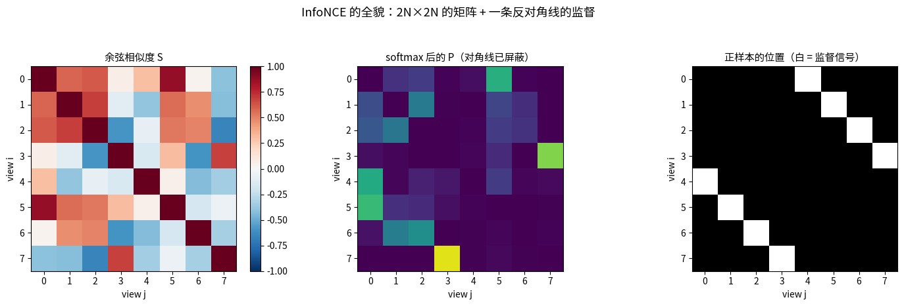
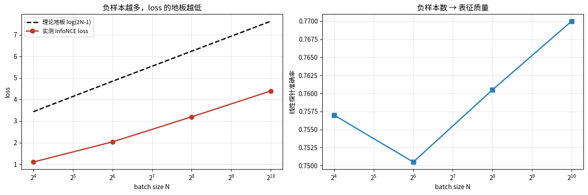
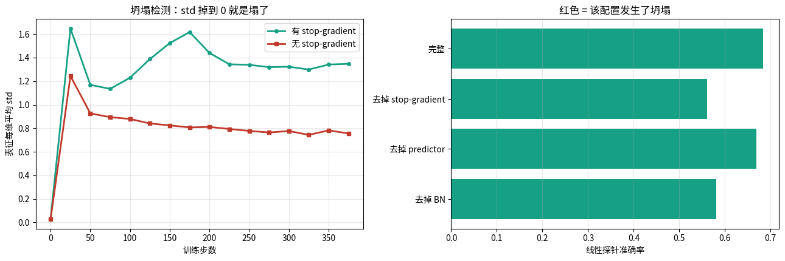
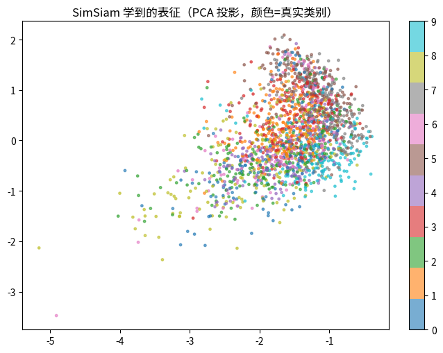
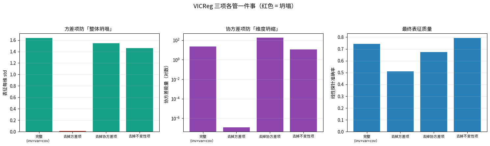

# 对比学习：InfoNCE 与 VICReg（第十七课）

## 数据来源

| 用途 | 数据 | 规模 |
|---|---|---|
| InfoNCE 手算 | 自造 4 对正样本的 8×8 相似度矩阵 | 2N=8, τ=0.2 |
| batch size 消融 | Fashion-MNIST | 12000 训练 / 2000 测试，400 步 |
| 增强强度消融 | 同上（增强 = 加噪 + 平移） | bs=256 |
| SimSiam / VICReg 消融 | 同上 | bs=256, out_dim=32 |
| 距离比值实验 | 同上（对表征整体缩放） | — |

图片目录：`images/`，由 notebook 先写到 `/tmp/cl_vis/` 再复制过来。

---

## 一句话

> InfoNCE 就是「标签是正样本下标」的交叉熵；
> 三种防坍塌机制 —— **负样本（SimCLR）、stop-gradient+predictor（SimSiam）、显式方差/协方差项（VICReg）** —— 是同一个问题的三种答案。

---

## 第 1 段 · InfoNCE 手算：它就是交叉熵

对 2N 个 view 算余弦相似度矩阵，对角线屏蔽，除以温度 $\tau=0.2$，按行 softmax，
每个 view 的损失就是 $-\log p_{\text{pos}}$。

以第 0 行为例：正样本对 $(0,4)$ 的相似度是 0.3010，但同 batch 里 $(0,5)$ 的相似度高达 0.8756 ——
softmax 后 $p_{\text{pos}}=0.0355$，这一行的损失就是 3.3393。

8 个 view 的损失 `[3.3393 1.5573 1.9084 0.2104 0.4895 1.9749 0.704  0.0442]`，平均得：

- **手算 loss = 1.278490**
- `F.cross_entropy` = 1.278490
- 差 = 2.062e-08

> **结论**：InfoNCE 没有任何神秘之处 —— 把正样本的下标当标签，剩下就是交叉熵。

---

## 第 2 段 · batch size 实验：loss 数值跨 batch 不可比较

只改 batch size（= 负样本数 2N−2），其余全部相同，400 步：

| batch | 负样本数 | 理论地板 log(2N−1) | 实测最终 loss | 线性探针 |
|---|---|---|---|---|
| 16 | 30 | 3.434 | 1.1024 | 0.7570 |
| 64 | 126 | 4.844 | 2.0367 | 0.7505 |
| 256 | 510 | 6.236 | 3.1955 | 0.7605 |
| 1024 | 2046 | 7.624 | 4.3949 | 0.7700 |

两个发现：

1. 探针从 0.757 涨到 0.770：方向符合「负样本越多越好」，但这个小任务 + 400 步下幅度不大。
2. **更重要的点**：实测 loss 随 batch 变大而**变大**（1.10 → 4.39），不是变差！
   因为 loss 的地板 log(2N−1) 本身就在涨（3.43 → 7.62）。

> **自监督第一铁律**：InfoNCE 的 loss 数值在不同 batch size 之间**不可比较**。
> 训练日志里 loss 从 4.5 降到 4.2，可能只是负样本数变了，表征根本没变好。
> 监控必须用探针 / 表征 std，不能只看 loss。

---

## 第 3 段 · 增强强度消融

| 增强强度 | 线性探针 | 表征每维 std |
|---|---|---|
| 0.00 | 0.6380 | 0.2821 |
| 0.05 | 0.6710 | 0.2895 |
| 0.20 | 0.7530 | 0.3385 |
| 0.60 | 0.7605 | 0.7721 |
| 1.50 | 0.7645 | 2.4451 |

增强为 0 时最差（0.638），加一点噪声立刻涨。但注意：**本实验没有出现「过猛变噪声」的拐点** —— 1.5 时反而最高。

原因是本实验的增强只有「加噪 + 平移」，噪声加大只是让任务更难，没有破坏语义；
真实 SimCLR 用裁剪 / 变色 / 模糊，那些增强过猛才会把语义抹掉、出现拐点。

> 结论：「增强定义了不变性」是对的，但**拐点在哪取决于你用的是哪类增强**。

---

## 第 4 段 · SimSiam 消融：小模型上「塌不了」，只能「变差」

| 配置 | 表征 std | 线性探针 |
|---|---|---|
| 完整（sg + predictor + BN） | 1.3277 | 0.6840 |
| 去掉 stop-gradient | 0.7135 | 0.5615 |
| 去掉 predictor | 0.6121 | 0.6685 |
| 去掉 BN | 0.4181 | 0.5810 |

**诚实的观察**：在这个小规模 + 400 步设置下，**没有哪个配置完全塌到 std=0**。
BYOL 论文里「去掉 stop-gradient 就彻底塌」需要更大模型 + 更长训练才明显。

但趋势清楚：去掉任何部件 std 和探针都降；去 sg 掉得最多（0.68 → 0.56），其次是去 BN（0.58）。

> 教训：文献里的「彻底坍塌」结论，在小模型上往往只能看到「变差」而不是「塌」。

---

## 第 5 段 · VICReg 消融：三个项各管一件事

| 配置 | 表征 std | 协方差能量 | 线性探针 |
|---|---|---|---|
| 完整（inv+var+cov） | 1.6367 | 22.0761 | 0.7420 |
| 去掉方差项 | **0.0153** | 0.0000 | 0.5110 |
| 去掉协方差项 | 1.5487 | **173.3725** | 0.6735 |
| 去掉不变性项 | 1.4617 | 10.8219 | **0.7925** |

- **去掉方差项**：std 直接掉到 0.0153（**彻底坍塌**），探针掉到 0.511 —— 这一项是防坍塌的主力。
- **去掉协方差项**：std 不塌，但协方差能量从 22 飙到 173（**维度坍缩**），探针掉到 0.674。
- **去掉不变性项**：探针反而最高（0.793）—— 别急着惊讶：
  只剩方差+协方差时，模型被迫学出「撑开的、各维不相关」的表征，
  在 Fashion-MNIST 这种类别结构很强的数据上，这本身就接近判别表征。
  换成细粒度数据集（不同狗的品种）就不会这样 —— **不变性项才是「对什么不变」的定义**。

### 三方法同预算对比

| 方法 | 表征 std | 线性探针 |
|---|---|---|
| SimCLR (InfoNCE) | - | 0.7605 |
| SimSiam | 1.3277 | 0.6840 |
| VICReg | 1.6367 | 0.7420 |

选型：显存放得下大 batch → SimCLR 最简单；batch 小 → SimSiam / VICReg；
想精确控制「每维要有多少方差」→ VICReg（**这是本项目该关心的**）。

---

## 第 6 段 · 距离比值判据的尺度无关性（接第十九课前的伏笔）

把表征整体缩放，看「距离比值」$d_+/d_-$ 变不变：

| 缩放因子 | 比值 d+/d− | 表征 std |
|---|---|---|
| 1.00 | 0.213717 | 0.9877 |
| 0.10 | 0.213717 | 0.0988 |
| 0.01 | 0.213717 | 0.0099 |
| 10.00 | 0.213717 | 9.8772 |

> 比值完全不随缩放变化 —— 这既是优点（尺度无关）也是危险：
> **「把表征整体缩小 100 倍」不会让这个指标变差，这就是退化解**。
> 所以比值判据必须配一个绝对尺度的约束（VICReg 方差项 / BN / L2 归一化）。

---

## 跟项目的连接

- VICReg 的方差项 = 给「距离比值」补上绝对尺度约束，正是师生比值路线需要的护栏；
- 三种防坍塌机制可以混用：BN/LN（第 16 课）+ 负样本 + 显式方差项，_layered 防线最稳；
- 不变性由增强定义 —— 换增强 = 换任务定义，调增强比调损失函数影响更大。
