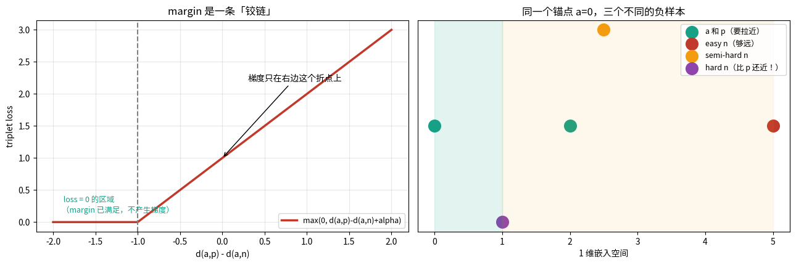
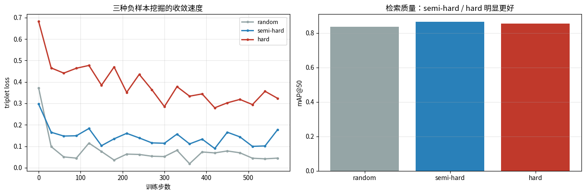
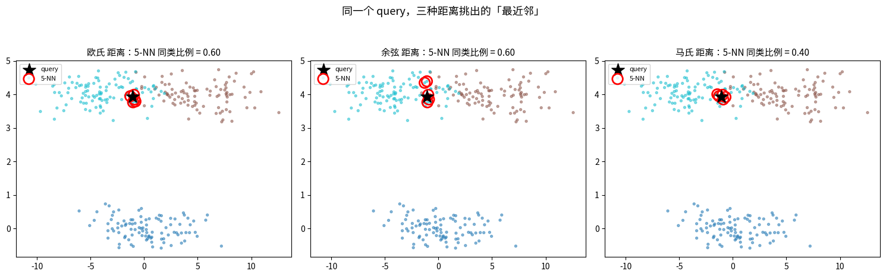
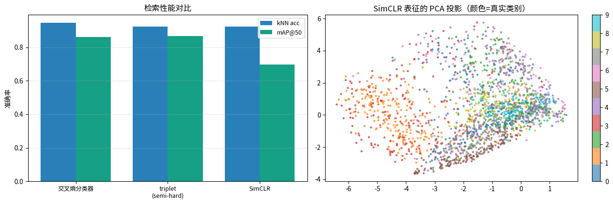
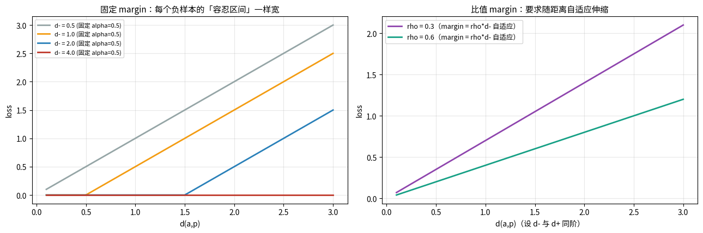

# 度量学习：三元组与 NTXent（第十八课）

## 数据来源

| 用途 | 数据 | 规模 |
|---|---|---|
| 三元组手算 / 梯度手算 | 自造二维点 | α=1.0 |
| 挖掘策略消融 | Fashion-MNIST | 12000 训练 / 2000 测试，600 步，bs=128，α=0.5 |
| 缩放不变性 | 同上表征整体缩放 | — |
| InfoNCE vs 软三元组 | 同一 anchor 集合 | 梯度方向余弦 |
| 距离选择 | 自造 3 个斜 45° 椭球簇 | 5-NN |
| 三方法对比 | Fashion-MNIST | kNN acc / mAP@50 |

图片目录：`images/`，由 notebook 先写到 `/tmp/metric_vis/` 再复制过来。

---

## 一句话

> 三元组损失 = 「把 anchor 拉向正样本、推离负样本，中间隔一个 margin α」；
> InfoNCE 是它的 softmax 版 —— **自动给所有负样本按难度加权**。

---

## 第 1 段 · 三元组手算

$$L=\max\big(0,\ d(a,p)-d(a,n)+\alpha\big)$$

三种情形（α=1.0）：

| 情形 | d(a,p) | d(a,n) | loss |
|---|---|---|---|
| 已满足（easy） | 2.00 | 5.00 | 0.0000 |
| 压线（semi-hard） | 2.00 | 2.50 | 0.5000 |
| 负样本更近（hard） | 2.00 | 1.00 | 2.0000 |

### 梯度手算 vs autograd

一个具体三元组：d(a,p)=1.4142，d(a,n)=1.1180，loss=0.7962。

- 手算梯度 = `[-0.1873 -1.1543]`
- autograd = `[-0.1873 -1.1543]`，最大差 = 0.000e+00

梯度的两个分量：

- **指向 p 的分量**（拉向正样本）：`[-0.7071 0.7071]`，方向 = (p−a)/d
- **背离 n 的分量**（推离负样本）：`[-0.8944 -0.4472]`，方向 = −(n−a)/d

> 两个力缺一不可：只有拉近会塌成一点，只有推离会撑爆空间。

---

## 第 2 段 · 负样本挖掘：在简单数据上显不出差距

三种挖掘策略（600 步, bs=128, α=0.5）：

| 策略 | kNN acc | mAP@50 | 表征 std |
|---|---|---|---|
| random | **0.9390** | 0.8371 | 0.8528 |
| semi-hard | 0.9235 | **0.8660** | 0.9279 |
| hard | 0.9380 | 0.8536 | 0.9197 |

**结果跟直觉不完全一致，得诚实说**：

- mAP 上 semi-hard 最好（0.8660），kNN 上 random 反而最高（0.9390）。
- 在 Fashion-MNIST 这种「类别分得很开」的数据上，挖掘策略的差距很小 ——
  随机挑的负样本里也已经有不少是 semi-hard 的了。
- 文献里「semi-hard 明显更好」是在人脸这种细粒度数据上得出的。

> 教训：**别在简单数据上调挖掘策略**，差距根本显不出来。

---

## 第 3 段 · 尺度退化：triplet loss 对整体缩放无感

三元组模型的表征：每维 std 均值 = 0.9279，样本范数 min/mean/max = 0.7099 / 4.9535 / 13.9813。

把表征整体缩放：

| 缩放 | triplet loss | 表征 std |
|---|---|---|
| 0.01 | 0.033779 | 0.0095 |
| 1.00 | 0.033779 | 0.9526 |
| 100.00 | 0.033779 | 95.2557 |

loss 完全不变 —— 距离差 $d(a,p)-d(a,n)$ 是「相对量」，整体缩放被减法抵消。

> 这就是为什么实际实现几乎都先做 **L2 归一化**：把尺度这个自由度直接钉死。
> （呼应第十七课：距离比值判据同样尺度无关，同样需要配绝对尺度约束。）

---

## 第 4 段 · InfoNCE ≈ 自动挖难负的软三元组

同一个 anchor 集合：

- InfoNCE loss = 10.534041
- softplus 版软三元组 = 2.276344（形状不同，优化方向一致）

两个损失对 anchor 的**梯度方向余弦**：
`[0.9184 0.8505 0.7677 0.8429 0.7581 0.9989]`，平均 = **0.8561**。

> InfoNCE 本质是「自动挖掘难负样本的三元组」：softmax 权重自动偏向近的负样本。

---

## 第 5 段 · 距离选择：簇分得开时，形状不重要

各向异性数据（3 个斜 45° 椭球簇）上的 5-NN 准确率：

| 距离 | 5-NN acc |
|---|---|
| 欧氏 | 0.9367 |
| 余弦 | 0.9367 |
| 马氏 | 0.9433 |

三种几乎一样。因为这几个椭球簇虽然斜，但**中心分得够开**，5-NN 根本不需要看清形状。

> 距离选择的差距要在「簇靠近 / 簇重叠」时才显现 —— 又一次验证第十三课的结论：
> **形状假设（协方差）只有在簇重叠时才关键**。
> 工程含义：类内形状差异大时，要么学一个「揉圆」的 encoder（VICReg 协方差项就在干这个），
> 要么检索时用马氏距离。纯欧氏 + 各向异性数据 = 天生吃亏。

---

## 第 6 段 · 三方法对比 + margin 的自适应化

| 方法 | kNN acc | mAP@50 | std |
|---|---|---|---|
| 交叉熵分类器 | **0.9460** | 0.8611 | 1.0637 |
| triplet(semi-hard) | 0.9235 | **0.8660** | 0.9279 |
| SimCLR | 0.9235 | 0.6957 | 0.7721 |

> 交叉熵是「有监督的度量学习」：只要有标签，它经常是最强基线，别小看它。
> triplet / SimCLR 的价值在于**不需要标签**。

### 比值 margin = 自适应 margin（接项目）

固定 margin 对「远负样本」和「近负样本」一视同仁，浪费信息。比值判据 $d_+ < \rho \cdot d_-$：

| d− | 要求 d+ < ρ·d− |
|---|---|
| 0.50 | 0.250（负样本越近，要求越严） |
| 1.00 | 0.500 |
| 2.00 | 1.000 |
| 4.00 | 2.000（负样本越远，要求越松） |

> 比值 margin 天然把「容易的负样本」放过去、把「危险的负样本」抓紧 ——
> **距离比值 = 随数据分布自适应的 margin**，这正是师生比值路线的数学内核。
