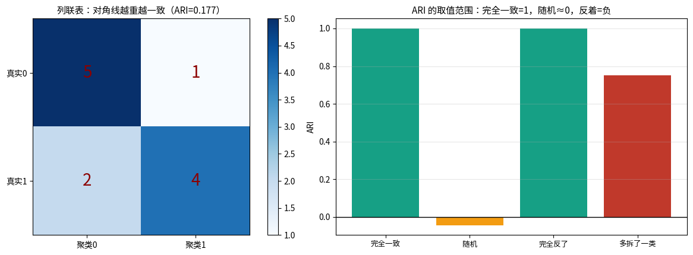
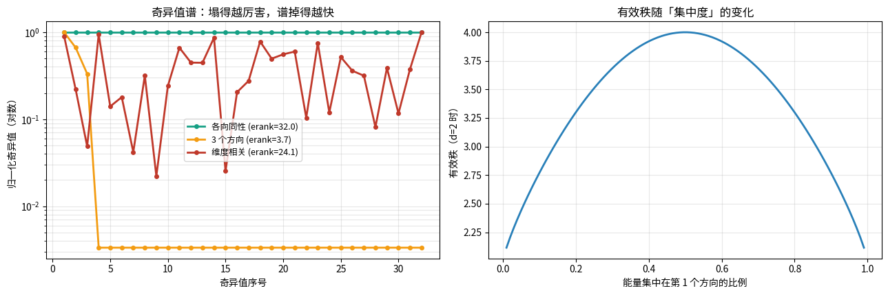
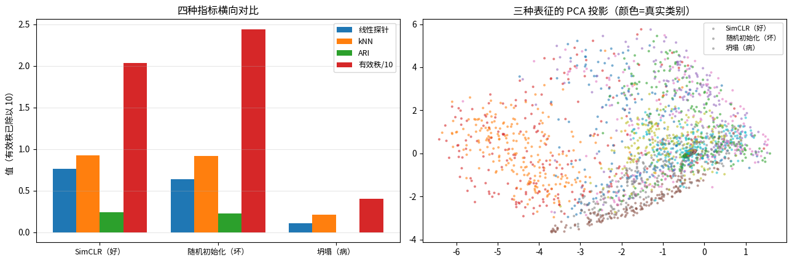
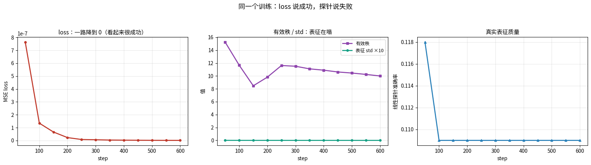

# 自监督评测：线性探测与有效秩（第十九课）

## 数据来源

| 用途 | 数据 | 规模 |
|---|---|---|
| 有效秩定义验证 | 自造指定谱的数据 | 维度 32 |
| ARI/NMI 手算 | 自造 2×2 列联表 | n=12 |
| 极端表征构造 | 自造四种病态表征 | d=32 |
| 体检报告 | Fashion-MNIST（SimCLR / 随机初始化 / 坍塌模型） | 2000 测试样本，10 类 |
| 训练监控 | Fashion-MNIST（故意会塌的自监督设置） | 600 步 |

图片目录：`images/`，由 notebook 先写到 `/tmp/eval_vis/` 再复制过来。

---

## 一句话

> **自监督的 loss 不算数** —— 评测要看四个仪表盘：线性探针、kNN、ARI、有效秩。
> 其中有效秩是训练时能实时画的那一条。

---

## 第 1 段 · 有效秩：表征实际用了几个维度

定义：对中心化表征做 SVD，把奇异值归一化成分布 $p_i = s_i/\sum s_j$，则

$$\text{erank} = \exp\Big(-\sum_i p_i\ln p_i\Big)$$

（= 谱分布的熵指数。接第四课「熵 = 有效选项数」。）

定义验证 —— 造一个有效维度为 k 的数据，实测：

| 构造的有效维度 | 实测有效秩 |
|---|---|
| 1 | 1.00 |
| 4 | 4.00 |
| 16 | 15.98 |
| 32 | 31.93 |

---

## 第 2 段 · ARI 手算：对随机校正过的聚类一致性

列联表（行=真实类，列=聚类）：

```
n_ij = [5 1]
       [2 4]     n = 12
```

- 一致对数 $\sum\binom{n_{ij}}{2}$ = 17
- 期望 = 30×31/66 = 14.0909
- **ARI = (17 − 14.0909) / (30.5 − 14.0909) = 0.177285**
- sklearn ARI = 0.1772853185595568，差 = 2.776e-17

极端情形：

| 情形 | ARI | NMI |
|---|---|---|
| 完全一致 | 1.0000 | 1.0000 |
| 随机 | **−0.0434** | 0.0299 |
| 完全反了 | 1.0000 | 1.0000 |
| 多拆了一类 | 0.7500 | 0.8133 |



> ARI 对随机是 0（校正过），NMI 不是 —— **跨 K 比较聚类时用 ARI 更稳**。

---

## 第 3 段 · 四种病态表征，有效秩全部抓到

| 构造 | erank | 每维 std 均值 |
|---|---|---|
| 各向同性（理想） | 31.93 | 1.0002 |
| 只有 3 个方向有用 | **2.77** | 0.1849 |
| 维度强相关（协方差塌） | **1.42** | 5.4875 |
| 整体塌成常数 | 31.93 | 0.0100 |

（「整体塌成常数」= 所有样本几乎挤在同一个点，只留 0.01 的各向同性小噪声。
中心化之后剩下的全是各向同性噪声，谱形状是满的 —— 所以**有效秩只看「形状」，不看「尺度」**，
塌成一点这种病要靠每维 std（0.0100）抓。两个指标必须一起看。）



> 有效秩对三种病都能抓到：方差塌、维度相关、整体常数。
> 这就是为什么它是自监督训练时最值得实时画的一条曲线。

---

## 第 4 段 · 三种表征的体检报告

| 表征 | 线性探针 | kNN | ARI | NMI | 有效秩 |
|---|---|---|---|---|---|
| SimCLR（好） | 0.7605 | 0.9235 | 0.2405 | 0.4141 | 20.35 |
| 随机初始化（坏） | 0.6345 | 0.9145 | 0.2227 | 0.3545 | 24.41 |
| 坍塌（病） | 0.1065 | 0.2115 | −0.0000 | 0.0032 | 4.05 |

两个必须注意的点：

1. **随机初始化的探针不是 0**（0.6345）—— ReLU 网络的随机特征本身就有判别性。
   所以自监督的「增益」要**跟随机基线比**，不是跟 0 比。
2. 坍塌模型的 ARI = −0.0000、有效秩掉到 4.05 —— 数字会同时报警，不会只坏一个。



---

## 第 5 段 · 训练监控：loss 一直在降，表征已经死了

故意用一个会塌的自监督设置，沿训练过程记录四个数：

| step | loss | std | 有效秩 | 线性探针 |
|---|---|---|---|---|
| 50 | 0.000001 | 0.00064 | 15.27 | 0.1180 |
| 100 | 0.000000 | 0.00031 | 11.67 | 0.1090 |
| 200 | 0.000000 | 0.00014 | 9.82 | 0.1090 |
| 400 | 0.000000 | 0.00004 | 10.90 | 0.1090 |
| 600 | 0.000000 | 0.00002 | 10.00 | 0.1090 |

**loss 从第 50 步起就是 0（完美优化！），但探针钉死在 0.109、有效秩一路下滑** ——
表征早就塌了，优化器却在「完美地」求解一个没有信息的目标。



> 这就是自监督实验最大的坑：只看 loss 你会以为一切正常。
> **仪表盘三件套：loss + 有效秩 + 探针，缺一不可。**

---

## 第 6 段 · 判读规则（背下来）

1. 有效秩掉到 1~3 附近 → 表征塌了（先修方差/协方差项）
2. 有效秩正常但线性探针低 → 表征撑开了但没装类别信息（换增强 / 加负样本）
3. 线性探针高但 kNN 低 → 类间有线性可分性但局部几何乱（判别学习强于度量学习）
4. kNN 高但线性探针低 → 类是「一小坨一小坨」的，但类间不是线性可分
5. ARI 与探针不一致 → 聚类结构和判别结构不是一回事，分别报

---

## 跟项目的连接

- 第十七课的距离比值 + 本课的有效秩 = 师生比值路线的**最小评测协议**：
  每次实验先看有效秩有没有塌，再谈比值降没降；
- 随机基线（0.6345）说明：任何「我的方法比随机好」的结论都不值钱，
  要比的是**同一个预算下超出随机初始化的那部分**。
