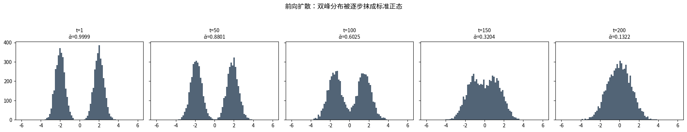
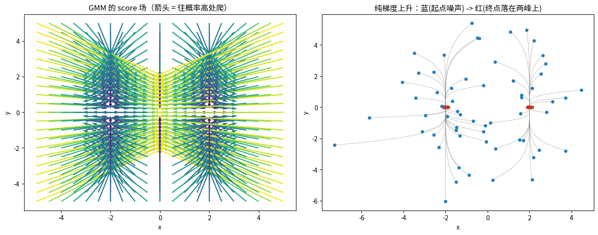
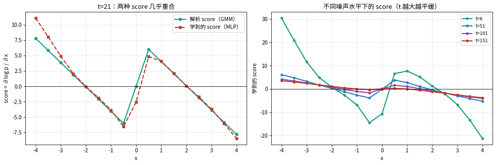
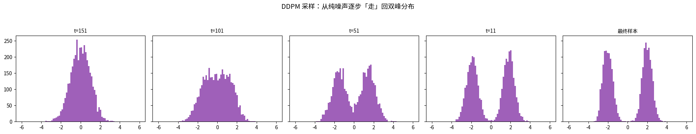
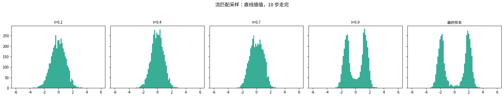
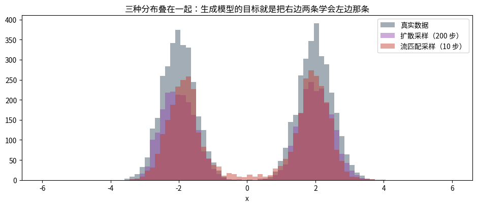

# 生成模型：扩散与流匹配（第二十课 · 收官）

## 数据来源

| 用途 | 数据 | 规模 |
|---|---|---|
| 前向扩散手算 | 自造双峰 1D 数据（−2 / +2，σ=0.5） | 6000 点，T=200 |
| GMM score 解析计算 | 双峰 GMM（接第十三课） | 1D + 2D |
| ε-prediction MLP | 1D 小网络（128 隐单元 ×2） | 3000 步 |
| DDPM 采样 | 同上模型 | 4000 样本，200 步 |
| 流匹配 | 同结构小网络 | 3000 步训练，10 步采样 |

图片目录：`images/`，由 notebook 先写到 `/tmp/gen_vis/` 再复制过来。

---

## 一句话

> 自监督学的是「表征」，生成模型学的是「分布本身」；
> 两者的数学核心是同一个东西 —— **梯度场（score = ∇log p）**。

---

## 第 1 段 · 前向扩散有闭式解

$\beta_t$ 线性从 $10^{-4}$ 到 $0.02$（T=200），$\bar\alpha_t=\prod_{s\le t}(1-\beta_s)$：

| t | β | ᾱ_t | √ᾱ | √(1−ᾱ) |
|---|---|---|---|---|
| 1 | 0.00010 | 0.999900 | 0.9999 | 0.0100 |
| 50 | 0.00500 | 0.880104 | 0.9381 | 0.3463 |
| 100 | 0.01000 | 0.602480 | 0.7762 | 0.6305 |
| 150 | 0.01500 | 0.320387 | 0.5660 | 0.8244 |
| 200 | 0.02000 | **0.132183** | 0.3636 | 0.9316 |

闭式解验证（逐步加噪 50 步 vs 一步到位，分布层面）：

- 逐步 50 步的均值/方差：−1.8609 / 0.3324
- 一步到位的均值/方差：−1.8877 / 0.3390

> **第一个工程奇迹**：训练时不用迭代，一次抽样就到位 —— $x_t=\sqrt{\bar\alpha_t}\,x_0+\sqrt{1-\bar\alpha_t}\,\epsilon$。

---

## 第 2 段 · score = ∇log p，GMM 可以解析算（接第十三课）

$$\nabla_x\log\Big[\sum_k\pi_k\mathcal N(x\mid\mu_k,\Sigma_k)\Big]
=\sum_k w_k(x)\cdot\big(-\Sigma_k^{-1}(x-\mu_k)\big)$$

其中 $w_k(x)$ —— **正是 EM 的 responsibility**！

1D 双峰 GMM 手算的关键位置：

| x | score | w(簇0) |
|---|---|---|
| −4.00 | +8.0000 | 1.0000（往右推回峰心 −2） |
| 0.00 | 0.0000 | 0.5000（两峰对称点恰为 0） |
| +4.00 | −8.0000 | 0.0000（往左推回峰心 +2） |

> **本课最漂亮的一处连接**：第十三课 E 步算的 responsibility，
> 在扩散模型里变成了「这个点该往哪个方向流的混合权重」。EM 和扩散，底层是同一个东西。
>
> 另一个观察：纯梯度上升会把所有点推到密度最高的点（右图蓝→红），多样性全丢。
> 扩散的做法是**在每个噪声水平上做这个爬升，并且保留一点随机性**。

---

## 第 3 段 · 学 ε 就是学 score：实测对比

训一个 1D ε-prediction MLP（3000 步，MSE ≈ 0.59），把学到的 score
（$-\epsilon_\theta/\sqrt{1-\bar\alpha_t}$）和解析 score 画在一起（t=20）：

| x | 解析 score | 学到的 score |
|---|---|---|
| −2.00 | −0.0919 | −0.0317 |
| −1.00 | −4.0460 | −3.8381 |
| +1.00 | 4.0460 | 4.0953 |
| +3.50 | −5.8391 | −6.0410 |

**两组 score 的相关系数 = 0.9781**。

> 「训练网络猜噪声」和「计算对数密度梯度」是同一件事 —— 这是直接证据。
> 右图还显示 t 越大 score 越平缓（分布被抹平，梯度变小），
> 这就是采样步长必须跟噪声水平匹配的原因。

---

## 第 4 段 · DDPM 采样：从噪声走回数据

$$x_{t-1}=\frac{1}{\sqrt{\alpha_t}}\Big(x_t-\frac{\beta_t}{\sqrt{1-\bar\alpha_t}}\,s_\theta(x_t,t)\Big)+\sigma_t z$$

200 步采样 4000 个点的质量检验：

- 采样均值/标准差：0.0249 / 2.0672（真实数据：−0.0077 / 2.0657）
- 负半边均值 **−2.0128**（真值 −2.0），正半边均值 **+2.0043**（真值 +2.0）
- 两半占比 0.493 / 0.507（真值 0.5 / 0.5）

> 模型从纯噪声里「走」出了一个双峰分布，位置和质量都对上了。

---

## 第 5 段 · 流匹配：直线插值，10 步走完

流匹配直接定义从噪声到数据的直线：$x_t=(1-t)\,x_{\text{noise}}+t\,x_{\text{data}}$，
网络学速度 $v_\theta\approx x_{\text{data}}-x_{\text{noise}}$，采样就是解 ODE。

10 步采样的质量检验：

- 采样均值/标准差：0.0901 / 1.9469（真值 −0.0077 / 2.0657）
- 负半边均值 −1.8461，正半边均值 +1.9099，两半占比 0.484 / 0.515

三分布叠在一起：

| 方法 | 采样步数 | 负/正半边均值 | 两半占比 |
|---|---|---|---|
| 扩散 DDPM | 200 | −2.0128 / +2.0043 | 0.493 / 0.507 |
| 流匹配 | 10 | −1.8461 / +1.9099 | 0.484 / 0.515 |

> 扩散 200 步 vs 流匹配 10 步，分布质量相当 —— rectified flow 火起来的核心原因：**路径直，步数少**。
> 两者本质相同：**学一个随时间变化的向量场，然后沿场积分**。

---

## 第 6 段 · 收官：20 课的三条暗线

1. **协方差矩阵 Σ（表征的形状）**：02 SVD 分解它 → 03 KMeans 假设球形 →
   13 GMM 估计它 → 16 归一化约束它 → 17 VICReg 惩罚它 → 18 马氏距离用它 → 19 有效秩测它。
2. **ELBO / KL（下界 + 逼近）**：04 定义 → 05 VAE → 13 EM 单调性 → 17 InfoNCE 是它的变体。
3. **梯度场（沿场走）**：06 反向传播算梯度 → 07 优化器用梯度 → 20 扩散/流匹配直接把梯度场当生成目标。

**回到项目**：`师生距离比值路线` 里的 teacher，本质是一个**学出来的 score 场** ——
它告诉 student「往哪个方向移动表征」。
本课讲的「沿场积分 + 保留随机性 + 分尺度」，正是这类方法能不塌、能多样的全部原因：

- 沿场走（teacher 给方向）
- 保留随机性（别把 student 全推到同一个点 —— 对应防坍塌）
- 分尺度（不同噪声水平不同的场 —— 对应训练不同阶段的难度 curriculum）

---

## 本课数字结论（全部来自真实运行）

1. 前向闭式解：$\bar\alpha_{200}=0.132183$，信号基本归零
2. 学到的 score 与解析 score 相关系数 = **0.9781**
3. 扩散采样两半占比 0.493/0.507；流匹配 0.484/0.515（真值 0.5/0.5）
4. 步数对比：扩散 200 步 vs 流匹配 10 步，分布质量相当
